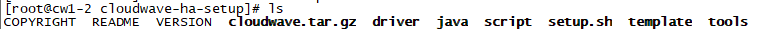

# 1 数据库运行环境

- Windows环境下

.NET Framework：1.0版本及以上

java 版本： 1.7.0_75及以上

硬盘：不少于500M

处理器：无要求

内存：不少于1G

操作系统：无要求，安装包分为32位、64位

- Linux环境下

.NET Framework：1.0版本及以上

java 版本： 1.7.0_75及以上

硬盘：不少于2G

处理器：无要求

内存：不少于2G

操作系统： Ubuntu、Fedora、CentOS、Red Hat、Debian等

网络：要求各节点服务器能ping通

# 2 数据库安装、运行及卸载

## 2.1 数据库安装

### 2.1.1 windows单机版安装

​     下载地址：

​      下载完成后，即可开始安装，在WINDOWS环境下，翰云提供了图形化安装界面，安装步骤如下：

双击安装程序Setup.exe，可进入如下界面：

 

点击“下一步”。

 

阅读用户许可协议，点击“我接受许可协议中的条款”，点击“下一步”。

 

可以修改安装路径。点击“下一步”。

 

勾选“程序安装”仅进行程序区的完全覆盖更新，勾选“数据库初始化”仅进行数据区的清除和初始化。

 

点击“安装”，单机版翰云数据库安装进行。

 

点击“完成”，安装完成。

### 2.1.2 linux集群版安装

下载地址：

下载完成后可按照如下步骤进行：

1、 把安装包 cloudwave-ha-setup.2.0.tar.gz 上传到主控服务器（Node0）的目录下；

2、 进入到该目录，解压安装包，可以看到生成了目录cloudwave-ha-setup；

tar zxvf cloudwave-ha-setup.2.0.tar.gz

进入cloudwave-ha-setup目录，下如图所示：

 

3、 以 root 身份执行 cloudwave-ha-setup 目录下的 setup.sh 脚本。接着可以通过配置

“安装计划”定制翰云数据库的集群参数，每个配置参数都有默认值，如果不需要更改直接回车即可。在下面的示例中，**高亮部分需要用户根据实际服务器地址填写**，其它选项可以采用安装程序给定的默认设置；

定制“安装计划”的过程大概是这样的：首先根据部署计划依次输入各个节点服务器的 IP 地址，以空格隔开多个地址；系统根据输入的 IP 地址自动分配服务器角色，如果确认不需要修改这些参数则直接输入回车；接下来输入翰云软件的安装目录，这个目录需要预留足够 的存储空间；然后输入翰云软件所属的普通用户及其口令，普通用户不需要预先创建。在如 下示例中，翰云数据库将以新建用户 cloudwave 安装到/usr/local/cloudwave-ha 目录。

```
[root@cw1-1 cloudwave-ha-setup]# ./setup.sh 

CloudWave V3.6.2 Build.20170707

COPYRIGHT 2011-2015 CLOUDWAVE

CLOUDWAVE PROPRIETARY & CONFIDENTIAL

@ Setup plan

\+ Please input ip addresses for cloudwave nodes.

 List of ip addresses must be seperated by space.

 For example, '192.168.0.10 192.168.0.11 192.168.0.12'

: [127.0.0.1] 172.17.187.19 172.17.182.191 172.17.144.68

\+ Please input installation path for cloudwave.

 All nodes must have the same installation path.

: [/usr/local/cloudwave-ha] 

\+ Please input data path for hdfs (dfs.datanode.data.dir).

 All nodes must have the same data path.

 For example: dir1,dir2,dir3 

: [/usr/local/cloudwave-ha/hadoop/hdfs/data] 

\+ Please input username for cloudwave owner.

 All nodes must have the same username for cloudwave owner.

: [cloudwave] 

\+ Please input password for cloudwave owner.

 All nodes must have the same password for cloudwave owner.

: [cloudwave1] 

\+ Please confirm the install plan: 

 NODE.ADDRESS=172.17.187.19 172.17.182.191 172.17.144.68

 HOME.PATH=/usr/local/cloudwave-ha

 NODE.HADOOPDATADIR=/usr/local/cloudwave-ha/hadoop/hdfs/data

 USER.NAME=cloudwave

 USER.PASSWD=cloudwave1

: [yes/no] yes
```

4、安装过程在认证各个服务器的时候就会需要输入root口令，只需要根据提示输入各个节点服务器正确的root口令即可，一般情况下，每台服务器只需要输入一次；

```
/usr/bin/ssh-copy-id: INFO: Source of key(s) to be installed: "/root/.ssh/id_rsa.pub"

The authenticity of host '172.17.187.19 (172.17.187.19)' can't be established.

ECDSA key fingerprint is SHA256:jkQPT32CctlgCvb5bXurqoP8utOJlatWA3vTU56+2dE.

ECDSA key fingerprint is MD5:52:bb:3c:7b:db:b9:5a:9d:13:03:e7:b5:04:49:32:5f.

Are you sure you want to continue connecting (yes/no)? yes

/usr/bin/ssh-copy-id: INFO: attempting to log in with the new key(s), to filter out any that are already installed

/usr/bin/ssh-copy-id: INFO: 1 key(s) remain to be installed -- if you are prompted now it is to install the new keys

root@172.17.187.19's password: 

Number of key(s) added: 1

Now try logging into the machine, with:  "ssh 'root@172.17.187.19'"

and check to make sure that only the key(s) you wanted were added.
```

5、安装完成后，分布式文件系统会完成初始化，在控制台输出的信息中能够看到下面的success提示。检查整个安装过程的输出信息，确认没有异常信息；

```
2023-02-03 12:02:16,243 INFO common.Storage: Storage directory /usr/local/cloudwave-ha/hadoop/hdfs/name has been successfully formatted.

2023-02-03 12:02:16,303 INFO namenode.FSEditLog: Edit logging is async:true

2023-02-03 12:02:16,376 INFO namenode.TransferFsImage: Opening connection to
```

## 2.2 数据库启动

### 2.2.1  windows下启动

使用桌面/开始菜单中CloudwaveDatabase的“启动数据库Server”和“启动数据库Client”快捷方式启动翰云数据库，方法如下：打开桌面/开始菜单，弹开CloudwaveDatabase可见如下图所示：


点击“启动数据库Server”，即可启动翰云数据库，启动过程大约需要1分钟。启动完成后如下图所示：


点击“启动数据库Client”，即可启动翰云数据库客户端。启动完成后如下图所示：

 

### 2.2.2 Linux下启动

翰云数据库的启动在安装数据库时的第一个节点执行，操作步骤如下：

- 使用SecureCRT登录节点第一个节点，输入用户名和密码
- 启动翰云数据库服务：需要先切换到cloudwave用户，su cloudwave,进入/usr/local/cloudwave-ha/cloudwave/bin目录，执行./start-cloudwave.sh，启动过程大概需要1分钟；

启动过程如下图所示:

```
[cloudwave@cw1-0 bin]$ ./start-cloudwave.sh 

ZooKeeper JMX enabled by default

Using config: /usr/local/cloudwave-ha/zookeeper/bin/../conf/zoo.cfg

Starting zookeeper ... STARTED

ZooKeeper JMX enabled by default

Using config: /usr/local/cloudwave-ha/zookeeper/bin/../conf/zoo.cfg

Starting zookeeper ... STARTED

ZooKeeper JMX enabled by default

Using config: /usr/local/cloudwave-ha/zookeeper/bin/../conf/zoo.cfg

Starting zookeeper ... STARTED

Starting namenodes on [cw1-0.cw1.dongli.svc.cluster.local 172.17.144.101]

Starting datanodes

Starting journal nodes [172.17.144.101 172.17.141.92 cw1-0.cw1.dongli.svc.cluster.local]

Starting ZK Failover Controllers on NN hosts [cw1-0.cw1.dongli.svc.cluster.local 172.17.144.101]

172.17.182.131

starting server ...

172.17.144.101

starting server ...

172.17.141.92

starting server ...

check server is up ...

[cloudwave@cw1-0 bin]$ .

Cloudwave successfully started.
```

## 2.3 数据库停止

### 2.3.1 Windows下停止

停止数据库Client方法：

在数据库Client窗口键入命令exit即可终止client程序运行。

停止数据库Server方法有2个：

1、在数据库Server窗口按Ctrl+C键，再按Y键确认终止程序运行。

2、通过直接关闭数据库Server窗口，达到关闭翰云数据库Server程序。

### 2.3.2 Linux下停止

翰云数据库的停止在在安装数据库时的第一个节点执行，操作步骤如下：

- 使用SecureCRT登录节点第一个节点，输入用户名和密码;
- 停止翰云数据库服务：切换到cloudwave用户，su cloudwave,进入/usr/local/cloudwave-ha/cloudwave/bin目录，执行./stop-cloudwave.sh，执行./stop-cloudwave.sh，停止过程需要10~20秒钟；

## 2.4 数据库卸载

### 2.4.1 Windows下卸载

方法1：

打开电脑控制面板，点击“程序”中的“卸载程序”选项，弹出如下窗口。

 

鼠标右键点击“CloudwaveDatabase V4.0”，再点击“卸载(U)”，有下面窗口弹出。

 

确认卸载点击“是(Y)”，进行程序卸载（注意：数据和日志部分保持不动），出现如下弹窗表示卸载完成，点击“完成”按钮关闭此提示窗口。


卸载完成。

方法2：

利用安装程序Setup.exe进行。点击运行Setup.exe，有如下窗口出现。

 

选择“除去(R)”，点击“下一步”，有下面窗口弹出。

 

确认卸载点击“是(Y)”，进行程序卸载（注意：数据和日志部分保持不动），出现如下弹窗表示卸载完成，点击“完成”按钮关闭此提示窗口。

 

卸载完成。

### 2.4.2 Linux下卸载

如果要卸载翰云数据库，请以root用户直接删除翰云数据库的安装目录。

1、 切换到root用户

​                                

2、 进入数据库安装目录

cd /usr/local/

找到cloudwave-ha，执行

 

  删除安装目录即可。

# 3 数据库管理工具

翰云数据库可通过DBeaver来管理，用此工具需要先添加翰云驱动

1、 添加翰云驱动

首先安装DBeaver软件，安装完成后打开软件，点击“数据库-驱动管理器”，点击“新建”，进入添加驱动页面，按要求填写如下几项：

驱动名称：用户可根据需要自定义名称

驱动类型：Generic

类名：com.wisdomdata.jdbc.CloudDriver

URL模板：jdbc:wisdomdata:@{host}:{port}

默认端口：1978

点击“添加文件”，把wisdomdata-1.0.jar文件添加进去，如下图所示：

 

如上图一样填写完成后，点击“OK”按钮即可。

2、连接数据库

点击“文件-新建-数据库连接”，选择刚才添加的翰云数据库，如下图所示：

 

进入编辑连接页面，填写用户名和密码:system/CHANGEME，其它值保持不变，点击“Finish”即可完成数据库连接配置。

 

如果有多台数据库需要连接，可以连接详情里设置连接名称用于区分，如下图所示，设置连接名称为：cloudwave_localhost

 

添加完成后，会在数据库导航栏找到名为“cloudwave_localhost”的数据库，双击该数据库即可连接。如下图所示：

 

3、 SQL编辑器

选中“cloudwave_localhost”数据库，点击右键，选择“SQL编辑器”即可进入SQL编

辑器页面。在此页面可以根据语法手册的语法要求完成创建用户、模式和表等操作。

【说明1】翰云数据库支持标准的SQL92规范，支持规范约束语法的所有SQL语句。

【说明2】翰云数据库简化了传统的数据库对象，已支持的对象：SCHEMA/TABLE/VIEW。

# 4 使用数据库

在安装完翰云数据库后，可通过DBeaver来连接翰云数据库，翰云数据库的默认管理员用户为：system，密码为CHANGEME   。

## 4.1 创建用户和模式

创建一个“test”用户，模式名也为test,如下所示：

```
create user test identified by test;

create schema test;

grant all on test.* to test;
```

## 4.2 创建表

```
use test;

create table test.test_table(

intColumn integer primary key,

varcharColumn varchar(10),

charColumn char(20),

doubleColumn double,

dateColumn date,

numColumn number(10,3)

);
```

建表语句说明：

翰云数据库表名、字段名都区分大小写。

翰云数据库支持多种数据类型，其它支持的类型可参照翰云数据库语法手册。

## 4.3 查看表信息

1、显示表

```
show tables;
```

TABLE_CATALOG：目录（暂未实际意义，值都是def）

TABLE_SCHEMA：表所属模式

TABLE_NAME：表名

TABLE_TYPE：表类型

其他字段均为兼容mysql用的，均为固定值填充，暂无实际意义

2、 查看表结构


## 4.4 插入数据

```
insert into test.test_table values(1,'aa','bb          ',1.02,'2023-05-01',5000.129);

insert into test.test_table values(2,'aa1','bb1          ',1.02,'2023-02-01',3800.678);
```

## 4.5查询数据

查询表中全部数据

执行如下语句：

```
select * from test.test_table;
```


详细的查询语法可参考翰云数据库语法手册。