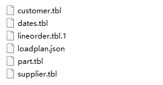

# 1 数据准备

## 1.1 配置数据导入计划

以导入ssb1数据为例，新建一个名为“loadplan.json”的文件，文件中的内容如下：

```
 {

"schema": "ssb1",

 "sqls": [

  "CREATE TABLE CUSTOMER(C_CUSTKEY INTEGER PRIMARY KEY,C_NAME VARCHAR(25),C_ADDRESS VARCHAR(25),C_CITY VARCHAR(10),C_NATION VARCHAR(15),C_REGION VARCHAR(12),C_PHONE VARCHAR(15),C_MKTSEGMENT VARCHAR(10))",

  "CREATE TABLE DATES(D_DATEKEY INTEGER PRIMARY KEY,D_DATE VARCHAR(18),D_DAYOFWEEK VARCHAR(18),D_MONTH VARCHAR(9),D_YEAR INTEGER,D_YEARMONTHNUM INTEGER,D_YEARMONTH VARCHAR(7),D_DAYNUMINWEEK INTEGER,D_DAYNUMINMONTH INTEGER,D_DAYNUMINYEAR INTEGER,D_MONTHNUMINYEAR INTEGER,D_WEEKNUMINYEAR INTEGER,D_SELLINGSEASON VARCHAR(12),D_LASTDAYINWEEKFL INTEGER,D_LASTDAYINMONTHFL INTEGER,D_HOLIDAYFL INTEGER,D_WEEKDAYFL INTEGER)",

  "CREATE TABLE PART(P_PARTKEY INTEGER PRIMARY KEY,P_NAME VARCHAR(22) ,P_MFGR VARCHAR(6),P_CATEGORY VARCHAR(7),P_BRAND VARCHAR(9),P_COLOR VARCHAR(11),P_TYPE VARCHAR(25),P_SIZE TINYINT,P_CONTAINER VARCHAR(10))",

  "CREATE TABLE SUPPLIER(S_SUPPKEY INTEGER PRIMARY KEY,S_NAME VARCHAR(25),S_ADDRESS VARCHAR(25),S_CITY VARCHAR(10),S_NATION VARCHAR(15),S_REGION VARCHAR(12),S_PHONE VARCHAR(15))",

  "CREATE TABLE LINEORDER(LO_ORDERKEY INTEGER,LO_LINENUMBER TINYINT,LO_CUSTKEY INTEGER,LO_PARTKEY INTEGER,LO_SUPPKEY INTEGER,LO_ORDERDATE INTEGER,LO_ORDERPRIOTITY VARCHAR(15),LO_SHIPPRIOTITY TINYINT,LO_QUANTITY TINYINT,LO_EXTENDEDPRICE INTEGER,LO_ORDTOTALPRICE INTEGER,LO_DISCOUNT TINYINT,LO_REVENUE INTEGER,LO_SUPPLYCOST INTEGER,LO_TAX TINYINT,LO_COMMITDATE INTEGER,LO_SHIPMODE VARCHAR(10))", 

     "create index lo_discount_idx on LINEORDER(LO_DISCOUNT)", 

     "create index lo_quantity_idx on LINEORDER(LO_QUANTITY)"

 ],

 "loads": [

  {"table": "customer", "file": "customer.*", "delimiter": "|"},

  {"table": "dates", "file": "dates.*", "delimiter": "|"},

  {"table": "part", "file": "part.*", "delimiter": "|"},

  {"table": "supplier", "file": "supplier.*", "delimiter": "|"},

  {"table": "lineorder", "file": "lineorder.*", "delimiter": "|"}

 ]

}
```

注释：

"schema"：要插入数据的schema。

"sqls"：建表语句。如果需要建立索引，可在建表语句后插入建立索引语句。

Loads：需要加载的表。

## 1.2 创建目录

在windows_local\cloudwave_server\base目录下创建“uploads”目录，把需要导入的数据放在一个文件夹下，文件夹的名字为schmea的名字，此处以ssb1为例，把1.1中创建的导入计划“loadplan.json”放入ssb1目录，并把要导入的表的数据也放到ssb1中，如下图所示：

   

然后把ssb1目录放到uploads目录中即可。

## 1.3 导入数据

准备好数据和导入计划后，便可开始导入数据。

打开客户端连接工具dbeaver，连接需要导入数据的数据库，详细的连接方法可参见《翰云数据库快速使用手册》

连接完数据库后，进入SQL编辑器，创建一个名为ssb1的schema，创建完后执行如下命令：

```
loaddata ssb1;
```

注：ssb1是uploads下建的文件名字。

大约等待1分钟即可完成数据导入。

