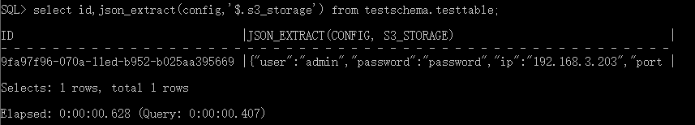
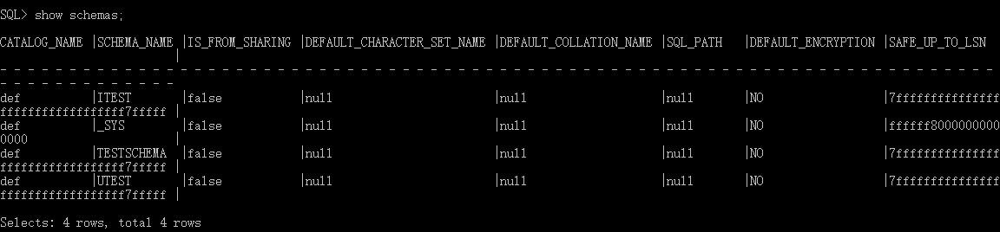
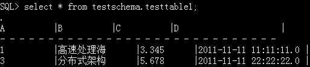
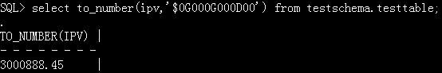
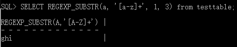

# 翰云数据库语法手册

## 1 数据类型

### 1.1 数值类型

翰云数据库支持的字段类型及其取值范围如下表所示：

| 类型名称       | 取值                                        |
| -------------- | :------------------------------------------ |
| INTEGER        | $-2^{31}$~ $2^{31}$-1                       |
| LONG           | -$2^{63}$ ~ $2^{63}$-1                      |
| AUTO_INCREMENT | 0 ~ $2^{63}$-1                              |
| NUMBER(P,S)    | -$10^{38}$ ~ $10^{38}$                      |
| FLOAT          | -$2^{128}$ ~ $2^{128}$                      |
| DOUBLE         | -$2^{1024}$ ~ $2^{1024}$                    |
| BOOLEAN        | TRUE 或 FALSE                               |
| CHAR(N)        | N字节文本数据，N<=4096，长度不足N后续补空格 |
| VARCHAR(N)     | 最长N字节文本数据，N<=132786                |
| BINARY[(N)]    | N字节二进制数据，N<=131072                  |
| VARBINARY[(N)] | 最长N字节二进制数据，N<=132786              |
| DATE           | YYYY-MM-DD                                  |
| TIMESTAMP      | YYYY-MM-DD HH:MM:SS.SSS                     |
| CLOB           | LOB类型，长文本数据类型                     |
| BLOB           | LOB类型，二进制数据                         |
| JSON           | JSON格式的字符串，最长132786字节            |

注：类型名称在命令行中不区分大小写，本手册在各示例中用小写，而在解释说明时使用大写。

#### 1.1.1 INTEGER

类型：4字节整型数，翰云数据库不支持INT缩写格式的书写，书写应为INTEGER。

范围：-2147483648到 2147483647。

【示例1】存取最小INTEGER型整数

```
create table testschema.testtable (testcolumn integer);
insert into testschema.testtable (testcolumn) values (-2147483648);
```

 

【示例2】存取最大INTEGER型整数

```
create table testschema.testtable (testcolumn integer);
insert into testschema.testtable (testcolumn) values (2147483647);` 
```

 

#### 1.1.2  LONG

类型：8字节整型数。

范围：-9223372036854775808 到 9223372036854775807。

【示例1】存取最小LONG型整数

```
create table testschema.testtable (testcolumn long);
insert into testschema.testtable (testcolumn) values (-9223372036854775808);
```

 

【示例2】存取最大LONG型整数

```
create table testschema.testtable (testcolumn long);
insert into testschema.testtable (testcolumn) values (9223372036854775807);
```

 

#### 1.1.3  AUTO_INCREMENT

类型：新记录插入表中时在此字段生成唯一的数字序号，初值为0，递增为1。同一个表中可同时用于多个字段。

范围：0~$2^{63}$-1

【示例1】使用自动增值字段

```
create table testschema.testtable (id integer primary key, id2 integer auto_increment);
insert into testschema.testtable (id) values (1);
insert into testschema.testtable (id) values (2);
insert into testschema.testtable (id) values (3);
```

 

【示例2】同一个表中允许两个以上字段为自动增值类型

```
create table testschema.testtable (id1 integer auto_increment, id2 integer auto_increment);
insert into testschema.testtable (id1, id2) values (null, null);
insert into testschema.testtable (id1, id2) values (null, null);
```

 

【示例3】表中主键设置为自动增值类型

```
create table testschema.testtable (id integer auto_increment primary key, ic integer);
insert into testschema.testtable values (1);
insert into testschema.testtable values (1);
```

 

注：如建下面的表

```
create table testschema.testtable(id auto_increment primary key)
```

这个表的创建毫无意义，翰云数据库不支持这样建表。

#### 1.1.4NUMBER

类型：固定精度和小数位数的数值数据类型。

范围：NUMBER(P, S)，P: 1~38，S: 0~127 （P:精度，S:刻度）。

有效位：从左边第一个不为0的数算起的位数，小数点和负号不计入有效位数。

下面分情况列举：

1）当P > S时

【示例1】P > S，S > 0

小数点前最多插入P - S位数字，小数点后四舍五入保留S位，总有效位数小于等于P。

```
create table testschema.testtable (testcolumn number (3,2));
insert into testschema.testtable (testcolumn) values (8.889);
```

 

【示例2】P > S，S = 0

小数点前四舍五入保留P位数字，小数点后0位，总有效位数等于P。

```
create table testschema.testtable (testcolumn number (3,0));
insert into testschema.testtable (testcolumn) values (888.889);
```

 

 2）当P < S时

1. 只能用来存放大于0小于1的小数；
2.  小数点后紧接着的0的数目至少有S - P位，不然无法正常插入；
3. P用来指定小数点之后的最大有效数字位数，从左边第一个不为0的数算起的位数；
4. s是用来限制小数点后的数字位数（当然也就包括小数点后紧接的0）。

【示例3】0 < P < S

```
create table testschema.testtable (testcolumn number(2,3));
insert into testschema.testtable (testcolumn) values (0.002);
```

3）当P = S时

【示例4】0 < P = S

```
create table testschema.testtable (testcolumn number (2,2));
insert into testschema.testtable (testcolumn) values (0.02);
```

 

4）当P、S省略时

【示例5】P、S都不指定

```
create table testschema.testtable (testcolumn number);
insert into testschema.testtable (testcolumn) values (123456789);
```

 

#### 1.1.5  FLOAT

类型：单精度浮点数，4字节存储（符号占1bit，指数占8bits，尾数占23bits）。

范围：大约在 -3.4E38 ~ 3.4E+38 之间。

【示例1】科学计数法表示单精度浮点数

小数点前超7位数字时开始用科学计数法表示。

```
create table testschema.testtable (testcolumn float);
insert into testschema.testtable (testcolumn) values (12345678);
```

 

【示例2】有效数据位数大于7时

小数点后最多保留7位小数，小数点后第8位四舍五入。

```
create table testschema.testtable (testcolumn float);
insert into testschema.testtable (testcolumn) values (1.12345678);
```

 

【示例3】

```
create table testschema.testtable (testcolumn float);
insert into testschema.testtable (testcolumn) values (12345678.987654321);
```

 

1.1.6 DOUBLE

类型：双精度浮点数，8字节存储（符号占1bit，指数占11bits，尾数占52bits）。

范围：大约在 -1.79E308 ~ 1.79E+308之间。

【示例1】科学计数法表示双精度浮点数

小数点后最多保留16位有效数字，小数点后第17位四舍五入。

```
create table testschema.testtable (testcolumn double);
insert into testschema.testtable (testcolumn) values (1.123456789123456789);
```

 

1.1.7 BOOLEAN

类型：布尔型（不支持BOOL缩写格式）。

范围：FALSE代表假，TRUE代表真，NULL表示空值。

【示例1】

```
create table testschema.testtable (testcolumn boolean);
insert into testschema.testtable (testcolumn) values (false);
insert into testschema.testtable (testcolumn) values (true);
insert into testschema.testtable (testcolumn) values (null);
```

 

### 1.2 字符类型

| 类型名称   | 最大长度              |
| ---------- | --------------------- |
| CHAR(N)    | 4096                  |
| VARCHAR(N) | 131072                |
| CLOB       | LOB类型，存储字符数据 |

#### 1.2.1 CHAR

表达：CHAR[(N)]

类型：字符型（注意：一个中文字占1个字符)。

范围：实际存储过程中固定长度的字符串，不足默认用空格补齐；翰云数据库支持的最大长度4096字符，即N不可大于4096。如定义N大于4096，则报错。

【示例1】使用CHAR类型字段

```
create table testschema.testtable (testcolumn char (4096));
insert into testschema.testtable (testcolumn) values ('北京翰云时代！');
```

 

注：如果在数据定义或变量声明语句中没有指定N，默认N为1。

#### 1.2.2 VARCHAR

表达：VARCHAR[(N)]。

类型：字符型（注意：一个中文字占1个字符）。

范围：实际存储过程中可变长度的字符串，参数代表最大字符长度；翰云数据库支持的最大长度131072字符，即N不可大于131072。如定义N大于131072，则报错。

【示例1】使用VARCHAR类型字段

```
create table testschema.testtable (testcolumn varchar (131072));
insert into testschema.testtable (testcolumn) values ('北京翰云时代数据技术有限公司');
```

 

### 1.3  二进制类型

#### 1.3.1 BINARY

表达：BINARY[(N)]。

类型：存储固定长度的 N字节二进制数据。

范围：N必须在1~ 131072；存储空间大小为N+4字节。

#### 1.3.2 VARBINARY

表达：VARBINARY[(N)]。

类型：存储N 字节变长二进制数据。

范围：N必须在1~ 131072；存储空间大小为实际输入数据长度+4字节，而不是N或N+4字节，实际输入的数据长度可能为0字节。

注：如果在数据定义或变量声明语句中没有指定N，默认N为1。

### 1.4 日期时间类型

翰云支持如下的日期时间类型：

| 类型名称  | 最小值                  | 最大值                  | 格式                   |
| --------- | ----------------------- | ----------------------- | ---------------------- |
| DATE      | 0001-01-01              | 9999-12-31              | yyyy-mm-dd             |
| TIMESTAMP | 0001-01-01 00:00:00.000 | 9999-12-31 23:59:59.999 | yyyy-mm-dd hh:mm:ss.ms |

#### 1.4.1  DATE

类型：日期型。

范围：'0001-01-01' 到 '9999-12-31'。

【示例1】日期字段使用最大及最小值

```
create table testschema.testtable (testdate date);
insert into testschema.testtable (testdate) values ('0001-01-01');
insert into testschema.testtable (testdate) values ('9999-12-31');
```

 

【示例2】日期字段使用不存在的日期

```
create table testschema.testtable (testdate date);
insert into testschema.testtable (testdate) values ('2014-09-31');
```

 

注：因为9月没有31号自动转换为10月1号。

【示例3】日期字段使用空值

```
create table testschema.testtable (testdate date);
insert into testschema.testtable (testdate) values (null);
```

 

注：允许输入空值。

#### 1.4.2 TIMESTAMP

类型：时间戳。

范围：0001-01-01 00:00:00.00到9999-12-31 23:59:59.999。

【示例1】时间戳字段使用最大及最小值

```
create table testschema.testtable (testdate timestamp);
insert into testschema.testtable (testdate) values ('0001-01-01 00:00:00.000');
insert into testschema.testtable (testdate) values ('9999-12-31 23:59:59.999');
```

 

### 1.5  LOB类型

​       LOB数据不能象其它数据类型一样直接插入（insert），插入前必须先插入一个空的LOB对象，CLOB类型的空对象为empty_clob()，BLOB类型的空对象为empty_blob。之后通过select命令查询得到先前的插入记录并锁定，继而将空对象修改为所要插入的LOB对象。翰云数据库的LOB类型对象不存在文件系统中而是存储在数据库的内部。下面分别来介绍CLOB类型的使用和BLOB类型的使用。

#### 1.5.1  CLOB

类型：长文本对象类型。

范围：最长可到4GB。

【示例1】通过界面工具普通插入

```
create table testschema.testtable (testcolumn clob, testline char (5));
insert into testschema.testtable values (null, 'abc');
update testschema.testtable set testcolumn = 'itest' where testline = 'abc'; 
```

【示例2】通过JDBC程序插入，只能用CloudPreparedStatement对象

(1) 应用程序通过JDBC连接到翰云数据库。

(2) 使用翰云数据库CloudPreparedStatement对象向数据库中插入数据的方法有以下几种。

```
setClob(parameterIndex, reader)
setClob(parameterIndex, reader, length)
setClob(parameterIndex, x)
ps.setCharacterStream(parameterIndex, reader)
setCharacterStream(parameterIndex, reader, length)
```

【示例3】通过JDBC程序读取CLOB类型的数据

(1) 通过ResultSet对象的getClob(columnIndex)方法获得clob对象。

(2) 通过loadClobAsString(Clob)方法转换clob为string。

程序如下：

```
public static string loadClobAsString(Clob clob)
throws Exception {
Reader reader = clob.getCharacterStream();
StringBuilder builder = new StringBuilder();
char[] buffer = new char[4096];
int readLength = reader.read(buffer);
while (readLength >= 0) {
builder.append(buffer, 0, readLength);
readLength = reader.read(buffer);
}
reader.close();
return builder.toString();
}
```

#### 1.5.2 BLOB

类型：二进制大对象。

范围：可以存储超大容量数据。

【示例1】

```
create table testschema.testtable (testcolumn blob, testline integer);
insert into testschema.testtable values (null, 123);
update testschema.testtable set testcolumn = '二进制大对象使用' where testline=123;
```

 

注：Blob<25>为指向Blob字段的指针。

【示例2】通过JDBC程序插入，只能用CloudPreparedStatement对象

(1) 应用程序通过JDBC连接到翰云数据库。

(2) 使用翰云数据库的CloudPreparedStatement对象向数据库中插入数据的方法有以下几种。

```
setBinaryStream(parameterIndex, x, length)
setBinaryStream(parameterIndex, x)
setBytes(parameterIndex, x)
setBlob(blob)
```

【示例3】通过JDBC程序读取BLOB类型的数据

(1) 通过ResultSet对象的getBlob(columnIndex)方法获得blob对象。

(2) blob.getBinaryStream()得到二进制流，is.read(byte[] readBytes)读取到数组中，new String(readBytes)再转换成string。

### 1.6  JSON类型

翰云数据库支持JSON数据类型，JSON值可以是数字、字符串、数组、对象等。用户可根据需要插入JSON对象和JSON数组，并且支持在JSON字段上建索引。目前支持的函数：json_extract。

【示例1】 插入json对象

```
create table testschema.testtable(a int ,b json);
insert into testschema.testtable values(1,'{"k1": "value", "k2": 10}');
select * from testschema.testtable;
```

 

【示例2】 插入JSON数组

```
create table testschema.testtable (id int, dept varchar(255),json_value json,primary key(id));
insert into testschema.testtable values(1, 'a1', '{"deptName":"a1","deptId":"1","deptLeaderId":"3"}');
insert into testschema.testtable values(2, 'a2', '{"deptName":"a2","deptId":"2","deptLeaderId":"4"}');
insert into testschema.testtable values(3, 'a3', '{"deptName":"a3","deptId":"3","deptLeaderId":"5"}');
select * from testschema.testtable;
```

 

【示例3】json_extract函数

```
create table testschema.testtable (id int ,dept varchar(255),json_value json,primary key(id));
insert into testschema.testtable values(1,'部门1','{"deptName":"部门1","deptId":"1","deptLeaderId":"3"}');
select id,json_extract(json_value,'$.deptName') from testschema.testtable;
```

 

【示例4】json递归示例

```
create table testschema.testtable (id varchar(255) primary key,status varchar(255),message varchar(255),config json);
insert into testschema.testtable values(
'9fa97f96-070a-11ed-b952-b025aa395669',
'is_idle',
'free',
'{"ftp":
{"user": "test",
"password": "test",
"ip": "192.168.3.2",
 "port": "21",
 "path": "/"
 },
 "s3_storage":{
 "user": "admin",
 "password": "password",
 "ip": "192.168.3.203",
 "port": "9000",
 "bucket": "etl",
 "path": "60_13_207_2_21"
 },
 "database": {
 "user": "admin",
 "password": "admin",
 "ip": "192.168.3.203",
 "port": "1978"
 },
 "app": {
 "time_loop": "10000"
 }
}'
);
select id,json_extract(config,'$.s3_storage') from testschema.testtable;
```

 

## 2 SQL语言基础

### 2.1 SQL语言分类

​       翰云数据库SQL语言分为两个部分：数据查询语言（DQL）、 数据操作语言 (DML) 、数据定义语言 (DDL)和事务控制语言（TCL）。

- 数据查询语言（DQL）

用于检索数据库中的数据，主要是SELECT语句。

- 数据操作语言 (DML)

用于改变数据库中的数据,主要包括insert、update和delete这3条语句。

insert into——将数据插入到数据库中

update——更新数据库中已经存在的数据

delete——删除数据库中已经存在的数据

- 数据定义语言 (DDL)

用于建立、修改和删除数据库对象，包括表、视图、索引等。

create database——创建数据库

alter database——修改数据库

create table——创建数据库表

alter table——改变数据库表结构

drop table——删除数据库表

create index——创建索引

drop index——删除索引

- 事务控制语言（TCL）

用于维护数据的一致性，包括commit、rollbac。

commit——用于提交对数据库的更改

rollback——用于取消对数据库的更改

### 2.2  SQL编写规则

   翰云数据库中SQL语言的编写要遵循以下几个基本的规则：

1. SQL关键字不区分大小写，既可以使用大写格式，也可以使用小写格式，或者大小写格式混用。
2. 对象名和字段名不区分大小写，它们既可以使用大写格式，也可以使用小写格式，或者大小写格式混用。
3. 字符值区分大小写，当插入字符时，必须给出正确的大小写数据，否则不能得出正确查询结果。
4. 在SQL Plus环境下编写SQL语句时，如果语句较短，可以将语句放在一行上显示，如果语句较长时，可以将语句分行显示，当SQL语句输入完成，要以分号作为结束符。

### 2.3 数据库保留字

   翰云数据库保留字请参见附录数据库保留字表，数据库保留字具有以下几个特性：

1. 翰云数据库保留字：翰云数据库内置的数据类型或函数名如GROUP，对于标准SQL来说它们中的大多数禁止用于字段名或表名。
2. 翰云数据库的关键字用作表名和字段名时，需要用反引号`标识，不建议用户使用关键字做为表列的标识符，使用不当可能会与翰云的内置函数等发生冲突，进而引发意想不到的错误。

【示例1】表名

```
create table testschema.`usage` (id integer);
insert into testschema.`usage` values(1);
```

 

【示例2】字段名

```
create table testschema.testtable(`usage` integer);
insert into testschema.testtable values(1);
```

 

### 2.4 comment注释

​       翰云库中支持comment（注释），注释分为两种，一种是表注释，一种是字段注释。对表或表字段增加或修改注释都支持。

【示例1】添加表注释

```
create table testschema.testtable(idcard integer, name varchar(10), sex boolean, age integer);
comment on table testschema.testtable is '个人信息'; 
```

【示例2】添加表字段注释

```
create table testschema.testtable(idcard integer, name varchar(10), sex boolean, age integer);
comment on column testtable.idcard is '身份证号';
comment on column testtable.name is '姓名';
comment on column testtable.sex is '性别';
comment on column testtable.age is '年龄';
```

【示例3】查询表注释

```
create table testschema.testtable(idcard integer, name varchar(10), sex boolean, age integer);
comment on table testschema.testtable is '个人信息';
```

UDBA目前支持通过JDBC的方式获取表注释信息，程序如下：

```
DatabaseMetaData metaData = conn.getMetaData();
ResultSet rs = metaData.getTables(null, "itest", "testtable", new String[]{"TABLE"});
while(rs.next()) {
String table_comment = rs.getString("REMARKS");
System.out.println("表注释信息：”+ table_comment);
System.out.println();
}
```

【示例4】查询表字段注释

```
create table testschema.testtable(idcard integer, name varchar(10), sex boolean, age integer);
comment on column testtable.idcard is '身份证号';
comment on column testtable.name is '姓名';
comment on column testtable.sex is '性别';
comment on column testtable.age is '年龄';
```

UDBA目前支持通过JDBC的方式获取表注释信息，如下图。

```
DatabaseMetaData metaData = conn.getMetaData();
ResultSet rs = metaData.getTables(null, "itest", "testtable", new String[]{"TABLE"});
while(rs.next()) {
ResultSet r = metaData.getColumns(null, "itest", "testtable", "%");
System.out.printIn("table \t column \t type \t remark ");
while(r.next()) {
String tabname = r.getstring("TABLE_NAME");
String colname = r.getString("COLUMN_NAME").toUpperCase();
String dateType = r.getString("TYPE_NAME");
String remark = r.getString("REMARKS");
System.out.println(tabname + "\t" + colname + "\t" + dateType + "\t" + remark);
}
}
```

【示例5】修改表注释

```
create table testschema.testtable(idcard integer, name varchar(10), sex boolean, age integer);
comment on table testschema.testtable is '李四的个人信息';
```

【示例6】修改表字段注释

```
create table testschema.testtable(idcard integer, name varchar(10), sex boolean, age integer);
comment on column testtable.idcard is '李四的身份证号';
comment on column testtable.name is '李四的姓名';
comment on column testtable.sex is '李四的性别';
comment on column testtable.age is '李四的年龄';
```

### 2.5 检索数据

​       检索数据是最常进行的操作，该语句由多个子句组成，通过这些子句可以完成筛选和连接等各种数据操作，最终得到用户想要的查询结果。它的语法结构如下：

SELECT 字段名称 * FROM 表名称

注：SQL语句对大小写不敏感，SELECT等效于select。

1.1.1. 简单查询

简单查询就是只包括select子句和from子句的查询,如果要检索所有列，可以在select子句后面用星号（*）来实现。

以下示例1至示例6均使用下面程序段创建的库表及插入的数据。

```
create table testschema.testtable(testcolumn1 integer primary key, testcolumn2 varchar(20), testcolumn3 varchar(20), testcolumn4 number(12));
insert into testtable values(1, 'a1', 'b1', 1111);
insert into testtable values(2, 'a2', 'b2', 2222);
insert into testtable values(3, 'a3', 'b3', 3333);
insert into testtable values(4, 'a3', 'b4', 4444);
insert into testtable values(5, 'a3', 'b5', 5555);
```

【示例1】检索所有列

 

注：上面的select语句如果在system模式下执行，则需要在testtable前面加上testschema.，即testschema.testtable，或者在执行查询语句前，执行use schema testschema，执行完这个命令后，查询时不用加testschema.。

【示例2】检索指定列

 

【示例3】带表达式的select子句

 

【示例4】为列指定别名

 

【示例5】也可以不使用关键字直接在字段名后指定列的别名

 

【示例6】显示不重复记录

​       在默认情况下，结果集中包含所有符合查询条件的数据行，这样结果集中就会有很多重复数据，这就需要去除重复记录，在select语句中，可以使用distinct关键字来去除重复记录。该关键字用在select子句的列的前面。

 

#### 2.5.2 筛选查询

​       在select语句中使用where子句可以实现对数据行的筛选操作，只有满足where子句中的判断条件的行才会显示在结果集中。其语法格式如下：

select 字段名 from 表名 where 条件

- 比较筛选

比较运算符主要包括：＝、<>、>、<、<=、>=

【示例1】查询testcolumn4小于3000的数据记录

```
create table testschema.testtable(testcolumn1 integer primary key, testcolumn2 varchar(20), testcolumn3 varchar(20), testcolumn4 number(12));
insert into testtable values(1, 'a1', 'b1', 1111);
insert into testtable values(2, 'a2', 'b2', 2222);
insert into testtable values(3, 'a3', 'b3', 3333);
insert into testtable values(4, 'a4', 'b4', 4444);
insert into testtable values(5, 'a5', 'b5', 5555);
```

 

- 使用特殊关键字进行筛选

翰云数据库支持in、between和isnull等关键字来筛选匹配的数据。

1、in关键字

in关键字用来指定列表搜索条件，in关键字的格式是in（目标值1，目标值2，目标值3，…）

【示例2】在testtable表中使用in关键字查询testcolumn3为b1,b3,b5中的任意一个的记录

```
create table testschema.testtable(testcolumn1 integer primary key, testcolumn2 varchar(20), testcolumn3 varchar(20), testcolumn4 number(12));
insert into testtable values(1, 'a1', 'b1', 1111);
insert into testtable values(2, 'a2', 'b2', 2222);
insert into testtable values(3, 'a3', 'b3', 3333);
insert into testtable values(4, 'a4', 'b4', 4444);
insert into testtable values(5, 'a5', 'b5', 5555);
```

 

2、between关键字

​        between关键字用来查询某一列是否满足两个给定值之间的记录，通常使用between…and和not…between…and来指定范围条件。

【示例3】查找testtable表中testcolumn4在3000到5000之间的记录

```
create table testschema.testtable(testcolumn1 integer primary key, testcolumn2 varchar(20), testcolumn3 varchar(20), testcolumn4 number(12));
insert into testtable values(1, 'a1', 'b1', 1111);
insert into testtable values(2, 'a2', 'b2', 2222);
insert into testtable values(3, 'a3', 'b3', 3333);
insert into testtable values(4, 'a3', 'b4', 4444);
insert into testtable values(5, 'a3', 'b5', 5555);
```

 

3、is null关键字

is null关键字用来检测特殊值之间的等价性。

【示例4】查找testtable表中testcolumn2为空的记录

```
create table testschema.testtable(testcolumn1 integer primary key, testcolumn2 varchar(20), testcolumn3 varchar(20), testcolumn4 number(12));
insert into testtable values(1, 'a1', 'b1', 1111);
insert into testtable values(2, 'a2', 'b2', 2222);
insert into testtable values(3, 'a3', 'b3', 3333);
insert into testtable values(4, 'a3', 'b4', 4444);
insert into testtable values(5, 'a3', 'b5', 5555);
insert into testtable values(6, null, 'abc', 666);
insert into testtable values(7, null, 'bcd', 777);
select * from testtable where testcolumn2 is null;
```

 

- 逻辑筛选

​      逻辑筛选是指在where子句中使用逻辑运算符and、or和not进行数据筛选操作，这些逻辑运算符可以把多个筛选条件组合起来。

1） and 表示两个逻辑表达式之间“逻辑与”的关系

【示例1】在testschema模式下，查找testtable表中testcolumnw4在2000到3000之间的记录

```
create table testschema.testtable(testcolumn1 integer primary key, testcolumn2 varchar(20), testcolumn3 varchar(20), testcolumn4 number(12));
insert into testtable values(1, 'a1', 'b1', 1111);
insert into testtable values(2, 'a2', 'b2', 2222);
insert into testtable values(3, 'a3', 'b3', 3333);
insert into testtable values(4, 'a3', 'b4', 4444);
insert into testtable values(5, 'a3', 'b5', 5555);
insert into testtable values(6, null, 'abc', 666);
insert into testtable values(7, null, 'bcd', 777);
Select * from testtable where testcolumn4>2000 and testcolumn4<=3000;
```

 

2)or逻辑运算符表示两个逻辑表达式之间“逻辑或”的关系，两个表达式之间有一个成立，则这个表达式的值就为true。

【示例2】在testschema模式下,查找testtable表中查找testcolumn4小于2000或大于3000的所有记录

```
create table testschema.testtable(testcolumn1 integer primary key, testcolumn2 varchar(20), testcolumn3 varchar(20), testcolumn4 number(12));
insert into testtable values(1, 'a1', 'b1', 1111);
insert into testtable values(2, 'a2', 'b2', 2222);
insert into testtable values(3, 'a3', 'b3', 3333);
insert into testtable values(4, 'a3', 'b4', 4444);
insert into testtable values(5, 'a3', 'b5', 5555);
insert into testtable values(6, null, 'abc', 666);
insert into testtable values(7, null, 'bcd', 777);
select * from testtable where testcolumn4<2000 or testcolumn4>3000;
```

 

 3)and、or和not逻辑运算符的运算优先级

逻辑运算符的运算优先级按not最高，and次之，or最低。翰云支持使用括号提升运算优先级。如下：

```
select * from TABLE t1 where 条件1 and not 条件2
```

*--* *等价于*

```
select * from TABLE t1 where 条件1  and ( not 条件2 )
select * from TABLE t1 where 条件1  and 条件2  or 条件3
```

*--* *等价于*

```
select * from TABLE t1 where (条件1  and 条件2 )  or 条件3
select * from TABLE t1 where 条件1  and 条件2  or 条件3  and 条件4
```

*--* *等价于*

```
select * from TABLE T1 where (条件1  and 条件2 )  or  ( 条件3  and 条件4 )
```

#### 2.5.3 分组查询

​       数据分组的目的是用来汇总数据或为整个分组显示单行的汇总信息，通常在查询结果集中使用group by子句对记录进行分组。语法格式如下：

select 字段名 from 表名 where 条件 group by 字段名

【示例1】在testschema模式下，查找testtable1表中，通过分组的方式计算每个分组中testcolumn3的平均值

```
create table testtable(testcolumn1 integer, testcolumn2 varchar(20), testcolumn3 number(6,2));
insert into testtable values(1001, 'aa', 1000);
insert into testtable values(1001, 'bb', 2000);
insert into testtable values(1002, 'cc', 2000);
insert into testtable values(1002, 'dd’', 3000);
select testcolumn1, avg(testcolumn3) as tc from testtable group by testcolumn1;
```

 

​         having子句是对分组之后的数据进行过滤，所以使用having时必须用group by先分组。having子句的语法和where子句的语法相类型，不同的是having子句中可以包含聚合函数，而where子句不能包含聚合函数。聚合函数有：count,avg,sum等。

【示例2】在testschema模式下，查找testtable1表中，testcolumn3的平均值大于2000的记录

```
create table testtable(testcolumn1 integer, testcolumn2 varchar(20), testcolumn3 number(6,2));
insert into testtable values(1001, 'aa', 1000);
insert into testtable values(1001, 'bb', 2000);
insert into testtable values(1002, 'cc', 2000);
insert into testtable values(1002, 'dd'', 3000);
select testcolumn1,avg(testcolumn3)as tc from testtable group by testcolumn1 having avg(testcolumn3)>2000;
```

 

#### 2.5.4 排序查询

​       在检索数据时，如果把数据从数据库中直接读取出来，这时查询结果将按照默认顺序排列，但往往这种默认顺序在数据量较大时，查看起来非常不方便，因此需要对检索的结果进行排序。在select语句中可以使用order by子句对检索结果进行排序。

关键字asc表示按升序排列，desc表示按降序排列。默认是按照升序排序。

【示例1】

```
create table testschema.testtable(testcolumn1 integer primary key, testcolumn2 varchar(20), testcolumn3 varchar(20),testcolumn4 number(12));
insert into testtable values(1, 'a1', 'b1', 1111);
insert into testtable values(2, 'a2', 'b2', 2222);
insert into testtable values(3, 'a3', 'b3', 3333);
insert into testtable values(4, 'a3', 'b4', 4444);
insert into testtable values(5, 'a3', 'b5', 5555);
insert into testtable values(6, null, 'abc', 666);
insert into testtable values(7, null, 'bcd', 777);
select * from testtable order by testcolumn4;
```

 

#### 2.5.5 多表关联查询

翰云数据库支持的多表关联查询有内连接、外连接。

- 内连接

​        内连接是一种常用的多表关联查询方式，一般使用关键字inner join来实现，在使用内连接查询多表时，必须在from子句之后定义一个on子句，该子句用来指定两个表实现内连接的“连接条件”。

内连接的语法格式如下：

select 字段列表 from 表1 inner join 表2 on 条件表达式

- 外连接

​        外连接扩展了内连接的结果集，除了返回所有匹配的行外，还会返回一部分或全部不匹配的行，这主要取决于外连接的种类。外连接通常有以下3种：

左外连接： left outer join或left join

右外连接：right outer join或right join

完全外连接：full outer join或full join

【示例1】 inner join内连接查询

```
create table testschema.testtable1 (a integer primary key, b varchar (10), c number (3, 0));
create table testschema.testtable2 (a2 integer primary key, b2 varchar (10));
insert into testschema.testtable1 values(1, '数学', 95.5);
insert into testschema.testtable1 values(2, '语文', 90);
insert into testschema.testtable1 values(3, '英语', 80);
insert into testschema.testtable2 values(1, '张三');
insert into testschema.testtable2 values(2, '李四');
insert into testschema.testtable2 values(4, '王五');
select testtable1.*,testtable2.* from testtable1 inner join testtable2 on (testtable1.a=testtable2.a2);
```

 

【示例2】 左外连接查询

left outer join，左向外联接的结果集包括 left outer子句中指定的左表的所有行，而不仅仅是联接列所匹配的行。如果左表的某行在右表中没有匹配行，则在相关联的结果集行中右表的所有选择列表列均为空值。

```
create table testschema.testtable1 (id integer primary key, ic varchar (20));
insert into testschema.testtable1 values (1, 'abc');
insert into testschema.testtable1 values (2, 'cde');
create table testschema.testtable2 (id integer primary key, ic char (10));
insert into testschema.testtable2 values (1, 'efg');
insert into testschema.testtable2 values (2, 'opt');
insert into testschema.testtable2 values (3, 'ghi');
select * from testtable2 left outer join testtable1 on testtable2.id=testtable1.id;
```

 

【示例3】 右外连接查询

right outer join，右向外联接是左向外联接的反向联接.将返回右表的所有行。如果右表的某行在左表中没有匹配行，则将为左表返回空值。

```
drop table testtable1;
create table testschema.testtable1 (id integer primary key, ic varchar (20));
insert into testschema.testtable1 values (1, 'abc');
insert into testschema.testtable1 values (2, 'cde');
drop table testtable2;
create table testschema.testtable2 (id integer primary key, ic char (10));
insert into testschema.testtable2 values (1, 'efg');
insert into testschema.testtable2 values (2, 'opt');
insert into testschema.testtable2 values (3, 'ghi');
select * from testtable2 right outer join testtable1 on testtable2.id=testtable1.id;
```

 

【示例4】 全外连接查询

full outer join，完整外部联接返回左表和右表中的所有行。当某行在另一个表中没有匹配行时，则另一个表的选择列表列包含空值。如果表之间有匹配行，则整个结果集行包含基表的数据值。

```
create table testschema.testtable1 (id integer primary key, ic varchar (20));
insert into testschema.testtable1 values (1, 'abc');
insert into testschema.testtable1 values (2, 'cde');
create table testschema.testtable2 (id integer primary key, ic char (10));
insert into testschema.testtable2 values (1, 'efg');
insert into testschema.testtable2 values (2, 'opt');
insert into testschema.testtable2 values (3, 'ghi');
select * from testtable2 full outer join testtable1 on testtable2.id=testtable1.id;
```

 

#### 2.5.6 模糊查询

​        like关键字：在where子句中使用like关键字查询数据的方式称为字符串模式匹配或字符串模糊查询。like关键字需要使用通配符在字符串中查找指定的模式。

常用的通配符：

“_” 下划线，它代表任意一个字符。

“%”百分号，它代表0个或多个字符。

例如：“a%”表示以a开头的任意长度的字符串，“%a%”表示包含字母a的任意长度的字符串，“_bcd”表示4个字符长度且后面3个字符是bcd的字符串，”ab_d”表示4个字符长度且倒数第二个字符是任意字符。

翰云数据库支持通配符%的前模糊查询like '%dddd'，后模糊查询like 'dddd%'，和全模糊查询like '%dddd%'。

翰云数据库支持通配符_放在前面“_bcd”和中间”ab_d”和后面的”abc_”的模糊查询。

注：模糊查询的字段类型只能是字符型。

注：当字符串中存在特殊字符_和%时，like模糊查询会默认_和%为通配符，只有通过escape关键字对_和%进行转义后，like才视其为普通字符，语法格式：like ‘wang\__’ escape ‘\’;like ‘wang\%%’ escape ‘\’;like ‘wang\_%’ escape ‘\’;like ‘wang\%_’ escape ‘\’。

语法：select col_name from schema.table where col_name like condition；

下面的程序段用于接下来的示例1至示例3。

```
create table testschema.testtable (a char (12), b varchar (12), c clob);
insert into testschema.testtable values('beijing', 'beijing', '北京翰云时代数据技术有限公司');
insert into testschema.testtable values('nanjing', 'nanjing', '南京航天航空大学');
```

【示例1】%后模糊查询

 

【示例2】%前模糊查询

 

【示例3】%全模糊查询

 

【示例4】_ 模糊查询

```
create table testschema.testtable (a varchar (12), b varchar (12));
insert into testschema.testtable values('abcd', 'abcd');
select * from testschema.testtable where a like '_bcd';
select * from testschema.testtable where a like 'ab_d';
select * from testschema.testtable where a like 'abc_';
```

以上三个select语句均可检索出插入的一条数据。

### 2.6 操作数据库

#### 2.6.1插入数据

​       插入数据就是将数据记录添加到已经存在的数据表中，翰云数据库通过INSERT语句来实现插入数据记录。该语句既可以实现向数据表中一次插入一条记录，也可以使用SELECT子句将查询结果集批量插入数据表。

语法格式：insert into 表名称 values（值1,值2,…）

也可以指定所要插入数据的列：

insert into 表名称（列1,列2,…）values(值1,值2,…)

insert into A表 select column1,column2 from 表B，表A和表B的结构要求相同。

【示例1】在testschema模式下向testtable1表中插入两条记录

```
create table testschema.testtable (column1 integer, column2 varchar(20));
insert into testschema.testtable values(1001, 'john');
insert into testschema.testtable values(1002, 'jack');
create table testschema.testtable1(column1 integer, column2 varchar(20));
insert into testschema.testtable1 select column1, column2 from testschema.testtable;
```

 

#### 2.6.2 更新数据

如果表中的数据不正确或不符合需求，可以通过update语句来实现修改表中的数据。

语法格式：update 表名称 set 字段名称 ＝新值 where 字段名称＝某值

update语句一定要带where条件语句，必要时可加where 1 = 1;

【示例1】在testschema模式下更新testtable表中testcolumn2中为null的记录

```
create table testschema.testtable(testcolumn1 integer primary key, testcolumn2 varchar(20), testcolumn3 varchar(20), testcolumn4 number(12));
insert into testschema.testtable values(1, 'a1', 'b1', 1111);
insert into testschema.testtable values(2, null, 'b2', 2222);
insert into testschema.testtable values(3, null, 'b3', 3333);
select * from testschema.testtable where testcolumn2 is null;
```

 

更新testcolumn2为null的值：

```
update testschema.testtable set testcolumn2 = 'test' where testcolumn2=null;
```

 

【示例2】使用where 1=1更新所有记录中的字段

```
create table testschema.testtable(id integer);
insert into testschema.testtable values(2);
insert into testschema.testtable values(3);
update testschema.testtable set id = 1 where 1 = 1;
```

 

#### 2.6.3 删除数据

翰云数据库删除记录可以使用delete语句和turncate语句。

- delete语句

delete语句可用来删除数据库中的所有记录和指定范围的记录。

语法格式：delete from 表名称 where 字段名称 ＝ 值

delete语句后面的where条件不可省略，必要时可填写where 1 = 1。

【示例1】在testschema模式下删除testtable表中testcolumn1中大于1的记录

```
create table testschema.testtable(testcolumn1 integer primary key, testcolumn2 varchar(20), testcolumn3 varchar(20), testcolumn4 number(12));
insert into testschema.testtable values(1, 'a1', 'b1', 1111);
insert into testschema.testtable values(2, 'a2', 'b2', 2222);
insert into testschema.testtable values(3, 'a3', 'b3', 3333);
insert into testschema.testtable values(4, 'a4', 'b4', 4444);
```

 

删除testcolumn1 > 1的记录：

```
delete from testschema.testtable where testcolumn1 > 1;
```

 

注：delete语句删除数据后，没执行commit之前，可产生回滚记录，所以可通过rollback语句来撤销。

rollback后查询记录：

 

 

【示例2】使用where 1=1删除所有数据

```
create table testschema.testtable(id integer);
insert into testschema.testtable values(2);
insert into testschema.testtable values(3);
delete from testschema.testtable where 1 = 1;
```

 

- truncate语句

truncate语句可以用来删除表中所有数据。它和delete区别在于：truncate删除数据不会产生回滚记录，删除数据速度会比delete快，但是执行truncate后数据就无法用rollback来恢复。

语法格式：truncate table 表名称。

【示例1】在testschema模式下，使用truncate删除testtable表中记录

```
create table testschema.testtable(testcolumn1 integer primary key, testcolumn2 varchar(20), testcolumn3 varchar(20), testcolumn4 number(12));
insert into testschema.testtable values(1, 'a1', 'b1', 1111);
insert into testschema.testtable values(2, 'a2', 'b2', 2222);
insert into testschema.testtable values(3, 'a3', 'b3', 3333);
insert into testschema.testtable values(4, 'a4', 'b4', 4444);
```

 

```
truncate table testschema.testtable;
```

 

## 3 常用对象创建

### 3.1  用户

#### 3.1.1创建用户

语法：create user username identified by password

权限：执行此操作，用户必须有全局create user 权限或system 数据库的使用权限。

                               

【解释】

username：账户名称，严格区分大小写，账户名只能由数字、字母、下划线组成，不允许以数字打头。

password：账户密码，严格区分大小写，密码只能由数字、字母、下划线和汉字组成，不允许以下划线打头。

【示例1】创建用户

 

【示例2】使用CPLUS工具连接数据库

 

注：CPLUS工具另有详细介绍。

【示例3】退出连接

 

#### 3.1.2 删除用户

语法：drop user username;

权限：删除数据库用户，执行此操作时用户要有system 数据库的使用权限。

【示例1】删除用户

 

#### 3.1.3 修改用户密码

- 修改当前登录用户自身密码

语法：alter user username identified by newpassword replace oldpassord

【解释】

username 为用户名，严格区分大小写。

newpassword 为新密码，区分大小写。

oldpassord 为旧密码，区分大小写。

【示例1】连接到CPLUS，用system用户登录，system用户密码默认CHANGEME

 

【示例2】修改密码为123456后登录

 

- system管理员修改普通用户密码时不需要提供初始密码

语法：alter user username identified by newpassword

【示例1】修改UTEST用户的密码，初始密码为utest

 

注：system用户的密码只能是system用户来更改，system用户可以更改所有用户的密码，更改普通用户的密码无须输入旧密码。普通用户只能更改自身的密码。

#### 3.1.4 用户授权

​       翰云数据库用户分为系统system用户和普通用户，系统用户可以新建、查看、删除普通用户、普通用户下的模式、模式下的表。系统system用户执行增、删、改操作需谨慎。

【示例1】system用户把A用户下所有表的SELECT权限授权给B用户

语法：grant select on A.* to B;

注意：只有system用户才能进行用户授权。

1）建用户shield

```
create user shield identified by shield;
create user itest identified by itest;
```

2）创建schema

```
create schema shield;
grant all on shield.* to shield;
create schema itest;
```

3）创建t1表，插入数据

```
create table shield.t1(a int, b varchar(20));
insert into shield.t1 values(1, 'aa');
insert into shield.t1 values(2, 'bb');
```

4）system用户授权

```
grant select on shield.* to itest;
```

5）登录itest用户，查询shield.ti表

```
select * from shield.t1;
```

 

【示例2】system用户把A用户下所有表的INSERT权限授权给B用户

语法：grant insert on A.* to B;

第一步 以system用户登录, grant insert on shield.* to itest;

第二步 以itest用户登录,执行对shield.t1表的插入操作。

```
insert into shield.t1 values(3, 'cc');
select * from shield.t1;
```

 

【示例3】system用户把A用户下所有表的UPDATE权限授权给B用户

第一步 以system用户登录，grant update on shield.* to itest;

第二步 以itest用户登录，执行对shield.t1表的更新操作。

```
update shield.t1 set a=10 where a=1;
```

 

【示例4】system用户把A用户下所有表的DELETE权限授权给B用户

第一步 以system用户登录，grant delete on shield.* to itest;

第二步 以itest用户登录，执行对sh.t1表的删除操作。

 

【示例5】system用户把A用户下所有表的所有权限授权给B用户

第一步 以system用户登录，grant all on shield.* to itest;

第二步 以itest用户登录，执行对shield.t1表的插入、更新、删除操作。

 

 

【示例6】system用户收回给B用户SELECT A模式下表的权限

```
revoke select on shield.* from itest;
```

 

【示例7】system用户收回给B用户INSERT A模式下表的权限

```
revoke insert on shield.* from itest;
```

 

【示例8】system用户收回给B用户UPDATE A模式下表的权限

```
revoke update on shield.* from itest;
```

 

【示例9】system用户收回给B用户DELETE A模式下表的权限

```
 revoke delete on shield.* from itest;
```

 

【示例10】system用户A收回给授权B用户的select、insert、update、delete权限

```
revoke all on shield.* from itest;
```

 

### 3.2 模式

#### 3.2.1 创建模式

​       每个用户可以创建多个模式，一个模式中的对象如表、视图可被多个用户使用，系统为每个用户自动建立一个与用户名同名的模式作为默认模式，用户可以根据需要建立其它模式。

​        在一个模式内部不可以直接访问其他模式的数据库对象，即使在具有访问权限的情况下，也需要指定模式名称才可以访问其他模式的数据库对象。


语法 ：create schema <模式名> 

grant all on 模式名.* to用户名

权限: 只有系统用户system可以删除不需要的模式，用户A也没有权限删除其下的模式。

注：如果在对表进行操作时，不想指定模式，需要执行use schema 模式名，否则操作表时都需在表名前指定模式。

【示例1】在utest用户下创建模式utest

 

#### 3.2.2 删除模式

在翰云数据库中，用户可以删除不需要的模式。

语法：drop schema <模式名>;

权限：只有系统用户system可以删除不需要的模式，用户A也没有权限删除其下的模式。

【示例1】

 

#### 3.2.3 显示模式

在翰云数据库中，可以显示模式状况。

语法：show schemas;



### 3.3 数据库表

#### 3.3.1 创建表

语法：create table 模式名.表名称(字段名称1 数据类型，字段名称2 数据类型，字段名称3 数据类型,...)

权限：普通用户在其拥有的模式下创建指定格式的表，系统用户可以指定模式创建表。


【示例1】  system用户在testschema模式下创建表testtable

```
create table testtable (testcolumn1 number (5), testcolumn2 char(10), testcolumn3 varchar(20));
```

表成功创建后，通过DESC命令查看表的描述，示例如下：

```
desc table testable;
```


【示例2】

create table 新表名 as select * from 原表名，该语句创建testtable的一个副本：

create table testtable1 as select * from testtable，表结构在复制时会带有主键。

```
create table testschema.testtable (a integer primary key, b varchar(5), c double, d timestamp); 
insert into testschema.testtable values(1,'高速处理海',3.345, '2011-11-11 11:11:11') ;
insert into testschema.testtable values(3,'分布式架构',5.678,'2011-11-11 22:22:22');
create table testschema.testtable1 as select * from testschema.testtable;
```

 

 

【示例3】复制表结构不复制数据创建空表

语法结构如下：create table 新表 as select * from 旧表where 1=2（或where 1<>1）

```
create table testschema.testtable (a integer primary key, b varchar(5), c double, d timestamp); 
insert into testschema.testtable values(1, '高速处理海量数据', 3.345, '2011-11-11 11:11:11') ;
insert into testschema.testtable values(3, '分布式架构', 5.678, '2011-11-11 22:22:22');
create table testschema.testtable1 as select * from testtable where 1=2;
create table testschema.testtable2 as select * from testtable where 1<>1;
```

 

 

【示例4】 create table 新表 as select column1 as column_1,column2 as column_2 from 旧表

```
create table testschema.testtable (a integer primary key, b varchar(5), c double, d timestamp); 
insert into testschema.testtable values(1, '高速处理海', 3.345, '2011-11-11 11:11:11') ;
insert into testschema.testtable values(3, '分布式架构', 5.678, '2011-11-11 22:22:22');
create table testschema.testtable1 as select a as id, b as content, c as value, d as timevalue from testschema.testtable;
```

 

【示例5】

```
create table if not exists itest.itest(c1 integer, c2 varchar(8), c3 timestamp);
insert into itest.itest values(1, 'integer', '2017-01-17 17:54:23');
```

 

【示例6】

```
create table if not exists itest.itest_copy as select * from itest.itest;
```

 

【示例7】

```
create table if not exists itest.itest_cp as select * from itest.itest where 1 <> 1;
```

 

【示例8】

```
create table itest.t1(c1 integer, c2 varchar(8), c3 integer, c4 timestamp);
insert into itest.t1 values(1, 'Amazon', 1, '2017-01-18 10:16:23');
create table if not exists itest.t1_copy as select c1 as cp1, c2 as cp2, c4 as cp4 from itest.t1 where t1.c1 > 1;
```

 

#### 3.3.2 修改表

​        在数据库表创建成功后，可能会根据实际需求的变化修改表的物理结构，包括修改已有表的字段名称、字段类型、表的名称，为已有表添加字段、删除字段。

注：这里的’已有表’指代表中存在数据的表，也更符合实际意义。

(1)  修改表名

重命名表在创建表后，用户可以根据需要修改表名称，重命名表通常使用alter table …rename…。

语法格式：alter table 原表名称 rename to 新表名称。

【示例1】

```
create table testschema. testtable (testcolumn double primary key);
insert into testschema. testtable values (1.55);
insert into testschema. testtable values (5.3456);
alter table testschema.testtable rename to itest;
```

 

(2)  修改字段

修改字段包括修改字段名称和列的数据类型，通常使用ALTER TABLE ...MODIFY语句。

修改字段名称语法格式：alter table testschema.testtable rename column 原字段名称 to 新字段名称。

修改表字段类型语法格式：alter table testschema.testtable modify column 字段名称 新字段类型。

【示例2】

```
create table testschema.testtable(testcolumn float );
insert into testschema. testtable values (1.45); 
insert into testschema. testtable values (0.0567); 
alter table testschema.testtable rename column testcolumn to newcolumn;
```

 

注：

- 主键字段的字段名不允许修改，单个字段做主键、重复主键都不可以
- 修改字段名称每次只允许对一个字段进行操作

【示例3】

```
create table testschema.testtable(testcolumn1 char(12), testcolumn2 number primary key);
insert into testschema. testtable values ('angle', 1);
alter table testschema.testtable modify column testcolumn1 varchar(12);
alter table testschema.testtable modify column testcolumn2 integer;
```

 

 

注：

- 修改字段类型时要求是相同类型之间的转换。
- 修改字段类型时每次只允许对一个字段进行操作。
- 可以修改主键的数据类型。

(3) 增加和删除字段

语法：alter table 表名称add/drop columnname。

【示例4】

```
create table testschema.testtable (a integer);
insert into testschema.testtable values (1);
alter table testschema.testtable add column b timestamp default '2015-07-13 14:14:14' not null;
```

 

注：修改表增加列每次只允许添加一列。

【示例5】

```
create table testschema.testtable (a integer, b datetime);
insert into testschema.testtable values (1,'2015-01-23 10:51:22');
alter table testschema.testtable drop column a;
```

 

【示例6】修改表同时增加列删除列

```
create table testschema. testtable (id integer, testcolumn integer);
insert into testschema. testtable values (1, 1);
alter table testschema.testtable add column testage number (3, 2) default 1.23 not null drop column id;
```

 

【示例7】修改数据库表字段增加默认值

```
create table testschema.testtable (a integer primary key, c varchar (10));
insert into testschema.testtable values (1, null);
alter table testschema.testtable modify c set default '数据压缩比率';
insert into testschema.testtable(a) values (2);
```

 

【示例8】修改数据库表字段删除默认值

```
create table testschema.testtable (a integer primary  key, c varchar (10) default 'abc');
insert into testschema.testtable values (1, null);
alter table testschema.testtable modify c drop default;
insert into testschema.testtable (a)values (2);
```

 

#### 3.3.3 数据完整性和约束性

##### 3.3.3.1 非空约束

​       非空约束就是限制必须为某个列提供值。空值（NULL）是不存在的值，它既不是0，也不是空字符串，而是不存在、未知的情况。

如果某个字段列值不允许为空，就可以使用NOT NULL来标记该列。

【示例1】创建表testtable，要求testcolumn1不为空

```
create table testschema.testtable(testcolumn1 integer not null, testcolumn2 varchar(20));
```


##### 3.3.3.2 主键约束

​       主键约束用于唯一的标识表中的每一行记录，主键必须包含唯一的值，主键列不允许为null。翰云数据库支持复合主键，也支持单一主键。复合主键约束可以由两个或两个以上的列组成，如果构成主键约束的列有多个，则多列之间使用英文输入法下的逗号分隔。当修改表追加列A为主键时表中原来的主键列B会被自动撤消主键约束。

在创建表时定义主键可以省略constraint，翰云数据库默认主键名称是表名_pk。

【示例1】创建表时定义的单一主键

```
create table testschema.testtable(testcolumn1 integer primary key, testcolumn2 varchar(20), testcolumn3 varchar(20));
```

注：如果表在创建时未定义主键约束，插入数据前用户可以使用alter table…add constraint…primary key语句为该表添加主键约束。

【示例2】创建表时定义的复合主键

```
create table testschema.testtable(testcolumn1 integer primary key, testcolumn2 varchar(20) primary key, testcolumn3 varchar(20) primary key);
```

注：表中的复合主键约束可以包含多个列。

【示例3】修改表增加主键

语法如下：alter table 表名 add constraint 主键名称 primary key (要作为主键的列的名称)。

第一步：

```
create table testschema.testtable (id integer, ic varchar (12));
```

第二步：

```
alter table testschema.testtable add constraint pk_test primary key (id);
```

注：仅在表中无数据时成立，CONSTRAINT后面跟的是主键名称，翰云数据库的默认主键名称是表名_pk。

【示例5】修改表删除主键

语法：alter table 表名 drop constraint 主键名称。

或alter table 表名 drop primary key

第一步：

```
create table testschema. testtable (id integer primary key, ic varchar (12));
```

第二步：

```
alter table testschema.testtable drop constraint testtable_pk; 
```

或：

```
alter table testschema.testtable drop primary key;
```

注：表中有数据时同样允许删除主键约束。

3.3.3.3 外键约束

​        外键约束使用两个表进行关联（也存在同个表的自连情况）。外键是指当前表A（即外键表）引用另一个表B（即被引用表）的某个列或某几个列，而B表中被引用的列必须具有主键约束。在B表中，被引用列中不存在的数据不能出现在A表对应的列中。一般情况下,当删除B表中的数据时，该数据也不能出现在A表中的外键列中。如果外键列存储了B表中的将要被删除的数据，那么对B表中的删除操作会失败。

【示例1】建表时含外键

```
create table testschema.testtable1(testcolumn1 integer primary key, testcolumn2 varchar(20));（被引用表）
insert into testschema.testtable1 values(1, 'a');
insert into testschema.testtable1 values(2, 'b');
create table testschema.testtable2(testcolumn1 integer primary key, testcolumn2 varchar(20), foreign key(testcolumn1) references testtable1(testcolumn1));（外键表）
insert into testschema.testtable2 values(1, 'happy');
insert into testschema.testtable2 values(2, 'hello');
```

 

 

注：包含外键的表中外键值必须存在于被引用表中，否则插入该数值会因“违反完整约束条件”而无法插入。

【示例2】建表不包含外键约束

```
create table testschema.testtable1(testcolumn1 integer primary key, testcolumn2 varchar(20));（被引用表）
insert into testschema.testtable1 values(1, 'a');
insert into testschema.testtable1 values(2, 'b');
create table testschema.testtable2(testcolumn1 integer primary key, testcolumn2 varchar(20));
alter table testschema.testtable2 add constraint abc foreign key(testcolumn1) references testschema.testtable1(testcolumn1);
insert into testschema.testtable2 values(1, 'happy');
insert into testschema.testtable2 values(2, 'hello');
```

 

 

注：

- abc为外键约束名，用户可根据需要命名，默认外键约束名为外键表名_被引用表名_fk。
-  外键表名和被引用表名必须跟建表时一致。

【示例3】删除表的外键约束

修改表删除主键语法：alter table 表名 drop constraint 外键名称。

```
alter table testschema.testtable drop constraint abc;
```

 

##### 3.3.3.4  唯一性约束

​       唯一性（UNIQUE）约束强调所在列不允许有相同的值，唯一键必须包含唯一的值。唯一键键约束可以由一个列组成，也可以由两个或两个以上的列组成，如果构成唯一键约束的列有多个，则多列之间使用英文输入法下的逗号分隔。空表允许修改表追加唯一键约束，允许修改表删除唯一键约束；非空表只允许修改表删除唯一键约束。

【示例1】 创建表时定义唯一键

```
create table testschema.testtable(testcolumn1 integer, testcolumn2 varchar(20), testcolumn3 varchar(20), unique(testcolumn1));
insert into testschema.testtable values(1, 'a', 'b'); 
insert into testschema.testtable values(1, 'a', 'b'); 
```

 

注：唯一键列插入重复数据会提示出错，插入不成功。

【示例2】 修改唯一键约束

用户如果在建表时没有定义UNIQUE约束，语法如下：

ALTER TABLE 表名 ADD CONSTRAINT UK1 UNIQUE(列名1，列名2,……)。

```
create table testschema.testtable(testcolumn1 integer, testcolumn2 varchar(20), testcolumn3 varchar(20));
alter table testschema.testtable add constraint uk1 unique(testcolumn1);
```


注：修改唯一键约束只能在空表上进行。

【示例3】 删除唯一键约束

用户可根据需要删除UNIQUE约束，唯一键约束默认名为：表名_列名_uk，语法如下：

ALTER TABLE 表名 DROP CONSTRAINT UNIQUE名字

```
create table testschema.testtable(testcolumn1 integer, testcolumn2 varchar(20), testcolumn3 varchar(20), unique(testcolumn1));
alter table testschema.testtable drop constraint testtable_testcolumn1_uk;
```

 

注：删除唯一键约束只能在空表上进行。

#### 3.3.4 显示表

##### 3.3.4.1 列出所有表

语法格式：show tables

【示例】


TABLE_CATALOG：目录（暂未实际意义，值都是def）

TABLE_SCHEMA：表所属模式

TABLE_NAME：表名

TABLE_TYPE：表类型

其他字段均为兼容mysql用的，均为固定值填充，暂无实际意义

##### 3.3.4.2 显示表

语法格式：desc table [表名]

【示例】

```
desc table testschema.testtable;
```


COLUMN_NAME：列名

DATA_TYPE：数据类型标识

TYPE_NAME：数据类型名

COLUMN_SIZE：列大小

COLUMN_DEF：列定义

IS_NULLABLE：是否可为空

IS_AUTOINCREMENET：是否自增

REMARKS：注释

#### 3.3.5 删除表

​       用户可以根据实际需求，删除表,一般情况下用户只能删除自己模式中的表，当被授权允许删除其它用户模式下的表时可以进行删除操作。只有system用户可以删除其他模式中的表。

语法格式：drop table 表名。

删除表后，不仅表数据将丢失，而且该表定义也将从数据库中删除。

【示例1】删除表数据

```
create table testschema.testtable(testcolumn1 integer primary key, testcolumn2 varchar(20));
insert into testschema.testtable values(1, 'a');
insert into testschema.testtable values(2, 'b');
delete from testschema.testtable where testcolumn1 = 1;
```

 

【示例2】删除表

```
create table testschema.testtable(testcolumn1 integer primary key,testcolumn2 varchar(20)); 
insert into testschema.testtable values(1,'a');
insert into testschema.testtable values(2,'b');
drop table testschema.testtable;
```

执行查询语句：select * from testschema.testtable where 1 = 1; 

提示表testtable并不存在。

【示例3】删除存在的表

```
create table testschema.testtable(testcolumn1 integer primary key,testcolumn2 varchar(20)); 
insert into testschema.testtable values(1,'a');
insert into testschema.testtable values(2,'b');
drop table if exists testschema.testtable;
```

执行查询语句：select * from testschema.testtable where 1 = 1; 

提示表testtable并不存在。

### 3.4 视图

​       视图是一个虚拟表，其内容由查询定义。同真实的表一样，视图包含一系列带有名称的列和行数据。但是，视图并不在数据库中存储的数据值。行和列数据来自由定义视图的查询语句所引用的表。

视图建立在关系表上，也可以在其他视图上，或者同时建立在两者之上。对视图的操作与对表的操作一样，可以在视图上进行insert、update和delete操作。视图有两个重要特性：简单性，看到的就是需要的；安全性,通过视图用户只能查询和修改他们所能见到的数据。

#### 3.4.1 创建视图

​        创建视图使用create view语句完成，当前用户只能在当前用户模式中创建视图，如果要在其他模式中创建视图，必须具有system权限。

语法：create view testschema.view_name as select_statement

select_statement是提供给定义视图的select语句.本语句可以从其它表或者视图中提取数据。

注：视图创建时可以指定别名

【示例1】从表中提取多列创建视图

```
create table testschema.testtable(testcolumn1 integer, testcolumn2 varchar(20), testcolumn3 varchar(30));
insert into testschema.testtable values(1, 'angle', 'jacky');
insert into testschema.testtable values(1, 'lily', 'tom');
create view testschema.testtable_view as select testcolumn1,testcolumn2 from testschema.testtable;
select * from testschema.testtable_view;
```

 

#### 3.4.2 显示视图

语法格式：desc views;


#### 3.4.3 删除视图

​       用户可根据需要删除没用的视图，用户可以直接删除其自身模式中的视图，但如果要删除其他用户模式中的视图，要求该用户必须具有system权限。

删除视图语法：drop view testschema.view_name;

注：drop view 每次只能删除一个视图.

【示例1】

 

### 3.5 索引

​       索引是对数据库表中一列或多列的值进行排序的一种结构。索引的作用就是通过给定的索引列值，快速地找到对应的记录。翰云数据库常用的两种索引是：普通索引（B树索引）和全文索引。

#### 3.5.1 B树索引创建

​       B树索引，以B树结构组织并存放索引数据.默认情况下，B树索引中数据是以升序方式排列的。翰云数据库支持除非结构化字段clob,blob,binary,varbinary字段之外的所有字段上建立普通索引。

创建索引语法： 

create index 索引名 on schema.table (column_name)

schema：模式名

table：表名

column_name：需要建立索引的字段名

主键是特殊的索引，不建议在主键字段上建立索引。

【示例1】

```
create table testschema.testtable (c_int integer, c_float float, c_varchar varchar (20), c_time timestamp);
insert into testschema.testtable values(2147483647, 12345678.987654321, '北京翰云时代数据技术有限公司', '2014-11-25 16:44:34');
insert into testschema.testtable values(-2147483648, 895678.987654786, '上地信息路2号', '2010-10-22 16: 42:34');
create index name1 on testschema.testtable (c_int);
create index name2 on testschema.testtable (c_float);
create index name3 on testschema.testtable (c_varchar);
create index name4 on testschema.testtable (c_time);
```

【示例2】

```
create table testschema.testtable (c_long long, c_number number (3, 2), c_bool boolean);
insert into testschema.testtable values (-9223372036854775808, 3.33, false);
insert into testschema.testtable values (9223372036854775807, 5.55, true);
create index name1 on testschema.testtable (c_long);
create index name2 on testschema.testtable (c_number);
create index name3 on testschema.testtable (c_bool);
```

##### 3.5.1.2 B树索引删除

当不需要时可以将索引删除以释放出硬盘空间。

删除索引语法。

Drop/delete index 索引名on schema.table

schema: 模式名

table: 表名

column_name：建有索引的字段名

【示例1】

```
create table testschema.testtable (c_long long, c_number number (3, 2), c_bool boolean);
insert into testschema.testtable values (-9223372036854775808, 3.33, false);
insert into testschema.testtable values (9223372036854775807, 5.55, true);
create index name1 on testschema.testtable (c_long);
create index name2 on testschema.testtable (c_number);
create index name3 on testschema.testtable (c_bool);
drop index name1 on testschema.testtable ;
drop index name2 on testschema.testtable;
drop index name3 on testschema.testtable ;
```

#### 3.5.2 Text Index

##### 3.5.2.1 Text Index创建

Text Index创建注意事项：

(1) 翰云数据库的所有字段类型都可以在其上创建Text Index。

(2) 翰云数据库Text Index可以创建、删除，不允许修改。

(3) 每个数据库字段只允许创建一次Text Index。

(4) Text Index创建可以在字段插入数据前或插入数据后；CLOB、BLOB字段除外，需插入数据后创建Text Index。

(5) 字段Text Index删除后，sql查询语句使用contains关键字不被允许。

(6) 创建Text Index的语法格式：

create text(fulltext) index 索引名 on testschema.testtable(columnA)

Testschema：模式名，以模式名

对应的用户名登录时可省略。

Testtable：表名，不可省略。

columnA：列名，不可省略。

【示例1】 在testtable表的t1、t2和t3列建立Text Index

create table testschema.testtable(id integer, t1 char(40), t2 varchar(40), t3 clob);

insert into testschema.testtable values(1, '一二三四五六七八九十', '数学语文英语历史化学', '甲乙丙丁戊己庚辛壬鬼');

create text index name1 on testschema.testtable (t1, t2, t3);

或create fulltext index name1 on testschema.testtable (t1, t2, t3);

##### 3.5.2.2 Text Index查询

Text Index查询语法：

(1) 模糊查询支持通配符

？通配符将查找所有满足通过一个字符替换后符合条件的文档。

\* 通配符将查询0个或者多个字符替换后符合条件的文档。

？和*通配符可以放在字符串的中间和结尾位置，但不允许放在开头位置。

？和*两种通配符不允许同时出现在同一个字符串中。

~ 放在查询词的后面用于匹配拼写相近的词，比如roam~可以查找相近词foam或者roams等。

(2) 关键字优先级设置符号^

可使用“^”符号，给不同的查询关键词设置不同的权重，将“^”符号放于关键词之后，同时跟上权重因子值，权重因子越大，该词越重要。

(3) 布尔操作符

AND操作符：规定操作符两边的操作符必须同时满足查询条件，大写

OR操作符：规定操作符两边的操作符只要有一个满足条件即可，大写

+操作符：规定其后的字符串在文档中一定要存在

NOT操作符：规定查询的文档必须不包含NOT之后的字符串，大写

-操作符：不包含“－”号之后的字符串

(4) 特殊字符

特殊字符清单：+ - && || ！ () {} []  ^  ”  ~  *  ？ ： \，转义这些特殊字符需使用符号”\”。

【示例1】 AND

```
create table testschema.testtable(id integer, t1 char(40), t2 varchar(40), t3 clob);
insert into testschema.testtable values(1, '一二三四五六七八九十', '数学语文英语历史化学', '甲乙丙丁戊己庚辛壬鬼');
insert into testschema.testtable values(2, '启动数据库的全文索引服务存储过程', '初始化全文索引存储过程', '英文自然的被空格分成若干词');
create text index name1 on testschema.testtable(t1, t2, t3);
select * from testschema.testtable where t1 contains '过程' and t1 contains '全文索引';
```


【示例2】 OR

```
create table testschema.testtable(id integer, t1 char(40), t2 varchar(40), t3 clob);
insert into testschema.testtable values(1, '一二三四五六七八九十', '数学语文英语历史化学', '甲乙丙丁戊己庚辛壬鬼');
insert into testschema.testtable values(2, '启动数据库的全文索引服务存储过程', '初始化全文索引存储过程', '英文自然的被空格分成若干词');
create text index name1 on testschema.testtable(t1, t2, t3);
select * from testschema.testtable where t2 contains '历史 OR 全文索引';
```


【示例3】 NOT

```
create table testschema.testtable(id integer, t1 char(40), t2 varchar(40), t3 clob);
insert into testschema.testtable values(1, '一二三四五六七八九十', '数学语文英语历史化学', '甲乙丙丁戊己庚辛壬鬼');
insert into testschema.testtable values(2, '启动数据库的全文索引服务存储过程', '初始化全文索引存储过程', '英文自然的被空格分成若干词');
create text index name1 on testschema.testtable(t1,t2,t3);
select * from testschema.testtable where t3 contains '英文 NOT 空格好';
```


【示例4】 多个and

```
select * from testschema.testtable where t1 contains '启动' and t2 contains '存储过程' and id = 2;
```


##### 3.5.2.3 Text Index删除

删除Text Index的语法格式：Delete/drop Index 索引名 on testschema.testtable

Testschema：模式名

Testtable：表名，不可省略

ColumnA: 列名，不可省略

【示例1】

```
create table itest.itest(c1 integer, c2 varchar(60));
insert into itest.itest values(1, '中国经济现状很健康吗');
insert into itest.itest values(2, '中国PK韩国乒乓球自由赛');
insert into itest.itest values(3, '美国自由市场主意盛行');
create text index name1 on itest(c2);
delete index name1 on itest;
```

#### 3.5.3 全文索引

​       翰云数据库的全文索引功能（Cloudwave Text Index Tool）是使用以开源项目Lucene为基础开发的，用于实现数据库中的基于文本的全文索引的创建（Create）、删除（Drop/Delete）与查询（Query）。其核心包含三个引擎模块，分别是文本分析引擎、索引引擎和查询引擎。其中，文本分析引擎利用已有的分析器对目标文本进行分词处理，得到不重复的term集合；接下来，索引引擎对分词结果中的每个term建立全文索引；查询引擎则负责接收用户的查询，在建立好的term全文索引中查找目标，并将查找结果反馈给用户。

目前，文本分析引擎中使用的分析器包含：IKAnalyzer、SmartChineseAnalyzer以及StandardAnalyzer，而翰云数据库的全文索引系统使用的默认分析器是不添加smart功能的IKAnalyzer。

翰云数据库的全文索引工具是使用以开源项目Lucene（4.1.0版本）为基础开发的，用于实现数据库中不同类型的字段进行全文索引的创建（create）、删除（delete）和查询（select）操作。其中，常用的文本类型包括char(n)、varchar(n)、clob。

### 3.6 系统表

#### 3.6.1 TABLES

tables是翰云数据库的查询库表，用于存放所有模式下所有数据表信息。在翰云数据库系统中，所有的数据表信息都被存储在INFORMATION_SCHEMA模式下的TABLES表里。若要查询该表的内容，需要使用system权限。

【示例1】

例如查询tpch1用户模式下的所表，其中包含两张数据表REGION、NATION、SUPPLIER、PART、PARTSUPP、CUSTOMER、ORDERS、LINEITEM，执行步骤：

1、system用户登录系统

2、执行查询语句：

```
select TABLE_SCHEMA, TABLE_NAME, AVG_ROW_LENGTH, CREATE_TIME from information_schema.tables;
```

执行结果为：


#### 3.6.2 COLUMNS

​       columns系统表，用来存放所有模式的所有表字段信息，在翰云数据库系统中，所有的数据表信息都被存储在INFORMATION_SCHEMA模式下的COLUMNS表里。该表中包括模式名TABLE_SCHEMA、表名TABLE_NAME、列名COLUMN_NAME、字段类型DATA_TYPET等。若要查询该表的内容，需要使用system权限。

【示例1】

例如查询tpch1用户模式下的所表字段信息,可通过如下操作：

1、system用户登录系统

2、执行查询语句：

```
select TABLE_SCHEMA,TABLE_NAME, COLUMN_NAME, DATA_TYPE from information_schema.columns where table_SCHEMA='TPCH1';
```

结果如下图：


### 3.7 备份与恢复

#### 3.7.1 全量备份

语法格式：backup

【示例】备份127.0.0.1下的所有数据。

用system用户登录，Conn [system/CHANGEME@127.0.0.1](mailto:system/CHANGEME@127.0.0.1)。

 

执行backup命令，进行全量备份，如下图所示：

 

​       备份的数据文件默认保存在上一级目录的output下，也即../output/fullbackup.dat，这是一个二进制文件，可通过恢复命令还原到翰云数据库中。

#### 3.7.2 全量恢复

语法格式：restore

用system用户登录，执行restore命令。

【示例】

 

执行全量恢复前，需要确认操作以免意外覆盖目标数据库中的数据；

执行全量恢复时，自动从../output/fullbackup.data读取备份文件；

执行全量恢复后，必须重启目标数据库，才能看到恢复后的数据。

#### 3.7.3 增量备份

增量备份基于数据库的日志系统，保存了自上次备份之后的所有数据更新。

语法格式：backup inc

用system用户登录，执行backup inc命令。

 

注：第1次增量备份前必须先做全量备份，增量文件保存在../output/incbackup.dat。

#### 3.7.4 增量恢复

增量恢复基于数据库的日志系统，可恢复自上次恢复之后的所有数据更新。

语法格式：restore inc

 

注：第1次增量恢复前必须先全量恢复，从../output/incbackup.dat读恢复文件。

## 4 函数

在翰云数据库的SQL语句中多处可以使用函数表达式，例如SELECT语句中的ORDER BY或HAVING子句，SELECT、DELETE、UPDATE语句中的WHERE子句。函数表达式可以是文字值、列值、NULL。这一章主要讲解翰云数据库支持的函数。

### 4.1  谓词函数

#### 4.1.1 BETWEEN AND

功能：返回n1, n2中间的值。

参数：n1, n2。

返回：n1 <= n <= n2。

【示例1】

```
create table testschema.testtable (testcolumn float);
insert into testschema.testtable (testcolumn) values (4);
insert into testschema.testtable (testcolumn) values (8);
```

 

【示例2】

```
create table testschema.testtable (testcolumn integer);
insert into testschema.testtable (testcolumn) values (4);
insert into testschema.testtable (testcolumn) values (8);
```

 

#### 4.1.2 EXISTS

​       功能：使用exists，翰云数据库会首先检查主查询，然后运行子查询直到它找到第一个匹配项，select * from T1 where exists(select 1 from T2 where T1.a=T2.a), T1数据量小而T2数据量非常大时，T1<<T2 时，查询效率高，反之，请选择in关键字进行查询，“select 1”这里的 “1”其实是无关紧要的，换成“*”也没问题，它只在乎括号里的数据能不能查找出来，是否存在这样的记录，如果存在,where 条件成立。

参数：n1, n2, …, nn。

返回：数值或字符串。

【示例1】

```
create table testschema.a (id integer, ic varchar (24));
create table testschema.b (id integer) ;
insert into testschema.a values(1, '北京翰云时代数据技术有限公司') ;
insert into a values(3, '北京翰云时代数据技术有限公司') ;
insert into testschema.b values (1) ;
insert into testschema.b values (2) ;
select * from a where exists (select 2 from b where a.id = b.id) ;
```

 

【示例2】

```
create table testschema.a (id integer, ic varchar (24));
create table testschema.b (id integer) ;
insert into testschema.a values(1, '北京翰云时代数据技术有限公司') ;
insert into a values(3, '北京翰云时代数据技术有限公司') ;
insert into testschema.b values (1) ;
insert into testschema.b values (2) ;
select * from a where not exists (select 1 from b where a.id = b.id) ;
```

 

#### 4.1.3 IN

功能：在执行IN关键字查询时，翰云数据库首先执行子查询，并将获得的结果列表存放在一个加了索引的临时表中。在执行子查询之前，系统先将主查询挂起,待子查询执行完毕，存放在临时表中以后再执行主查询，当子查询表中数据量远少于主查询表时，查询效率非常高.select * from T1 where T1.a in (select T2.a from T2),T1数据量非常大而T2数据量小时，T1>>T2 时，查询效率高，反之，请选择exists关键字进行查询.“in”后面括号里的语句搜索出来的字段的内容一定要相对应，一般来说，T1和T2这两个表的a字段表达的意义应该是一样的，否则这样查没什么意义。

参数：n1, n2, …, nn。

返回：数值或字符串。

【示例1】

```
create table testschema.testtable (testcolumn float);
insert into testschema.testtable (testcolumn) values (1.56);
insert into testschema.testtable (testcolumn) values (1.65);
```

 

【示例2】

```
create table testschema.testtable (testcolumn float);
insert into testschema.testtable (testcolumn) values (1.56);
insert into testschema.testtable (testcolumn) values (1.65);
```

 

### 4.2  字符型函数

#### 4.2.1 CHAR_LENGTH

功能：character_length与char_length是同义词，计算字符串str 的字符长度，两种写法都支持。翰云数据库中取汉字、数字、字母都为一个字符的长度。

参数：字段名或字符串。

返回：数值。

【示例1】

```
create table testschema.testtable (testcolumn varchar(10));
insert into testschema.testtable (testcolumn) values ('中国');
insert into testschema.testtable (testcolumn) values ('china');
insert into testschema.testtable (testcolumn) values (1234);
select character_length (testcolumn) from testschema.testtable;
```

 

#### 4.2.2 CHR

功能：将ASCII码转换为字符。

参数：数值A。

返回：特殊符号。

【示例1】

```
create table testtable(a int);
insert into testtable values(40);
insert into testtable values(50);
insert into testtable values(51);
insert into testtable values(55);
select chr(a) from testtable;
```

 

#### 4.2.3 DECODE 

功能：值匹配函数。

参数：decode( x , 1 , ‘x is 1 ’, 2 , ‘x is 2 ’, ‘others’)

返回：字符串。

【示例1】select decode( x , 1 , ‘x is 1 ’, 2 , ‘x is 2 ’, ‘others’) from 表

```
create table testschema.testtable(id integer, sex boolean);
insert into testschema.testtable values(1, true);
insert into testschema.testtable values(2, true);
select decode(sex,true,'女',false,'男','不知道') from testtable;
```

 

【示例2】语法2：比较2个值的时候，配合SIGN()函数一起使用

select decode(sign(变量1-变量2)，-1，变量1，变量2) from dual；--取较小值。

sign()函数根据某个值是0、正数还是负数，分别返回0、1、-1。

则sign(变量1-变量2)返回-1，decode解码结果为“变量1”，达到了取较小值的目的。

```
create table testschema.testtable(id integer);
insert into testschema.testtable values(3);
select decode(sign(id -3), 1,'P', -1,'N',0,'Z') from testschema.testtable;
```

 

【示例3】

```
create table testschema.testtable(id integer)
insert into testschema.testtable values(3)
select decode(sign(id -6), 1,'P', -1,'N',0,'Z') from testschema.testtable
```

 

【示例4】

```
create table testschema.testtable(id integer)
insert into testschema.testtable values(3)
select decode(sign(id -1), 1,'P', -1,'N',0,'Z') from testschema.testtable
```

 

【示例5】用法3：比较2个值的时候，配合SIGN()函数一起使用，可以用CASE实现。

```
create table testschema.testtable(id integer)
insert into testschema.testtable values(3)
select case sign(id -3) when 1 then 'P' when -1 then 'N' else 'Z' end from testschema.testtable
```


#### 4.2.4 INSTR 

功能：instr函数是返回要截取的字符串在源字符串中的位置。

参数：c1,字符类型。

返回：数值类型。

【示例1】

```
create table testschema.testtable(ipv varchar(12));
insert into testschema.testtable values('sysranmosd');
insert into testschema.testtable values('employees');
select instr(ipv, 's') from testschema.testtable;
```

 

#### 4.2.5 LENGTH

功能：length计算字符串str 的字符长度，是character_length的同义词。翰云数据库中取汉字、数字、字母都为一个字符的长度。

参数：c1为字段名或字符串。

返回：数值。

【示例1】

```
create table testschema.testtable (testcolumn varchar(10));
insert into testschema.testtable (testcolumn) values ('中国');
insert into testschema.testtable (testcolumn) values ('china');
insert into testschema.testtable (testcolumn) values (1234);
select length (testcolumn) from testschema.testtable;
```

 

#### 4.2.6 LTRIM

功能：ltrim返回结果是移除STR 最左边多余空格后的字符串。

参数：字段名或字符串。

返回：字符。

【示例1】

```
create table testschema.testtable (testcolumn varchar (20));
insert into testschema.testtable (testcolumn) values ('    quality');
```

 

#### 4.2.7 LPAD

功能：lpad(string,n,[pad_string]),lpad函数将在字符串的左边填充一些特定的字符串。

参数：string :字符或者参数；N :字符的长度，是返回的字符串的数量，如果这个数量比原字符串的长度要短，lpad函数将会把字符串截取成从左到右的n个字符；pad_string :可选参数，这个字符串是要粘贴到string的左边，若这个参数未写，lpad函数将会在string的左边粘贴空格。

返回： 字符串。

【示例1】

```
create table testschema.testtable(id integer, ipv varchar(20));
insert into testschema.testtable values(1, 'tech');
insert into testschema.testtable values(2, 'tech on the net');
select id, lpad(ipv,9,'0') from testschema.testtable;
```

 

#### 4.2.8 LOWER

功能：LOWER函数用于返回字符串STR的小写形。

参数：字符串或字段名。

返回：字符串。

【示例1】

将大写字符串用lower函数转换为小写。

```
create table testtable(a varchar(20));
insert into testtable values('AAA');
insert into testtable values('BBB');
insert into testtable values('DDD');
select lower(a) from testtable;
```

 

#### 4.2.9 NVL

功能：nvl(expr1,expr2),如果 expr1 是 null 值，则 nvl 函数返回 expr2，否则就返回 expr1，用来判断某个值是否为NULL。

参数：expr1,expr2。

返回： expr1或者expr2。

【示例1】

```
create table testschema.testtable (iname varchar (10));
insert into testschema.testtable values ('abcdefghi');
insert into testschema.testtable values (null);
```

#### 4.2.10 NVL2

功能：NVL2(expr1, expr2, expr3), 如果expr1为NULL，则函数返回expr3，若expr1不为null，则返回expr2。

参数：expr1,expr2, expr3

返回： expr3或者expr2。

【示例1】

```
create table ptest(uname varchar(6), salary number(5,1));
insert into ptest values('UA', 12);
insert into ptest values('UC', null);
select uname, nvl2(salary,1,0) from ptest where uname like 'U%' order by uname asc;
```

 

#### 4.2.11 RTRIM

功能：rtrim返回移除STR 最右边多余空格后剩下的字符串。

参数：字段名或字符串。

返回：字符。

【示例1】

```
create table testschema.testtable (id integer, address varchar(10));
insert into testschema.testtable values (1, '  a  ');
insert into testschema.testtable values (2, '  b  ');
```

 

#### 4.2.12 RPAD

功能：rpad(string,n,[pad_string]), rpad函数将在字符串的右边填充一些特定的字符串。

参数：string:字符或者参数；N:字符的长度，是返回的字符串的数量，如果这个数量比原字符串的长度要短，lpad函数将会把字符串截取成从左到右的n个字符；

pad_string:可选参数，这个字符串是要粘贴到string的右边，如果这个参数未写，lpad函数将会在string的右边粘贴空格。

返回：字符串。

【示例1】

```
create table testschema.testtable(id integer, ipv varchar(20));
insert into testschema.testtable values(1, 'tech');
insert into testschema.testtable values(2, 'tech on the net');
select id, rpad(ipv,8,'0') from testtable;
```

 

#### 4.2.13 SUBSTR

功能：substr(char,start,length)，截取指定长度的字符串，从“母字符串”的“指定位置”开始提取“指定长度”的“子字符串”。

参数：start是必选项，指明要提取的“子字符串”的起始位置，字符串中的第一个字符的索引为 0。length是可选项，指明要提取的“子字符串”中应包括的字符个数，如果length为0 或负数，将返回一个空字符串，如果没有指定该参数，则子字符串将延续到“母字符串”的最后。

返回：字符串。

【示例1】

```
create table testschema.testtable (iname varchar (10));
insert into testschema.testtable values ('abcdefghi');
```

 

#### 4.2.14 TRANSLATE

功能：Translate(expr,from,to),expr: 代表一串字符，from与to是从左到右一一对应的关系，如果不能对应，则视为空值。

参数：Translate(expr,from,to)。

返回：from部分被替换为to部分后的字符串。

【示例1】

```
create table itest(c1 varchar(30), c2 integer);
insert into itest values('abcdefghij', 1);
insert into itest values('abcbbaadef', 2);
insert into itest values('我是中国人,我爱中国', 4);
```

 

#### 4.2.15 UPPER

功能：UPPER函数用于返回字符串STR的大写形式。

参数：字符串或字段名。

返回：字符串。

【示例1】

在testschema模式下，将testtable表中testcolumn2列的值转换为大写。

```
create table testtable(a varchar(20));
insert into testtable values('aaa');
insert into testtable values('bbb');
insert into testtable values('ccc');
select a,upper(a) from testtable;
```

 

4.2.16 ||

功能：字符串连接函数 ||。

参数：c1, c2。

返回：c1与c2的组合。

【示例1】

```
create table testtable(c1 varchar(20), c2 varchar(20));
insert into testtable values('a', 'b');
insert into testtable values('c', 'd');
```

 

### 4.3 数值型函数

#### 4.3.1 ABS

功能：ABS函数求绝对值。

参数：数值x。

返回：x的绝对值。

【示例1】

```
create table testtable(a int);
insert into testtable values(-10);
insert into testtable values(-100);
select abs(a) from testtable;
```

 

#### 4.3.2 ASCII

功能：将字符转换为ASCII码。

参数：字符。

返回：ASCII码。

【示例1】

```
create table itest(id integer, ic varchar(10));
insert into itest values(1, '@#$');
insert into itest values(1, null);
insert into itest values(1, '!');
```

 

#### 4.3.3 CEIL

功能：返回大于或等于n的最小整数,即向上取整。

参数：数值n。

返回：数值。

【示例1】

```
create table testtable(a number(3,2));
insert into testtable values(8.23);
insert into testtable values(8.56);
insert into testtable values(-5.23);
select ceil(a) from testtable;
```

 

#### 4.3.4 FLOOR

功能：floor(n)，返回小于或是等于n的最大整数,即向下取整。

参数：数值n。

返回：数值。

【示例1】

```
create table testtable(a number(3,2));
insert into testtable values(8.23);
insert into testtable values(8.56);
insert into testtable values(-5.23);
select floor(a) from testtable;
```

 

#### 4.3.5 MOD

功能：MOD(x,y)返回X除以Y的余数，如果Y是0，则返回X的值。

参数：x, y。

返回：余数。

【示例1】

```
create table testtable(a int,b int);
insert into testtable values(7, 2);
insert into testtable values(10, 2);
insert into testtable values(3, 5);
insert into testtable values(7, 0);
select mod(a,b) from testtable;
```

 

#### 4.3.6 ROUND

功能：ROUND（number, num_digits）,四舍五入取近似值。

参数：Number是需要进行四舍五入的数字；Num_digits为指定的位数，按此位数进行四舍五入，如果 num_digits 大于0，则四舍五入到指定的小数位，如果 num_digits 等于0，则四舍五入到最接近的整数，如果 num_digits 小于0，则在小数点左侧进行四舍五入。

返回：近似值。

【示例1】：默认情况下保留整数

```
create table testschema.testtable (testcolumn float);
insert into testschema.testtable values (1.5358);
insert into testschema.testtable values (1.4358);
```

 

【示例2】：ROUND()函数可以设置保留小数的位数。

```
create table testschema.testtable (testcolumn float);
insert into testschema.testtable values (1.5358);
insert into testschema.testtable values (1.4558);
select round(testcolumn,1) from testschema.testtable;
```

 

#### 4.3.7 SAMPLE

功能：Sample抽样函数用于支持数据挖掘。Sample 函数使得数据分析操作在样本数据上进行，而不是在整张表上进行。翰云数据库的Sample 函数用法如下。翰云数据库只支持指定的是记录的SAMPLE，目前不支持指定的是BLOCK的Sample，使用sample选项的意思是指定翰云数据库从表中随机选择记录样本，这样比从整个表中选择更高效。sample_percent是指定总记录行为数据样本的百分比数值，这个值只能在[0.000001,100]之间，能等于100。只能在单表查询的SQL中指定sample选项，不支持有连接的查询。

参数：n。

返回：样本均值。

【示例1】

```
create table testschema.testtable(a_number number(5,1), b_char char(20), c_varchar varchar(20));
insert into testtable values(1.1, 'hello', 'happy');
insert into testtable values(2.2, 'apple', 'about');
insert into testtable values(3.3, 'bick', 'bridge');
insert into testtable values(4.4, 'choose', 'chose');
insert into testtable values(5.5, 'desk', 'door');
insert into testtable values(6.6, 'end', 'eight');
insert into testtable values(7.7, 'five', 'full');
insert into testtable values(8.8, 'good', 'god');
insert into testtable values(9.9, 'horse', 'hero');
insert into testtable values(10.1, 'egg', 'eight');
```

 

#### 4.3.8 TRUNC

功能：trunc(x[,y]),返回x按精度y截取后的值。

参数：x,y,数字型表达式，如果y不为整数则截取y整数部分，如果y>0则截取到y位小数，如果y小于0则截取到小数点向左第y位，小数前其它数据用0表示。

返回：数值。

【示例1】

```
create table testschema.testtable (id1 integer, id2 number (9, 7));
insert into testschema.testtable values (3, 88.666666);
select trunc (id2, id1*2) from testschema.testtable;
```

 

### 4.4  日期函数

#### 4.4.1 SYSDATE

功能：在翰云数据库sysdate函数主要用于获取系统当前时间。

参数：sysdate。

返回：系统当前时间。

【示例1】

```
create table testschema.testtable("timestamp" timestamp);
insert into testschema.testtable values(sysdate);
```

 

### 4.5 聚组函数

合计函数的操作面向一系列的值，并返回一个单一的值。

#### 4.5.1 AVG 

功能：avg 函数返回指定数值列的平均值。null 值不包括在计算中。

参数：字段名。

返回：数值。

【示例1】

```
create table testschema.testtable (id integer, testcolumn number);
insert into testschema.testtable values (1, 1.5);
insert into testschema.testtable values (1, 2.0);
insert into testschema.testtable values (1, null);
insert into testschema.testtable values (2, 1.5);
insert into testschema.testtable values (2, 3.4);
```

 

#### 4.5.2 COUNT 

功能：count函数返回匹配指定条件的行数。

参数：字段名。

返回：数值。

【示例1】

```
create table testschema.testtable (id integer, testcolumn integer);
insert into testschema.testtable values (1, 1.5);
insert into testschema.testtable values (1, 2.0);
insert into testschema.testtable values (2, 1.5);
```

 

#### 4.5.3 MAX

​       功能：max 函数返回一列中的最大值，null 值不包括在计算中；max 也可用于文本列，以获得按字母顺序排列的最高值。

参数：字段名。

返回：max最大值。

【示例1】

```
create table testschema.testtable (id integer, testcolumn number(5,4));
insert into testschema.testtable values (1, 1.1234);
insert into testschema.testtable values (1, 1.2356);
insert into testschema.testtable values (1, 1.1238);
select id,max(testcolumn) as a from testtable group by id;
```

 

#### 4.5.4 MIN

​       功能：min函数返回一列中的最小值，null 值不包括在计算中。min也可用于文本列，以获得按字母顺序排列的最低值。

参数：字段名。

返回：min最小值。

【示例1】

```
create table testschema.testtable (id integer, testcolumn number(6,5));
insert into testschema.testtable values (1, 1.55555);
insert into testschema.testtable values (2, 1.255);
insert into testschema.testtable values (1, null);
select min(testcolumn) from testtable;
```

 

#### 4.5.5 SUM 

功能：sum 函数返回指定数值列的总和。

参数：字段名。

返回：数值。

【示例1】

```
create table testschema.testtable (id integer, testcolumn number(6,5));
insert into testschema.testtable values (1, 1.5);
insert into testschema.testtable values (2, 1.54567);
```

 

### 4.6 分析函数

​       翰云数据库支持sum() over (PARTITION BY ...), avg() over (PARTITION BY ...)等分析函数，执行效果跟普通的sum…group by…不一样，它计算组中表达式的累积和，不是简单的和。分析函数用于计算基于分组的某种聚合值，它和聚合函数的不同之处是，对于每个组返回多行，而聚合函数对于每个组只返回一行。

聚合函数group by是对检索结果保留行进行单纯分组，与avg、count、max、min一起使用。

#### 4.6.1 GROUPING

​       功能：GROUPING函数可以接受一列,返回0或者1。如果列值为空，那么GROUPING()返回1；如果列值非空，那么返回0。翰云数据库中GROUPING只能在使用ROLLUP的查询中使用。当需要在返回空值的地方显示某个值时，GROUPING()就非常有用。

参数：字段名。

返回：数值。

【示例1】多列使用grouping

```
create table testschema.testtable (class_id integer, group_id integer, job varchar(10), name varchar(10), salary integer);
insert into testschema.testtable values (1, 10, 'Coding', 'Bruce', 1000);
insert into testschema.testtable values (2, 10, 'Programmer', 'Clair', 1000);
insert into testschema.testtable values (1, 20, 'Coding', 'Jason', 2000);
insert into testschema.testtable values (2, 20, 'Programmer', 'Joey', 2000);
select class_id, group_id, grouping(class_id)+grouping(group_id) as hierarchy from testschema.testtable group by rollup(class_id, group_id) order by grouping(class_id)+grouping(group_id) desc, class_id, group_id;
```

 

【示例2】使用case转换grouping的返回值。

```
create table testschema.testtable (group_id integer, job varchar(10), name varchar(10), salary integer);
insert into testschema.testtable values (10, 'Coding', 'Bruce', 1000);
insert into testschema.testtable values (10, 'Programmer', 'Clair', 1000);
insert into testschema.testtable values (20, 'Coding', 'Jason', 2000);
insert into testschema.testtable values (20, 'Programmer', 'Joey', 2000);
select case grouping(job) when 1 then 'all Job' else job end as stat, sum(salary) from testschema.testtable group by rollup(job) order by job;
```

 

#### 4.6.2 PARTITION BY

功能：partition by常与over一起使用，语法如下，over（order by 字段名）按照字段名排序进行累计、over（partition by 字段B）按照字段B分区、over（partition by字段B order by字段名）。

参数：字段名。

返回：数值。

【示例1】

```
create table testschema.testtable (id int,class int,cnt int);
insert into testschema.testtable values(1, 1, 3);
insert into testschema.testtable values(2, 1, 4);
insert into testschema.testtable values(3, 2, 5);
insert into testschema.testtable values(4, 2, 6);
insert into testschema.testtable values(5, 3, 7);
select class,cnt,avg(cnt) over(partition by class) percent from testschema.testtable order by id;
```

 

【示例2】

```
create table testschema.testtable (id int,class int,cnt int)
insert into testschema.testtable values(1, 1, 3)
insert into testschema.testtable values(2, 1, 4)
insert into testschema.testtable values(3, 2, 5)
insert into testschema.testtable values(4, 2, 6)
insert into testschema.testtable values(5, 3, 7)
select * from ( select class,sum(cnt), avg(sum(cnt)) over(partition by class ) percent from testschema.testtable group by class ) t order by t.class;
```

 

#### 4.6.3 ROLLUP

功能：ROLLUP函数是GROUP BY子句的一种扩展，可以为每个分组返回小计记录以及为所有分组返回总计记录。

参数：字段名。

返回：数值。

【示例1】

```
create table testschema.testtable (group_id integer, job varchar(10), salary integer);
insert into testschema.testtable values (10, 'Coding', 1000);
insert into testschema.testtable values (10, 'Programmer', 1000);
insert into testschema.testtable values (20, 'Coding', 2000);
insert into testschema.testtable values (20, 'Programmer', 2000);
select grouping(group_id), sum(salary) from testschema.testtable group by rollup(group_id) order by group_id;
```

 

【示例2】

```
create table testschema.testtable (id integer primary key,job varchar(20), deptno varchar(10), sal number(16,2));
insert into testschema.testtable values(1, 'CLERK', '10', 1300.00);
insert into testschema.testtable values(2, 'CLERK', '20', 800.00);
insert into testschema.testtable values(3, 'CLERK', '20', 1100.00);
insert into testschema.testtable values(4, 'SALESMAN', '30', 1250.00);
insert into testschema.testtable values(5, 'SALESMAN', '30', 1500.00);
insert into testschema.testtable values(6, 'SALESMAN', '30', 1250.00);
select job, deptno, sum(sal) total_sal from testschema.testtable group by rollup(job,deptno) order by deptno;
```

 

#### 4.6.4 RANK

​       功能：RANK OVER既是一个聚合函数，也是一个分析函数，RANK计算的是一个组值中每个值的等级，返回的是整数。

参数：字段名。

返回：数值。

【示例1】

```
create table testschema.testtable (id number, sub varchar(10), cj number(10,2));
insert into testschema.testtable values('1', 'a', '80');
insert into testschema.testtable values('1', 'a', '70');
insert into testschema.testtable values('1', 'a', '60');
insert into testschema.testtable values('2', 'd', '80');
insert into testschema.testtable values('1', 'a', '80');
insert into testschema.testtable values('3', 'f', '80');
select sub,cj,rank() over(order by cj desc) as a1 from testtable where sub='a' order by a1;
```

 

【示例2】

```
create table testschema.testtable (id number,sub varchar(10),cj number(10,2))
insert into testschema.testtable values('1', 'a', '80')
insert into testschema.testtable values('1', 'a', '70')
insert into testschema.testtable values('1', 'a', '60')
insert into testschema.testtable values('2', 'd', '80')
insert into testschema.testtable values('1', 'a', '80')
insert into testschema.testtable values('3', 'f', '80')
select x.*, rank() over(order by sum_score desc) mc from(select id,sub,sum(cj) sum_score from testschema.testtable group by id,sub) x;
```

 

#### 4.6.5 WITHAS

功能：WithAs功能类似视图。

参数：sql语句。

返回：数值。

【示例1】

```
create table testschema.testtable (a integer, b varchar(30));
insert into testschema.testtable values(1, 'aaa');
insert into testschema.testtable values(2, 'bbb');
insert into testschema.testtable values(3, 'ccc');
insert into testschema.testtable values(4, 'ddd');
with a as (select * from testschema.testtable)select * from a;
```

 

### 4.7 转换函数

#### 4.7.1 CAST

​       功能：CAST(字段名 as 数据类型)，CAST函数可以进行数据类型的转换，CAST函数的参数有两部分，源字段、目标数据类型,中间用AS关键字分隔。

参数：字段名。

返回：数值。

【示例1】转换列

```
create table testschema.testtable (id number(5,3));
insert into testschema.testtable values (23.67);
```

 

【示例2】转换值

create table testschema.testtable (a varchar(10));

insert into testtable values('1234');

select cast(a as integer) as result from testtable;

 

#### 4.7.2 TO_CHAR

功能：类型：日期和时间模式，具有函数功能，就是将数值型或者日期型转化为字符型。

说明：日期和时间格式由日期和时间模式字符串指定。在日期和时间模式字符串中，未加引号的字母 'A' 到 'Z' 和 'a' 到 'z' 被解释为模式字母，用来表示日期或时间字符串元素。文本可以使用单引号 (') 引起来，以免进行解释。"''" 表示单引号，所有其他字符均不解释；只是在格式化时将它们简单复制到输出字符串，或者在解析时与输入字符串进行匹配。

参数：字段名。

返回：字符串。

| 字母 | 日期或时间元素           | 表示                                                         | 示例                                  |
| ---- | ------------------------ | ------------------------------------------------------------ | ------------------------------------- |
| G    | Era 标志符               | [Text](G:计算机-PCJAVA1.6 apijavatextSimpleDateFormat.html#text) | AD                                    |
| y    | 年                       | [Year](G:计算机-PCJAVA1.6 apijavatextSimpleDateFormat.html#year) | 1996; 96                              |
| M    | 年中的月份               | [Month](G:计算机-PCJAVA1.6 apijavatextSimpleDateFormat.html#month) | July; Jul; 07                         |
| w    | 年中的周数               | [Number](G:计算机-PCJAVA1.6 apijavatextSimpleDateFormat.html#number) | 27                                    |
| W    | 月份中的周数             | [Number](G:计算机-PCJAVA1.6 apijavatextSimpleDateFormat.html#number) | 2                                     |
| D    | 年中的天数               | [Number](G:计算机-PCJAVA1.6 apijavatextSimpleDateFormat.html#number) | 189                                   |
| d    | 月份中的天数             | [Number](G:计算机-PCJAVA1.6 apijavatextSimpleDateFormat.html#number) | 10                                    |
| F    | 月份中的星期             | [Number](G:计算机-PCJAVA1.6 apijavatextSimpleDateFormat.html#number) | 2                                     |
| E    | 星期中的天数             | [Text](G:计算机-PCJAVA1.6 apijavatextSimpleDateFormat.html#text) | Tuesday; Tue                          |
| a    | Am/pm 标记               | [Text](G:计算机-PCJAVA1.6 apijavatextSimpleDateFormat.html#text) | PM                                    |
| H    | 一天中的小时数（0-23）   | [Number](G:计算机-PCJAVA1.6 apijavatextSimpleDateFormat.html#number) | 0                                     |
| k    | 一天中的小时数（1-24）   | [Number](G:计算机-PCJAVA1.6 apijavatextSimpleDateFormat.html#number) | 24                                    |
| K    | am/pm 中的小时数（0-11） | [Number](G:计算机-PCJAVA1.6 apijavatextSimpleDateFormat.html#number) | 0                                     |
| h    | am/pm 中的小时数（1-12） | [Number](G:计算机-PCJAVA1.6 apijavatextSimpleDateFormat.html#number) | 12                                    |
| m    | 小时中的分钟数           | [Number](G:计算机-PCJAVA1.6 apijavatextSimpleDateFormat.html#number) | 30                                    |
| s    | 分钟中的秒数             | [Number](G:计算机-PCJAVA1.6 apijavatextSimpleDateFormat.html#number) | 55                                    |
| S    | 毫秒数                   | [Number](G:计算机-PCJAVA1.6 apijavatextSimpleDateFormat.html#number) | 978                                   |
| z    | 时区                     | [General time zone](G:计算机-PCJAVA1.6 apijavatextSimpleDateFormat.html#timezone) | Pacific Standard Time; PST; GMT-08:00 |
| Z    | 时区                     | [RFC 822 time zone](G:计算机-PCJAVA1.6 apijavatextSimpleDateFormat.html#rfc822timezone) | -0800                                 |

【示例1】

```
create table testschema.testtable (c_timestamp timestamp, c_varchar varchar(20) );
insert into testschema.testtable values ('2015-01-05 16:21:33', '2015-01-05 16:21:33');
```

 

【示例2】

```
create table testschema.testschema (c_timestamp timestamp, c_varchar varchar(20) );
insert into testschema.testschema values ('2015-01-05 16:21:33', '2015-01-05 16:21:33');
```

 

#### 4.7.3 TO_DATE

功能：翰云数据库to_date函数的基本格式：select to_date(sysdate,'yyyy-MM-dd HH24:mi:ss') from dual;    //mi是分钟。

参数：字段名。

返回：日期值。

to_date函数的日期格式参数含义如下

| D         | 一周中的星期几                           |
| --------- | ---------------------------------------- |
| DAY       | 天的名字,使用空格填充到9个字符           |
| DD        | 月中的第几天                             |
| DDD       | 年中的第几天                             |
| DY        | 天的简写名                               |
| IW        | ISO 格式表示的一年中每个星期的编号(1–53) |
| IYYY      | ISO 年 (4个或更多个数字位)               |
| YYYY      | 四位年份                                 |
| YYY,YY,Y  | 年份的最后三位,两位,一位                 |
| HH        | 小时,按12小时计                          |
| HH24 小时 | 按24小时计                               |
| MI        | 分                                       |
| SS        | 秒                                       |
| MM        | 月                                       |
| Mon       | 月份的简写                               |
| Month     | 月份的全名                               |
| W         | 该月的第几个星期                         |
| WW        | 年中的第几个星期                         |

【示例1】

```
create table testschema.testtable(c_date timestamp);
insert into testschema.testtable values('2015-05-22 17:38:40');
select to_char(c_date, 'YYYY-MM-DD HH24:MI:SS') from testschema.testtable;
```

 

#### 4.7.4 TO_NUMBER 

功能：to_number函数是翰云数据库常用的类型转换函数之一，是将一些处理过的按一定格式编排过的字符串变回数值型的格式。

参数：TO_NUMBER(c[9G999D99/0G000D00]) 将char,varchar,clob型字串按照fmt中指定格式转换为数值类型并返回。

返回：数值。

如下图，G等价于千位分隔符号”,”，D等价于小数点分隔符号”.”，函数可以识别负号。

| 9    | 代表一个数字         |
| ---- | -------------------- |
| 0    | 强迫0显示            |
| $    | 显示美元符号         |
| .    | 显示一个小数点       |
| ,    | 显示一个千位分隔符号 |

【示例1】

```
create table testschema.testtable(ipv varchar(20));
insert into testschema.testtable values('$3,000,888.45');
select to_number(ipv,'$9,999,999.99') from testschema.testtable;
```

 

【示例2】

```
create table testschema.testtable(ipv varchar(20));
insert into testschema.testtable values('$3,000,888.45');
select to_number(ipv,'$0G000G000D00') from testschema.testtable;
```

 

### 4.8 正则表达式

#### 4.8.1 REGEXP_LIKE

功能：在翰云数据库中正则函数表达式REGEXP_LIKE函数的功能与LIKE的功能很相似，通常用于字符串的匹配。

| 标识符       | 含义                                                         |
| ------------ | ------------------------------------------------------------ |
| '^'          | 匹配输入字符串的开始位置；在方括号表达式中使用，此时它表示不接受该字符集合。 |
| '$'          | 匹配输入字符串的结尾位置；如果设置了 RegExp 对象的 Multiline 属性，则 $ 也可以匹配 '/n' 或 '/r'。 |
| '.'          | 匹配除换行符之外的任何单字符                                 |
| '?'          | 匹配前面的子表达式零次或一次                                 |
| '+'          | 匹配前面的子表达式一次或多次                                 |
| '*'          | 匹配前面的子表达式零次或多次                                 |
| '\|'         | 指明两项之间的一个选择                                       |
| '( )'        | 标记一个子表达式的开始和结束位置                             |
| '[]'         | 标记一个中括号表达式                                         |
| '{m,n}'      | 一个精确地出现次数范围，m=<出现次数<=n，'{m}'表示出现m次，'{m,}'表示至少出现m次 |
| /num         | 匹配 num，其中 num 是一个正整数。对所获取的匹配的引用        |
| [[:alpha:]]  | 任何字母                                                     |
| [[:digit:]]  | 任何数字                                                     |
| [[:alnum:]]  | 任何字母和数字                                               |
| [[:space:]]  | 任何空白字符                                                 |
| [[:upper:]]  | 任何大写字母                                                 |
| [[:lower:]]  | 任何小写字母                                                 |
| [[:punct:]]  | 任何标点符号                                                 |
| [[:xdigit:]] | 任何16进制的数字，相当于[0-9a-fA-F]                          |

各种操作符的运算优先级如下：

/转义符

(), (?:), (?=), [] 圆括号和方括号

*, +, ?, {n}, {n,}, {n,m} 限定符

^, $, anymetacharacter 位置和顺序

| 

【示例1】

```
create table testschema. testtable (id integer, Opercontent varchar(50 ));
insert into testschema. testtable values (1, '0123456789');
insert into testschema. testtable values (2, 'amberjacky');
insert into testschema. testtable values (3, 'abcdefg好@01234589');
select opercontent from testtable where regexp_like(opercontent,'^([a-z]+|[0-9]+)$');
```

 

【示例2】

```
create table testschema. testtable (id integer, Opercontent varchar(50 ));
insert into testschema. testtable values (1, '0123456789');
insert into testschema. testtable values (2, 'amberjacky');
insert into testschema. testtable values (3, '01234');
select opercontent from testtable where regexp_like(opercontent,'[0-9]{5,10}');
```

 

【示例3】

```
create table testschema.testtable(ic varchar(4), iv varchar(10));
insert into testschema.testtable values('1', '1234560');
insert into testschema.testtable values('2', '1234560');
insert into testschema.testtable values('3', '1b3b560');
insert into testschema.testtable values('4', 'abc');
insert into testschema.testtable values('5', 'abcde');
insert into testschema.testtable values('6', 'ADREasx');
insert into testschema.testtable values('7', '123 45');
insert into testschema.testtable values('8', 'abc de');
insert into testschema.testtable values('9', 'abc,.de');
insert into testschema.testtable values('10', '1B');
insert into testschema.testtable values('10', 'abcbvbnb');
insert into testschema.testtable values('11', '11114560');
insert into testschema.testtable values('11', '11124560');
select * from testtable where regexp_like(iv, '1[[:digit:]]{4}60');
```

 

【示例4】

```
create table testschema.testtable(ic varchar(4), iv varchar(10))
insert into testschema.testtable values('1', '1234560')
insert into testschema.testtable values('2', '1234560')
insert into testschema.testtable values('3', '1b3b560')
insert into testschema.testtable values('4', 'abc')
insert into testschema.testtable values('5', 'abcde')
insert into testschema.testtable values('6', 'ADREasx')
insert into testschema.testtable values('7', '123 45')
insert into testschema.testtable values('8', 'abc de')
insert into testschema.testtable values('9', 'abc,.de')
insert into testschema.testtable values('10', '1B')
insert into testschema.testtable values('10', 'abcbvbnb')
insert into testschema.testtable values('11', '11114560')
insert into testschema.testtable values('11', '11124560')
select * from testtable where regexp_like(iv, '[[:punct:]]');
```

 

#### 4.8.2 REGEXP_INSTR 

功能：在翰云数据库中正则函数表达式REGEXP_INSTR函数的功能与INSTR的功能很相似。

参数：

source_string：输入的字符串

pattern：正则表达式

position：标识从第几个字符开始正则表达式匹配。（默认为1）

occurrence：标识第几个匹配组。（默认为1）

return_option：0——返回第一个字符出现的位置。1：pattern下一个字符起始位置。

match_parameter：取值范围

i：大小写不敏感；

c：大小写敏感；

n：点号 . 不匹配换行符号；

m：多行模式；

x：扩展模式，忽略正则表达式中的空白字符。 

【示例1】

```
create table testtable(a varchar(20));
insert into testtable values('avdsdabasdab');
select regexp_instr(a, 'a', 1, 1) from testtable;
```

 

【示例2】

 

#### 4.8.3 REGEXP_SUBSTR

功能：在翰云数据库中正则函数表达式REGEXP_SUBSTR函数的功能与SUBSTR的功能很相似。

参数：

regexp_substr (string, pattern, position, occurrence, modifier)

srcstr   ：需要进行正则处理的字符串

pattern   ：进行匹配的正则表达式

position  ：起始位置，从第几个字符开始正则表达式匹配（默认为1）

occurrence ：标识第几个匹配组，默认为1

modifier  ：模式（'i'不区分大小写进行检索；'c'区分大小写进行检索。默认为'c'。）

【示例1】

```
create table testtable(a varchar(20));
insert into testtable values('abc def ghi');
SELECT REGEXP_SUBSTR(a, '[a-z]+') from testtable;
```

 

【示例2】

```
SELECT REGEXP_SUBSTR(a, '[a-z]+', 1, 3) from testtable;
```

 

#### 4.8.4 REGEXP_REPLACE 

功能：在翰云数据库中正则函数表达式REGEXP_REPLACE函数的功能与REPLACE函数的功能很相似，通常用于字符串的替换。

参数：

1、待匹配的字符串

2、正则表达式

3、替换的字符

4、标识从第几个字符开始正则表达式匹配。（默认为1）

5、[标识](http://cpro.baidu.com/cpro/ui/uijs.php?app_id=0&c=news&cf=1001&ch=0&di=128&fv=11&is_app=0&jk=d3ab948207d94490&k=%B1%EA%CA%B6&k0=%B1%EA%CA%B6&kdi0=0&luki=2&n=10&p=baidu&q=72008038_cpr&rb=0&rs=1&seller_id=1&sid=9044d9078294abd3&ssp2=1&stid=0&t=tpclicked3_hc&tu=u1893960&u=http%3A%2F%2Fwww%2Echengxuyuans%2Ecom%2Foracle%2F54955%2Ehtml&urlid=0)第几个匹配组。（默认为全部都替换掉）

6、取值范围：

i：大小写不敏感；

c：大小写敏感；（默认）

n：不匹配换行符号；

m：多行模式；

x：扩展模式，忽略正则表达式中的空白字符。

【示例1】

```
create table testschema.testtable (ic varchar2(40), iv char(40));
insert into testschema.testtable values('HelloWorld! X9x99X999x9999Happy2You!', 'HelloWorld! X9x99X999x9999Happy2You!');
select regexp_replace(ic,'x[0-9]+','Like',1,2) ic, regexp_replace(iv,'x[0-9]+','Like',1,2) iv from testschema.testtable;
```

 

【示例2】

```
create table testschema.testtable (ic varchar2(40), iv char(40));
insert into testschema.testtable values('HelloWorld! X9x99X999x9999Happy2You!', 'HelloWorld! X9x99X999x9999Happy2You!');
select regexp_replace(ic,'x[0-9]+','Like',1,2,'i') ic, regexp_replace(iv,'x[0-9]+','Like',1,2,'i') iv from testschema.testtable;
```

 

### 4.9 其他函数

#### 4.9.1 ROWNUM

功能：rownum是一种伪列,它会根据返回记录生成一个序列化的数字。.利用rownum可以生产一些原先难以实现的结果输出。

翰云数据库中rownum查询用法类似于ORACLE中的分页函数时，查询用法如下。

等于X的查询语法：select * from (select * from table_name) where rownum = x

大于X的查询语法：select * from (select * from table_name) where rownum > x

小于X的查询语法：select * from (select * from table_name) where rownum < x

参数：无。

返回：rownum伪列。

【示例1】 查询rownum等于3的记录

```
create table testschema.testtable (id number (10) primary key, testname varchar (100) not null, testdate datetime);
insert into testtable (id, testname, testdate) values (1, 'test1', '2014-08-21');
insert into testtable (id, testname, testdate) values (2, 'test2', '2014-08-21');
insert into testtable (id, testname, testdate) values (3, 'test3', '2014-08-21');
insert into testtable (id, testname, testdate) values (4, 'test4', '2014-08-21');
insert into testtable (id, testname, testdate) values (5, 'test5', '2014-08-21');
select * from (select id,testdate,rownum virtual from testtable) where virtual=3;
```

 

【示例2】 查询rownum大于3的记录

```
create table testschema.testtable (id number (10) primary key, testname varchar (100) not null, testdate datetime);
insert into testtable (id, testname, testdate) values (1, 'test1', '2014-08-21');
insert into testtable (id, testname, testdate) values (2, 'test2', '2014-08-21');
insert into testtable (id, testname, testdate) values (3, 'test3', '2014-08-21');
insert into testtable (id, testname, testdate) values (4, 'test4', '2014-08-21');
insert into testtable (id, testname, testdate) values (5, 'test5', '2014-08-21');
```

 

【示例3】查询rownum小于3的记录

```
create table testschema.testtable (id number (10) primary key, testname varchar (100) not null, testdate datetime);
insert into testtable (id, testname, testdate) values (1, 'test1', '2014-08-21');
insert into testtable (id, testname, testdate) values (2, 'test2', '2014-08-21');
insert into testtable (id, testname, testdate) values (3, 'test3', '2014-08-21');
insert into testtable (id, testname, testdate) values (4, 'test4', '2014-08-21');
insert into testtable (id, testname, testdate) values (5, 'test5', '2014-08-21');
```

 

【示例4】rownum和排序

```
create table testschema.testtable (id number (10) primary key, testname varchar (100) not null, testdate datetime);
insert into testtable (id, testname, testdate) values (1, 'test1', '2014-08-21');
insert into testtable (id, testname, testdate) values (2, 'test2', '2014-08-21');
insert into testtable (id, testname, testdate) values (3, 'test3', '2014-08-21');
insert into testtable (id, testname, testdate) values (4, 'test4', '2014-08-21');
insert into testtable (id, testname, testdate) values (5, 'test5', '2014-08-21');
select * from (select id,testname,testdate,rownum virtual from testtable order by id asc);
```

 

```
select * from (select id,testname,testdate,rownum virtual from testtable order by id desc);
```

 

【示例5】相当于limit 2,1; 从第三条开始取一条数据

```
create table itest(c1 integer,c2 integer);
insert into itest values(0, 0);
insert into itest values(1, 1);
insert into itest values(2, 2);
insert into itest values(3, 3);
insert into itest values(4, 4);
select c1 from (select c1 from itest where rownum > 1) where rownum < 1;
```

 

【示例6】相当于limit 2,1; 从第三条开始取一条数据

```
create table itest(c1 integer,c2 integer)
insert into itest values(0, 0)
insert into itest values(1, 1)
insert into itest values(2, 2)
insert into itest values(3, 3)
insert into itest values(4, 4)
select c1 from (select c1 from itest where rownum < 3) where rownum > 1
```

 

【示例7】limit 2 offset 1; 从第二条数据开始查询两条数据

```
create table itest(c1 integer,c2 integer)
insert into itest values(0,0)
insert into itest values(1,1)
insert into itest values(2,2)
insert into itest values(3,3)
insert into itest values(4,4)
select c1 from (select c1 from itest where rownum > 0) where rownum < 2
```

 

【示例8】limit 2 offset 1; 从第二条数据开始查询两条数据

```
create table itest(c1 integer,c2 integer)
insert into itest values(0, 0)
insert into itest values(1, 1)
insert into itest values(2, 2)
insert into itest values(3, 3)
insert into itest values(4, 4)
select c1 from (select c1 from itest where rownum < 3) where rownum > 0
```

 

#### 4.9.2 CASE

功能：控制流函数case when [condition] then result [when [condition] then result ...] [else result] end。

参数：字段名。

返回：数值。 

【示例1】

```
create table testschema.testtable (testcolumn integer);
insert into testschema.testtable (testcolumn) values (12);
select case when testcolumn>120 then 'true' when testcolumn<18 then 'fals' else 'null' end testcolumn from testschema.testtable;
```

 

【示例2】

```
create table testschema.testtable (testcolumn integer);
insert into testschema.testtable (testcolumn) values (12);
insert into testschema.testtable (testcolumn) values (15);
select case when testcolumn>120 or testcolumn<14 then 'fals' else 'null' end testcolumn from testschema.testtable;
```

 

【示例3】

```
create table testschema.testtable (testcolumn integer);
insert into testschema.testtable (testcolumn) values (12);
insert into testschema.testtable (testcolumn) values (15);
select case when testcolumn>14 and instr('spoon','s')>0 then 'fals' else 'null' end testcolumn from testschema.testtable;
```

 

#### 4.9.3 COALESCE

​       功能：coalesce(表达式1,表达2……,表达式n),n>=2,此表达式的功能为返回第一个不为空的表达式，如果都为空则返回空值。注意，所有表达式必须为同一类型或者能转换成同一类型。

参数：字段名。

返回：数值。

【示例1】

```
create table testschema.testtable ( id number(5,3));
insert into testschema.testtable values (23.67);
insert into testschema.testtable values (null);
insert into testschema.testtable values (null);
select coalesce(id, 55.55) from testtable;
```

 

#### 4.9.4 SIGN

功能：sign(n),取决于数字n的符号，大于0返回1，小于0返回-1，等于0返回0。通常与decode函数一起使用。

参数：数值。

返回：数值。

【示例1】

```
create table testschema.testtable(id1 number(3,2), id2 number(3,2), id3 integer);
insert into testschema.testtable values(3.23, 4.43,1);
select decode(sign(id1-id2),-1,id1,id2) from testtable;
```

 

【示例2】

```
create table testschema.testtable(id1 number(3,2), id2 number(3,2), id3 integer)
insert into testschema.testtable values(3.23, 4.43,1)
select decode(sign(id1-id2),1,id1,id2) from testtable;
```

 

【示例3】

```
create table testschema.testtable(id1 number(3,2), id2 number(3,2), id3 integer)
insert into testschema.testtable values(3.23, 4.43,1)
select decode(sign(id1-(id2-1.2)),1,id1,0) from testtable;
```

 

#### 4.9.5 ALIAS

功能：alias是别名，可以是表名、列名、子查询的别名。

【示例1】

```
create table testAlias01(id integer);
insert into testAlias01 values(3);
select t.* from (select * from testAlias01)t;
```

 

【示例2】

```
create table testAlias01(id integer);
insert into testAlias01 values(3);
select t.id as column1 from testAlias01 t;
```

 

### 4.10 集合操作

#### 4.10.1 EXCEPT

功能：Except,对两个结果集进行差操作，不包括重复行，同时进行默认规则的排序。

参数：字段名。

返回：列的差集。

【示例1】

```
create table t1(c1 integer, c2 varchar(12));
create table t2(c1 integer, c2 varchar(12));
insert into t1 values(11, 'angle');
insert into t1 values(11, 'testschema');
insert into t2 values(11, 'a');
insert into t2 values(12, 't');
select c1 from t2 except(select c1 from t1);
```

 

#### 4.10.2 INTERSECT

功能：Intersect,对两个结果集进行交集操作，不包括重复行，同时进行默认规则的排序。

参数：字段名。

返回：列的交集。

【示例1】

```
create table testschema.t1(c1 integer primary key, c2 varchar(12) not null, c3 number(4,1) not null);
insert into testschema.t1 values(1, 'Aaron', 78);
insert into testschema.t1 values(2, 'Bill', 76);
insert into testschema.t1 values(3, 'Cindy', 89);
insert into testschema.t1 values(4, 'Damon', 89);
insert into testschema.t1 values(5, 'Ella', 73);
insert into testschema.t1 values(6, 'Frado', 61);
insert into testschema.t1 values(7, 'Gill', 99);
select * from t1 where c1<4 intersect select * from testschema.t1 where c1>2 and c1<6;
```

 

#### 4.10.3 UNION

功能：Union,对两个结果集进行并集操作，不包括重复行，同时进行默认规则的排序。要求数据集的列数一样。数据集的数据类型要一样。

参数：字段名。

返回：列的并集。

【示例1】

```
create table testschema.t1(c1 integer primary key, c2 varchar(12) not null, c3 number(4,1) not null);
insert into testschema.t1 values(1, 'Aaron', 78);
insert into testschema.t1 values(2, 'Bill', 76);
insert into testschema.t1 values(3, 'Cindy', 89);
insert into testschema.t1 values(4, 'Damon', 89);
insert into testschema.t1 values(5, 'Ella', 73);
insert into testschema.t1 values(6, 'Frado', 61);
insert into testschema.t1 values(7, 'Gill', 99);
select * from t1 where c1<4 union select * from testschema.t1 where c1>2 and c1<6 order by c1;
```

 

#### 4.10.4 UNION ALL

功能：对两个结果集进行并集操作，包括重复行，不进行排序。要求数据集的列数一样，数据集的数据类型要一样。

参数：字段名。

返回：列的并集。

【示例1】

```
create table testschema.t1(c1 integer primary key, c2 varchar(12) not null, c3 number(4,1) not null);
insert into testschema.t1 values(1, 'Aaron', 78);
insert into testschema.t1 values(2, 'Bill', 76);
insert into testschema.t1 values(3, 'Cindy', 89);
insert into testschema.t1 values(4, 'Damon', 89);
insert into testschema.t1 values(5, 'Ella', 73);
insert into testschema.t1 values(6, 'Frado', 61);
insert into testschema.t1 values(7, 'Gill', 99);
```

 


## 附录

<center><center>翰云数据库保留字一览表</center></center>


| ADD          | ALL               | ALTER        |
| ------------ | ----------------- | ------------ |
| ASC          | AS                | AND          |
| BETWEEN      | CURSOR            | BINARY       |
| BLOB         | BOTH              | BY           |
| CALL         | CASCADE           | CASE         |
| CHANGE       | CHAR              | CHARACTER    |
| CHECK        | COLLATE           | COLUMN       |
| CLASS        | FULLTEXT          | SELECT       |
| CONSTRAINT   | CONTINUE          | CONVERT      |
| CREATE       | CROSS             | CURRENT_DATE |
| CURRENT_TIME | CURRENT_TIMESTAMP | CURRENT_USER |
| DEC          | CONNECT           | CONNECTION   |
| DECIMAL      | EXISTS            | DELETE       |
| DESC         | DESCRIBE          | DISTINCT     |
| DOUBLE       | DROP              | DUAL         |
| EXIST        | EXPLAIN           | FALSE        |
| FETCH        | FLOAT             | FOR          |
| FULLTEXT     | GET               | GOTO         |
| GRANT        | GROUP             | HAVING       |
| IF           | IN                | INDEX        |
| INNER        | REVOKE            | RIGHT        |
| INSENSITIVE  | INSERT            | INT          |
| INTEGER      | INTERVAL          | INTO         |
| IS           | KEY               | JOIN         |
| LABEL        | LEADING           | REAL         |
| LEFT         | LIKE              | READ         |
| LONG         | FOREIGN           | FROM         |
| MATCH        | ELSE              | ELSEIF       |
| MODULE       | DATETIME          | RESULT       |
| NATURAL      | NOT               | SET          |
| NULL         | NUMERIC           | ON           |
| OR           | ORDER             | OUT          |
| OUTER        | OPTION            | RENAME       |
| PRIMARY      | PROCEDURE         | PUBLIC       |
| REPLACE      | SCHEMA            | RESTRICT     |
| SHOW         | SMALLINT          | SQL          |
| SQLSTATE     | SYSTEM            | THEN         |
| TABLE        | TRIGGER           | TO           |
| TRAILING     | UNION             | TRUE         |
| UPDATE       | USAGE             | USING        |
| USER         | UNIQUE            | USE          |
| VARBINARY    | VALUES            | VARCHAR      |
| VARYING      | WHILE             | WHEN         |
| WHERE        | WITH              | WRITE        |

