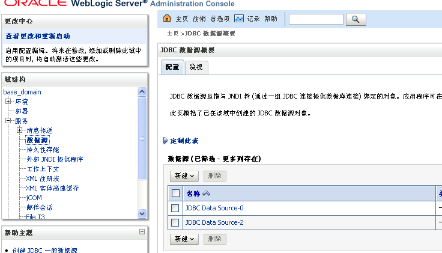
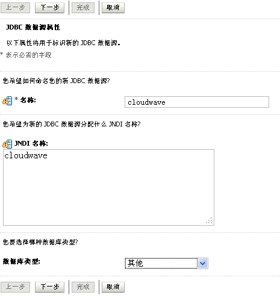
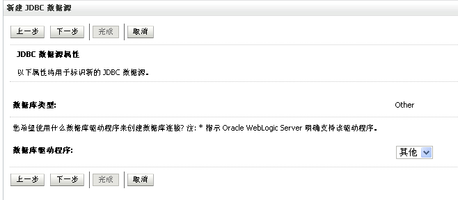
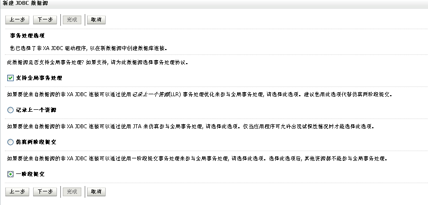
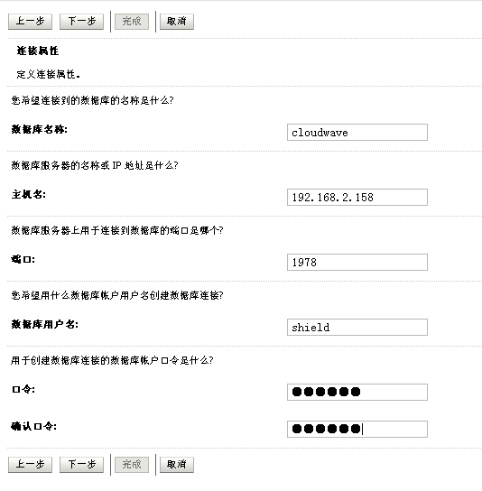
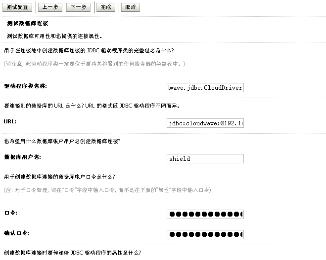
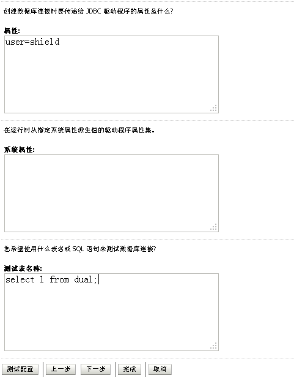
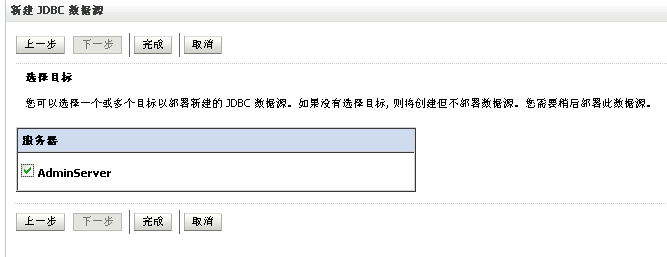
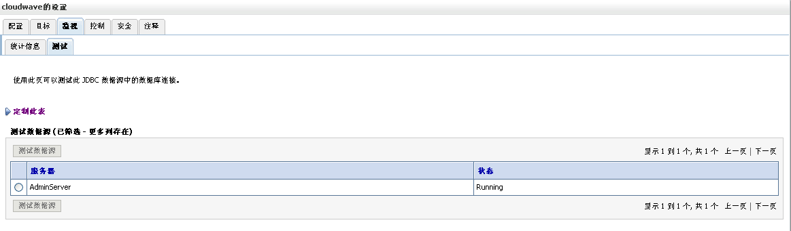

# 1   Cloudwave JDBC支持的数据类型

翰云数据库的JDBC驱动目前提供了如下表列出的数据类型：

| CLOUD TYPE    | SQL IDENTIFIER         |                           |
| ------------- | ---------------------- | ------------------------- |
| ASCII_STREAM  | char(n)                |                           |
| BFILE         | bfile                  |                           |
| BINARY_STREAM | binary(n)/varbinary(n) |                           |
| BLOB          | blob                   | REMARK                    |
| BOOLEAN       | boolean                |                           |
| BYTE          | binary(n)/varbinary(n) | Defined by CloudWave.     |
| BYTES         | binary(n)/varbinary(n) |                           |
| CHAR          | char(1)                |                           |
| CLOB          | clob                   | true/false                |
| DATETIME      | timestamp              |                           |
| DECIMAL       | number(m,n)            |                           |
| DOUBLE        | double                 |                           |
| FLOAT         | float                  |                           |
| INT16         | integer                | ‘2014-04-12 09:10:21.000’ |
| INT32         | integer                | m: precision, n: scale    |
| INT64         | long                   |                           |
| STRING        | char(n)/varcahr(n)     |                           |


# 2   Cloudwave JDBC的主要对象

## 2.1  Connection


Connection 对象代表与[数据源](http://baike.baidu.com/view/286828.htm)进行的唯一会话。也就是与数据库的连接。

(把cloudwave-jdbc.jar 放在目标工程的LIB目录下）

创建Connection：

连接代码如下：

方法一：

```
com.cloudwave.jdbc.CloudDriver driver = new com.cloudwave.jdbc.CloudDriver();
Properties info = new Properties();
info.put("user", "system");
info.put("password", "CHANGEME");
Connection conn = driver.connect("jdbc:cloudwave:@192.168.0.12:1978", info); 
// 会话结束后，请执行conn.close()释放资源
```

方法二：

```
Class.forName("com.cloudwave.jdbc.CloudDriver");
Connection conn = DriverManager.getConnection
("jdbc:cloudwave:@192.168.0.12:1978", "system", "CHANGEME");
// 会话结束后，请执行conn.close()释放资源
```

说明："com.cloudwave.jdbc.CloudDriver"是数据库驱动的名称，

"jdbc:cloudwave:@192.168.0.12:1978"是数据库连接的地址，其中"jdbc"说明连接方式是JDBC，"cloudwave"说明连接的是翰云数据库；"@"后边是数据库所在IP地址及端口号；"system"是用户名；"CHANGEME"是密码。

如果翰云数据库服务器部署在HA模式，JDBC驱动需要配置互为主备的两个服务器的地址，当需要建立连接时，JDBC驱动会以轮询方式连接两个服务器，如果成功则返回。当发生在用服务器宕机或其它故障时，当前连接未提交的事务会被回滚，数据库服务器需

要大约1分钟左右完成主备切换。

```
// 格式：

”jdbc:cloudwave:@[host]:[port]:@[host]:[port]”,” username”,”password”

// 在HA的部署方式中，连接串配置两个服务器的地址 

Class.forName("com.cloudwave.jdbc.CloudDriver");

Connection conn = DriverManager.getConnection

("jdbc:cloudwave:@192.168.0.12:1978:@192.168.0.13:1978","system","CHANGEME");

// 会话结束后，请执行connection.Close()释放资源
```

缺省状态下新建连接将处于禁用自动提交模式，在对事务操作后，必须显式调用commit或rollback方法提交或回滚事务。通过setAutoCommit方法可以启用或禁用自动提交模式，在自动提交模式下，不应再显式调用commit和rollback。

## 2.2  Statement

Statement对象用于发送简单的 SQL 语句到数据库服务器。

1. 创建 Statement 对象

建立连接后， Statement 对象用 Connection 对象的 createStatement 方法创建，以下代码创建 Statement 对象：

```
Connection conn = DriverManager.getConnection(url, itest, itest);
Statement stmt = conn.createStatement();
```

2. 使用 Statement 对象执行语句

Statement 接口提供了三种执行 SQL 语句的方法： executeQuery 、 executeUpdate 和 execute 。

方法 executeQuery 用于产生单个结果集的语句，例如 SELECT 语句。

方法 executeUpdate 用于执行 INSERT 、 UPDATE 或 DELETE 语句以及 SQL DDL 语句，如 CREATE TABLE 和 DROP TABLE 。 INSERT 、 UPDATE 或 DELETE 语句的效果是修改表中零行或多行中的一列或多列。 executeUpdate 的返回值是一个整数，表示受影响的行数。对于 CREATE TABLE 或 DROP TABLE 等 DDL 语句， executeUpdate 的返回值总为零。

方法 execute 用于执行返回多个结果集、多个更新元组数或二者组合的语句。

执行语句的三种方法都将关闭所调用的 Statement 对象的当前打开结果集（如果存在）。这意味着在重新执行 Statement 对象之前，需要完成对当前 ResultSet 对象的处理。

3. 关闭 Statement 对象

Statement 对象可由 Java 垃圾收集程序自动关闭。但作为一种好的编程风格，应在不需要 Statement 对象时显式地关闭它们。这将立即释放数据库服务器资源，有助于避免潜在的内存问题。

Statement使用示例代码：

```
//创建Statement命令对象
Statement statement= conn.createStatement();
// 构造静态SQL语句，循环插入100条记录
String sql = null;
for (int i = 0; i < 100; i++)
{
sql ="INSERT INTO ITEST.MYTABLE VALUES (" + (i) + ", " + (10.05 + i) + ")";
 statement.execute(sql);
 }
statement.close();
```


## 2.3  PreparedStatement

PreparedStatement 继承了 Statement 对象 。用于发送带有一个或多个输入参数的SQL 语句。 参数的值在 SQL 语句创建时未被指定。该语句为每个参数保留一个问号（ “ ？ ” ）作为占位符。每个问号所对应的值必须在该语句执行之前，通过适当的 setXXX 方法来提供。

由于 PreparedStatement 对象已预编译过，所以其执行速度要快于 Statement 对象。因此，需要多次重复执行的 SQL 语句经常创建为 PreparedStatement 对象，以提高效率。

作为 Statement 的子类， PreparedStatement 继承了 Statement 的所有功能。另外它还添加了一整套方法，用于设置发送给数据库以取代 参数占位符的值。同时， execute 、 executeQuery 和 executeUpdate 三种方法能执行设置好参数的语句对象。

1. 创建 PreparedStatement 对象

以下的代码段创建一个 PreparedStatement 对象：

```
PreparedStatement psmt = conn.prepareStatement( UPDATE t_test  SET name = ? WHERE id = ?);
```

对象 psmt 包含的语句中带有两个参数占位符，将该语句发送给数据库，并由数据库服务器为其执行作好准备。

2. 设置参数

在执行 PreparedStatement 对象之前，必须设置每个参数的值。可以通过调用 setXXX 方法来完成，其中 XXX 是与该参数相应的类型。例如，如果参数具有 Java 类型 String ，则使用的方法就是 setString 。对于不同类型的参数，一般都会有一个推荐的设置方法和多个可行的设置方法。 setXXX 方法的第一个参数是要设置的参数的序号（从 1 算起），第二个参数是设置给该参数的值。

每当设置了给定语句的参数值，就可执行该语句。设置一组新的参数值之前，应先调用 clearParameters 方法清除原先设置的参数值。

使用 setObject 方法 : 可显式地将输入参数转换为特定的 JDBC 类型。

该方法可以接受三个参数，其中第三个参数用来指定目标 JDBC 类型。将 Java Object 发送给数据库之前，驱动程序将把它转换为指定的 JDBC 类型。

如果没有指定 JDBC 类型，驱动程序就会将 Java Object 映射到其缺省的 JDBC 类型，然后将它发送到数据库。这与常规的 setXXX 方法类似。在这两种情况下，驱动程序在将值发送到数据库之前，会将该值的 Java 类型映射为适当的 JDBC 类型。

二者的差别在于 setXXX 方法使用从 Java 类型到 JDBC 类型的标准映射，而 setObject 方法使用从 Java Object 类型到 JDBC 类型的映射。

方法 setObject 允许接受所有 Java 对象，这使应用程序更为通用，并可在运行时接受参数的输入。这样，如果用户在编辑应用程序时不能确定输入类型，可以通过使用 setObject ，对应用程序赋予可接受的 Java 对象，然后由 JDBC 驱动程序自动将其转换成数据库所需的 JDBC 类型。但如果用户已经清楚输入类型，使用相应的 setXXX 方法是值得推荐的，可以提高效率。

 setNull 方法允许程序员将 JDBC NULL 值作为参数发送给数据库。在这种情况下，可以把参数的目标 JDBC 类型指定为任意值，同时参数的目标精度也不再起作用。

 setBytes 和 setString 方法能够发送无限量的数据。但是，内存要足够容纳相关数据。有时程序员更喜欢用较小的块传递大型的数据，这可通过将参数设置为 Java 输入流来完成。当语句执行时， JDBC 驱动程序将重复调用该输入流，读取其内容并将它们当作实际参数数据传输。

Preparedstatement使用示例代码如下：

```
//构造带有参数的动态SQL语句

String sql = "INSERT INTO ITEST.MYTABLE(INTCOLUMN, FLOATCOLUMN) VALUES (?, :?)";

//创建PreparedStatement命令对象

PreparedStatement pstmt= conn.preparedStatement(sql);

//循环插入数据，需要指定数据类型，执行并提交

for (int i = 0; i < 1000; i ++)

{

 Pstmt.setInt(1, i);

 pstmt.setFloat(2, 10.05 + i);

 pstmt.addBatch();

}

pstmt.executeBatch();

conn.commit;

pstmt.close();
```

批量方式插入数据，示例代码如下：

```
// 批次大小，每1000条记录作为一个批次传给数据库

int BATCH_SIZE = 1000;

// 事务大小，每10000条记录作为一个事务提交永久存储

int COMMIT_SIZE = 10000;

//构造带有参数的动态SQL语句

String sql =

 "INSERT INTO ITEST.MYTABLE VALUES (?, ?)";

//创建PreparedStatement命令对象

PreparedStatement pstmt= conn.preparedStatement(sql);

//分批次插入100万条记录

for (int i = 0; i < 1000000; i++)

{

// 填充每一行数据

pstmt.setInt(1, i);

pstmt.setFloat (1, 10.05 + i);

pstmt.addBatch();

// 如果达到了一个批次，则执行这个批次

if (i % BATCH_SIZE == BATCH_SIZE - 1) 

{

  pstmt.executeBatch();

pstmt.clearBatch();

}

// 如果达到了一个事务，则提交这个事务

If (i % COMMIT_SIZE == COMMIT_SIZE - 1)

{

  conn.commit();

}

}
```


## 2.4 ResultSet

ResultSet 提供执行 SQL 语句后从数据库返回结果中获取数据的方法。执行 SQL 语句后数据库返回结果被 JDBC 处理成结果集对象，可以用 ResultSet 对象的 next 方法以行为单位进行浏览，用 getXXX 方法取出当前行的某一列的值。

1. 获取行

ResultSet 维护指向其当前数据行的逻辑光标。每调用一次 next 方法，光标向下移动一行。最初它位于第一行之前，因此第一次调用 next 将把光标置于第一行上，使它成为当前行。随着每次调用 next 导致光标向下移动一行，按照从上至下的次序获取 ResultSet 行。

在 ResultSet 对象或对应的 Statement 对象关闭之前，光标一直保持有效。

2. 获取列

方法 getXXX 提供了获取当前行中某列值的途径。在每一行内，可按任何次序获取列值。

列名或列号可用于标识要从中获取数据的列。例如，如果 ResultSet 对象 rs 的第二列名为 “title” ，则下列两种方法都可以获取存储在该列中的值：

```
String s = rs.getString(title);

String s = rs.getString(2);
```

注意列是从左至右编号的，并且从 1 开始。

关于 ResultSet 中列的信息，可通过调用方法 ResultSet.getMetaData 得到。返回的 ResultSetMetaData 对象将给出其 ResultSet 对象各列的名称、类型和其他属性。

3. 采用流方式获取列

为了获取大数据量的列， JDBC 驱动程序提供了四个获取流的方法：

getBinaryStream 返回只提供数据库原字节而不进行任何转换的流。

getAsciiStream 返回提供单字节 ASCII 字符的流。

getUnicodeStream 返回提供双字节 Unicode 字符的流。

getCharacterStream 返回提供双字节 Unicode 字符的 java.io.Reader 流。

在这四个函数中， JDBC 规范不推荐使用 getCharacterStream 方法，其功能可以用 getUnicodeStream 代替。

4. NULL 结果值

要确定给定结果值是否是 JDBC NULL ，必须先读取该列，然后使用 ResultSet 对象的 wasNull 方法检查该次读取是否返回 JDBC NULL 。

当使用 ResultSet 对象的 getXXX 方法读取 JDBC NULL 时，将返回下列值之一：

Java null 值：对于返回 Java 对象的 getXXX 方法（如 getString 、 getBigDecimal 、 getBytes 、 getDate 、 getTime 、 getTimestamp 、 getAsciiStream 、 getUnicodeStream 、 getBinaryStream 、 getObject 等）。

零值：对于 getByte 、 getShort 、 getInt 、 getLong 、 getFloat 和 getDouble 。

false 值：对于 getBoolean 。

5.代码示例：执行查询，通过ResultSet读取每一行结果记录：

```
//创建Statement命令对象

Statement statement = conn.createStatment();

String sql = 

“SELECT ID, PRICE FROM ITEST.MYTABLE”;

//执行查询SQL，并以ResultSet的形式返回结果

ResultSet rs = statement.executeQuery(sql);

//循环读取结果集的每一条记录

while (rs.next())

{

 System.out.println(rs.getInt(1) + " " + rs.getFloat(2));

}

rs.close();

statement.close();
```


## 2.5  ResultSetMetaData

ResultSetMetaData 提供许多方法，用于读取 ResultSet 对象返回数据的元信息。包括：列名、列数据类型、列所属的表、以及列是否允许为 NULL 值等，通过这些方法可以确定结果集中列的一些信息。

1. 创建结果集元数据对象

结果集元数据是用来描述结果集的特征，所以，需要首先执行查询获得结果集，才能创建结果集元数据对象。

2. 创建 ResultSetMetaData 对象如下例所示：

假如有一个表 TESTTABLE(no int,name varchar(10)) ，利用下面的代码就可以知道这个表的各个列的类型：

```
ResultSet rs = stmt.executeQuery(SELECT * FROM TESTTABLE);

ResultSetMetaData rsmd = rs.getMetaData();

for(int i = 1; i <= rsmd.getColumnCount(); i ++)

{

  String typeName = rsmd.getColumnTypeName(i);

  System.out.println( 第 + i + 列的类型为： + typeName);

}
```

## 2.6 DatabaseMetaData

DatabaseMetaData 提供了许多方法，用于获取数据库的元数据信息。包括：描述数据库特征的信息、目录信息、模式信息、表信息、表权限信息、表列信息等。 DatabaseMetaData 有部分方法以 ResultSet 对象的形式返回结果，可以用 ResultSet 对象的 getXXX() 方法获取所需的数据。

 

1、创建数据库元数据对象

数据库元数据对象由连接对象创建。以下代码创建 DatabaseMetaData 对象（其中 conn 为连接对象）：

```
DatabaseMetaData dbmd = conn.getMetaData();
```

利用该数据库元数据对象就可以获得一些有关数据库和 JDBC 驱动程序的信息：

```
String databaseName = dbmd.getDatabaseProductName(); // 数据库产品的名称

int majorVersion = dbmd.getJDBCMajorVersion(); // JDBC 驱动程序的主版本号

String []types ={TABLE};

ResultSet tablesInfor = dbmd.getTables(null, null, “*TE%”, types);
```


## 2.7  ParameterMetaData

参数元数据是 JDBC 3.0 标准新引入的接口，它主要是对 PreparedStatement 、 CallableStatement 对象中的 ? 参数进行描述，例如参数的个数、参数的类型、参数的精度等信息，类似于 ResultSetMetaData 接口。通过引入这个接口，就可以对参数进行较为详细、准确的操作。

 1 ．创建参数元数据对象

通过调用 PreparedStatement 或 CallableStatement 对象的 getParameterMetaData() 方法就可以获得该预编译对象的 ParameterMetaData 对象：

```
ParameterMetaData pmd = pstmt.getParameterMetaData();
```

然后就可以利用这个对象来获得一些有关参数描述的信息：

```
// 获取参数个数

int paraCount = pmd.getParameterCount();

for(int i = 1; i <= paraCount; i ++) {

// 获取参数类型

System.out.println(The Type of Parameter(+i+) is + ptmt.getParameterType(i));

// 获取参数类型名

System.out.println(The Type Name of Parameter(+i+) is

\+ ptmt.getParameterTypeName(i));

// 获取参数精度

System.out.println(The Precision of Parameter(+i+) is + ptmt.getPrecision(i));

// 获取参数是否为空

System.out.println(Parameter(+i+) is nullable? + ptmt.isNullable (i));

}
```


## 2.8  DataSource

数据源是 JDBC 2.0 规范作为扩展包引入的，在 JDBC 3.0 规范中成为核心 API 。数据源不仅能够从功能上完全取代利用 DriverManager 建立连接的方式，而且具有以下几点优势：

(1) 增强了代码的可移植性；

(2) 方便了代码的维护；

(3) 利用连接池来提高系统的性能。

 JDBC 驱动程序提供了对数据源的支持，实现了 javax.sql.DataSource 接口和 java.sql.ConnectionPoolDataSource 接口。用户通过 javax.sql.DataSource 接口来建立连接。

 使用数据源来建立连接时，

首先要向 JNDI 注册一个数据源。在建立连接的时候，首先通过 JNDI 来获得要使用的数据源：

DataSource ds = (DataSource) ctx.lookup(datasourceName) ；

然后使用这个数据源来建立连接对象：

Connection con = ds.getConnection() ；

该连接同通过 DriverManager 所建立的连接是一样的。

 实现 javax.sql.ConnectionPoolDataSource 接口是为了提高系统的性能。通过设置一个连接缓冲区，在其中保持数目较小的物理连接的方式，这个连接缓冲区由大量的并行用户共享和重新使用，从而避免在每次需要时建立一个新的物理连接，以及当其被释放时关闭该连接的昂贵操作。该连接池是 JDBC 提供系统性能的一种措施，是在 JDBC 内部实现的，能够为用户提供透明的高速缓冲连接访问。用户利用数据源来建立连接的应用不需为此做出任何代码上的变动。

## 2.9 大对象

 JDBC 标准为了增强对大数据对象的操作，在 JDBC 3.0 标准中增加了 java.sql.Blob 和 java.sql.Clob 这两个接口。这两个接口定义了许多操作大对象的方法，通过这些方法就可以对大对象的内容进行操作。此外，Cloudwave JDBC 支持Bfile类型对象，在下一章中详细介绍。

产生 Lob 对象

在 ResultSet对象中调用 getBlob() 和 getClob() 方法就可以获得 Blob 对象和 Clob 对象：

```
Blob blob = rs.getBlob(1);

Clob clob = rs.getClob(2);
```

设置 Lob 对象

Lob 对象可以像普通数据类型一样作为参数来进行参数赋值，在操作 PreparedStatement 、 ResultSet 对象时使用：

```
PreparedStatement pstmt = conn.prepareStatement(INSERT INTO bio (image, text) “ +

“VALUES (?, ?));

pstmt.setBlob(1, authorImage);

pstmt.setClob(2, authorBio);
```


# 3  Cloudwave JDBC与非结构化数据

翰云数据库（Cloudwave）同时支持结构化和非结构化的数据。结构化的数据存取采用SQL92标准，非结构化的数据存储通过扩展类型BFILE、BLOB和CLOB实现。下面讲述如何使用翰云提供的JDBC驱动，在翰云数据库中存取非结构化的BFILE数据。

## 3.1  BFILE相关的对象定义

为了便于理解翰云BFILE的存取方法，有必要对其中涉及的关键对象解释如下，它们是对标准JDBC规范的扩展。

BFILE存取操作涉及的关键对象：

CloudBfile：非结构化二进制数据的类型定义

CloudConnection：连接翰云数据库主节点的会话

CloudTabletServerConnection：连接翰云数据库子节点的会话

BfileLoader：封装的BFILE加载类

BfileBatchLoader：封装的BFILE批量加载类

BfileOutputStream：封装的BFILE写入流，可流式写入数据到BFILE

BfileInputStream：封装的BFILE读取流，可流式读取BFILE数据

MultiBfileInputStream：封装的NFS BFILE读取流，可流式读取BFILE数据

CloudBfile类型的部分成员定义：

// BFILE文件唯一编号，由数据库维护

Long fileId;

// BFILE文件名称，不同BFILE可以同名

String filename;

// BFILE创建时的时间戳，由数据库维护

Long createStamp;

// BFILE文件长度，字节为单位

Long length;

// BFILE分段编号，由数据库维护，BFILE存储在某个分段中

String segmentName;

// BFILE所在TabletServer编码，采用“主机名:IP的BASE64码:端口号”

String encodedTabletServer;

## 3.2 使用BfileLoader加载数据

BfileLoader一次性传送所有的BFILE数据，适用于传输网络稳定，BFILE小于100MB的环境。这些数据可以来自于内存BUFFER或者客户端的本地文件。

```
// 1）使用数据库连接conn，构造BfileLoader对象

BfileLoader loader = new BfileLoader(conn);

// 2）构造1MB的测试数据，数据可以来自内存或客户端本地文件

byte[] content = new byte[1 << 20];

for (int i = 0; i < content.length; i ++) {

content[i] = (byte) i;

}

// 3）加载测试数据，创建名为“LoaderBfile”的BFILE

CloudBfile bfile = loader.load(content, "LoaderBfile");

System.out.println("Bfile: ["+ bfile.getId() + ", "

\+ bfile.getName() + "," + bfile.getTimestamp() + ", " 

\+ bfile.getLength() + "," + bfile.getTabletServer() + "]");
```


## 3.3 使用BfileBatchLoader批量加载数据

BfileBatchLoader在BfileLoader的基础上，可以批量创建多个CloudBfile，通过减少客户端-服务端交互次数，显著提升小文件BFILE的加载性能。

```
// 1）使用数据库连接conn，构造BfileBatchLoader对象

BfileBatchLoader batchLoader = new BfileBatchLoader(conn);

// 2）构造测试数据，这些数据可以来自内存或客户端的本地文件

String[] inputFiles = new String[] {"./bfile.0", "./bfile.1", "bfile.2", "bfile.3"};

// 3）循环将测试数据追加到batchLoader

for (int i = 0; i < inputFiles.length; i ++) {

batchLoader.add(new File(inputFiles[i]));

}

// 4）执行batchLoader的批，创建多个BFILE

CloudBfile[] bfiles = batchLoader.executeBatch();

if (bfiles != null) {

System.*out*.println("Created bfiles " + bfiles.length);

  for (int i = 0; i < bfiles.length; i ++) {

​      CloudBfile bfile = bfiles[i];

​    System.*out*.println("Bfile: [" 

​        \+ bfile.getId() + ", " + bfile.getName() + "," + bfile.getTimestamp() + ", " 

​      \+ bfile.getLength() + "," + bfile.getTabletServer() + "]");

}

}
```


## 3.4  使用BfileOutputStream加载数据

BfileOutputStream采用流式加载数据，支持断点续传，可以分块多次加载。适用于网络环境不稳定，BFILE大于100MB的情况。

```
// 1）使用数据库连接conn，创建名为“OSBFile”的BFILE

CloudBfile bfile = conn.createBfile("OSBFile");

// 2）构造position位于 0的OutputStream

OutputStream bos = bfile.getOutputStream(0);

// 3）使用写入流，分块多次传送

byte[] content = new byte[1 << 20];

int writeLen = content.length / 10;

for (int i = 0; i < content.length; i += writeLen) {

if (i + writeLen >= content.length) {

​      writeLen = content.length - i;

}

  bos.write(content, i, writeLen);

}

// 4）写入流关闭时，自动同步清空缓存

bos.close();
```


## 3.5 按照编号或名称查找BFILE

按照编号ID查找返回唯一的BFILE，按照名称NAME查找返回多个BFILE。这些BFILE以ResultSet的形式返回，包含这些字段：ID, NAME, TIMESTAMP, LENGTH, USER, SEGMENT, TABLET_SERVER，使用这些字段能够构造出CloudBfile对象。

```
// 1）使用数据库连接conn，查找ID为2的BFILE

CloudBfile bfile = conn.getBfile(2);

System.out.println("Bfile: [" 

\+ bfile.getId() + ", " + bfile.getName() + "," + bfile.getTimestamp() + ", " 

  \+ bfile.getLength() + "," + bfile.getTabletServer() + "]");

// 2）使用数据库连接conn，查找NAME为“OSBfile”的BFILE，返回ResultSet

ResultSet result = conn.getBfiles("OSBfile");

ResultSetMetaData rsmd = result.getMetaData();

for (int i = 0; i < rsmd.getColumnCount(); i ++) {

System.out.print(rsmd.getColumnName(i + 1) + " ");

}

System.out.println();

while (result.next()) {

for (int i = 0; i < rsmd.getColumnCount(); i ++) {

​      System.out.print(result.getString(i + 1) + " ");

}

  System.out.println();

}

result.close();
```


## 3.6 使用BfileInputStream读取BFILE数据

BfileInputStream采用流式读取数据，支持断点续传，可以分块多次读取。

```
// 1）查找编号ID为2的BFILE

CloudBfile bfile = conn.getBfile(2);

// 2）构造position为0、缓存为256KB的InputStream

InputStream bis = bfile.getInputStream(0, (1<<18));

// 3）创建大小为256KB的接收数组

byte[] content = new byte[1 << 18];

int readLen = 0, totalReadLen = 0;

// 4）从InputStream循环读取数据，直至文件结尾EOF

readLen = bis.read(content, 0, content.length);

while (readLen > 0) {

totalReadLen += readLen;

  System.out.println("read " + readLen + "/" + totalReadLen);

  readLen = bis.read(content, 0, content.length);

}

// 5）关闭InputStream

bis.close();
```


## 3.7  从服务器节点挂载的NFS加载数据并创建BFILE

可以将高速网络存储挂载在各个服务器节点，数据库支持从这些挂载的NFS加载数据并创建BFILE，称作NFS BFILE，将平均分布在所有的节点服务器上。

```
// 1）使用数据库连接conn，从服务器节点挂载的NFS创建BFILE

CloudBfile bfile = conn.createNfsBfile("/mnt/nfsfile.jar");

System.out.println("Bfile: [" 

\+ bfile.getId() + ", " + bfile.getName() + "," + bfile.getTimestamp() + ", " 

\+ bfile.getLength() + "," + bfile.getTabletServer() + "]");

// 2）构造position为0、缓存为256KB的InputStream

InputStream mis = bfile.getInputStream(0, (1<<18));

// 3）创建大小为256KB的接收数组

byte[] content = new byte[1 << 18];

int readLen = 0, totalReadLen = 0;

// 4）从MultiInputStream循环读取数据，直至文件结尾EOF

readLen = mis.read(content, 0, content.length);

while (readLen > 0) {

totalReadLen += readLen;

  System.out.println("read " + readLen + "/" + totalReadLen);

  readLen = mis.read(content, 0, content.length);

}

// 关闭MultiInputStream

mis.close();
```


## 3.8 在表中定义BFILE字段，插入BFILE列值

BFILE对象可以作为一般列值插入到数据库的表中，这样结构化和非结构化的数据融合在了一起。对BFILE列值的操作与一般列值相似，可以使用PreparedStatement.setBfile设置列值或使用ResultSet.getBfile读取列值。

```
// 1）使用数据库连接conn，构建BfileLoader

BfileLoader loader = new BfileLoader(conn);

// 2）加载内存数据，创建名为“bfileOfColumn”的BFILE

CloudBfile bfile = loader.load(new byte[1 << 10], "bfileOfColumn");

// 3）创建数据库表bfileTable，第二个字段是bfile类型

Statement stmt = conn.createStatement();

stmt.executeUpdate("create table bfileTable (bt_id integer primary key, bt_file bfile)");

stmt.close();

// 4）使用PreparedStatement，以setBfile方式添加带BFILE列值的记录

CloudPreparedStatement pstmt = (CloudPreparedStatement) 

conn.prepareStatement("insert into bfileTable values(?, ?)");

pstmt.setInt(1, 1);

pstmt.setBfile(2, bfile);

pstmt.executeUpdate();

pstmt.close();

// 5）主动提交更新

conn.commit();

// 6）查表，以resultset.getBfile得到BFILE对象

stmt = conn.createStatement();

CloudResultSet result = (CloudResultSet) stmt.executeQuery("select * from bfileTable");

ResultSetMetaData rsmd = result.getMetaData();

for (int i = 0; i < rsmd.getColumnCount(); i ++) {

System.*out*.print(rsmd.getColumnName(i + 1) + " ");

}

System.*out*.println();

while (result.next()) {

System.*out*.print(result.getInt(1) + " ");

  System.*out*.print(result.getBfile(2) + " ");

  System.*out*.println();

}

result.close();

stmt.close();
```


## 3.9  在BFILE字段上使用用户自定义函数UDF

为了在非结构化的数据上执行计算，翰云数据库设计了用户自定义函数UDF。使用UDF的优势是计算在数据库端进行，充分利用集群做并行计算，极大减少了客户端与服务端之间的交互数据规模，有效提升非结构化数据的处理性能。

​    在目前的设计中，如果要在BFILE上执行自定义函数UDF，需要将BFILE作为列值插入到表中，参见示例7。下面以示例的形式解释如何使用UDF。

​    第一步：创建用户自定义的类class及可调用的方法method，比如A.checkBfile。该方法可以在数据库服务端调用，类似于传统数据库的存储过程。

```
import java.io.IOException;

import java.io.InputStream;

import com.cloudwave.jdbc.bfile.CloudBfile;

public class A {

    // 自定义方法，用于过滤BFILE

public boolean checkBfile(CloudBfile bfile) throws IOException {

    byte[] readBuffer = new byte[4];

       // 获取BFILE的InputStream，读取首部4个字节

  

  InputStream is = bfile.getInputStream(0);

    int readCount = is.read(readBuffer);

is.close();

// 检查BFILE文件首部4个字节是0x01020304 

  if (readCount == readBuffer.length 

        && readBuffer[0] == 0x01

        && readBuffer[1] == 0x02

        && readBuffer[1] == 0x03

        && readBuffer[1] == 0x04) {

      return true;

    } else {

      return false;

    }

  }

}
```

第二步：使用自定义类创建UDF，可以为UDF创建一个不同于类名的别名。

```
// 建立数据库连接，可以使用system用户身份

CloudConnection conn = (CloudConnection) connect("system", "CHANGEME");

// 装载自定义类的字节码

byte[] classBytes = FileLoader.*loadFileAsBytes*("D:\\workplace\\A.class");

// 以字节码为基础创建UDF，命名为bfileudf

conn.createUDF("bfileudf", classBytes);

// 释放数据库连接

conn.close();
```

第三步：假定存在表bfileTable(id integer primary key, data bfile)，可以使用扩展SQL，在bfileTable中检索满足UDF条件的记录。在扩展SQL语句中，以如下语法格式调用自定义函数UDF：

```
udf::UdfName.MethodName(ColumnName)。
```


## 3.10在Bfile字段上建立全文索引

翰云数据库为非结构化的多媒体数据提供了易用的计算接口，针对TXT、WORD、PPT、PDF等包含文本内容的BFILE文件可以创建全文索引，高效快速搜索关键字。在翰云数据库系统中，所有的BFILE存储在一张叫做bfiles的系统表里，可以通过bfileId找到这个BFILE并下载，不同用户创建的BFILE是相互隔离的。

​    为了方便工程应用，我们可以按业务定义自己的文件表，比如mydocs，包含三个字段：(id integer, created timestamp, content bfile)。其中id是mydocs表的主键，created是文件上传时的日期，content是已经入库的BFILE(mydoc.docx)。有了这张表，我们就可以指定数据库为这个表mydocs建全文索引。

```
Statement statment= conn.createStatement();

//创建业务相关的文件表MYDOCS

String sql = “CREATE TABLE MYDOCS

(ID INTEGER, CREATED TIMESTAMP, CONTENT BFILE, PRIMARY KEY(ID))”;

statment.executeUpdate(sql);

//指定在MYDOCS(CREATED, CONTENT)两个字段上创建全文索引

sql = “CREATE FULLTEXT ON MYDOCS(CREATED, CONTENT)”;

statment.executeUpdate(sql);

//准备向MYDOCS插入数据

sql = “INSERT INTO MYDOCS VALUES(?,?,?)”;

PreparedStatement ps = conn.prepareStatement(sql);

//上传一个本地DOC，然后向MYDOCS插入一条记录

//数据库会自动为这个DOC文件创建全文索引

BfileLoader bfileLoader = new BfileLoader((CloudConnection) conn);

CloudBfile bfile = bfileLoader.load(new File(“d:/fti.doc”));

ps.setInt(1, 1);

String dateText = "2014-04-03 12:00:01.333";

ps.setTimestamp(2, new Timestamp(dateFormat.parse(dateText).getTime()));

((CloudPreparedStatement) ps).setBfile(3, bfile);

ps.execute();

conn.commit;

//有一点需要说明，索引的创建因为缓存的缘故会有延迟

//如果要立即建立索引，需要执行如下的checkPoint命令

//但我们不建议这么做，频繁checkPoint会影响系统效率

conn.checkPoint();

Statement statment= conn.CreateStatement();

//构造关键字查找的SQL，使用关键字CONTAINS表示查找全文索引

sql = 

“SELECT * FROM MYDOCS WHERE CONTENT CONTAINS ‘经济改革’”;

//执行查询SQL，返回结果集reader

ResultSet rs = statement.executeQuery(sql);

while (rs.next()) 

{

 //取出BFILE字段并下载到本地

 CloudBfile bfile = rs.getBfile(3);

InputStream is = bfile.getInputStream(0L);

OutputStream out = new FileOutputStrea

(new File(“d:/output/” + bfile.getName()));

byte[] bytes = new byte[4096];

int read = 0;

while ((read = is.read(bytes)) != -1) {

out.write(bytes, 0, read);

}

is.close();

out.close();

}
```


# 4  Cloudwave JDBC与第三方持久层

## 4.1  Cloudwave JDBC与Hibernate集成

1. 把Hibernate的jar包和cloudwave-jdbc.jar放在工程的LIB目录下；

​    2. 配置Hibernate.cfg.xml，主要配置以下几个参数：  

```
<property name="connection.driver_class">com.cloudwave.jdbc.CloudDriver</property>

  <property name="connection.url">jdbc:cloudwave:@192.168.0.12:1978</property>

  <property name="connection.username">itest</property>

<property name="connection.password">itest</property>

    <property name="dialect">

       com.cloudwave.integration.hibernate.CloudwaveDialect</property>
```

​    说明：connection.driver_class是数据库驱动类，connection.url是数据库连接地址， connection.username是用户名，connection.password是密码，dialect是数据库方言。

​    一个简单的Hibernate.cfg.xml配置如下。

```
<?xml version='1.0' encoding='utf-8'?>

<!DOCTYPE hibernate-configuration PUBLIC

  "-//Hibernate/Hibernate Configuration DTD 3.0//EN"

  "http://www.hibernate.org/dtd/hibernate-configuration-3.0.dtd">

<hibernate-configuration>

 <session-factory>

  <!-- Database connection settings -->

  <property name="connection.driver_class">com.cloudwave.jdbc.CloudDriver</property>

  <property name="connection.url">jdbc:cloudwave:@localhost:1978</property>

  <property name="connection.username">itest</property>

  <property name="connection.password">itest</property>

  <!-- JDBC connection pool (use the built-in) -->

  <property name="connection.pool_size">1</property>

  <!-- SQL dialect -->

  <property name="dialect">

​       com.cloudwave.integration.hibernate.CloudwaveDialect</property>

  <!-- Enable Hibernate's automatic session context management -->

  <property name="current_session_context_class">thread</property>

  <!-- Disable the second-level cache -->

  <property name="cache.provider_class">org.hibernate.cache.internal.NoCacheProvider</property>

  <!-- Echo all executed SQL to stdout -->

  <property name="show_sql">true</property>

  <mapping resource="beans/Stock.hbm.xml"/>

 </session-factory>

</hibernate-configuration>

 

Beans/Stock.hbm.xml配置如下:

<?xml version="1.0"?>

<!DOCTYPE hibernate-mapping PUBLIC 

"-//Hibernate/Hibernate Mapping DTD 3.0//EN"

"http://hibernate.sourceforge.net/hibernate-mapping-3.0.dtd">

 

<hibernate-mapping>

  <class name="beans.Stock" table="itest.STOCK">

    <id name="stockId" type="java.lang.Integer">

      <column name="STOCK_ID" />

      <generator class="assigned" />

    </id>

    <property name="stockCode" type="string">

      <column name="STOCKCODE" length="10" not-null="true" unique="true" />

    </property>

    <property name="stockName" type="string">

      <column name="STOCKNAME" length="20" not-null="true" unique="true" />

    </property>

  </class>

</hibernate-mapping>
```


# 5 Cloudwave JDBC与J2EE应用服务器

## 5.1  Cloudwave JDBC与JBOSS 6集成配置

1． 把cloudwave-jdbc.jar、cloudwave-integration.jar拷贝到JOBSS_HOME/server/default/lib目录；

2． 创建数据源：在JOBSS_HOME/server/default/lib创建cloudwave-ds.xml。文件内容如下；

```
<?xml version="1.0" encoding="UTF-8"?>

<!-- JBoss Server Configuration                      -->

<!-- See http://www.jboss.org/community/wiki/Multiple1PC for information about local-tx-datasource -->

<!-- $Id: oracle-ds.xml 97536 2009-12-08 14:05:07Z jesper.pedersen $ -->

<!--  Datasource config for Oracle originally from Steven Coy-->

<datasources>

 <local-tx-datasource>

  <jndi-name>cloudwaveDS</jndi-name>

  <connection-url>jdbc:cloudwave:@192.168.2.158:1978</connection-url>

    <!--Here are a couple of the possible OCI configurations.

       For more information, see http://otn.oracle.com/docs/products/oracle9i/doc_library/release2/java.920/a96654/toc.htm

 

    <connection-url>jdbc:oracle:oci:@youroracle-tns-name</connection-url>

       or

    <connection-url>

jdbc:oracle:oci:@(description=(address=(host=youroraclehost)(protocol=tcp)(port=1521))(connect_data=(SERVICE_NAME=yourservicename)))</connection-url>

Clearly, its better to have TNS set up properly.-->

  <driver-class>com.cloudwave.jdbc.CloudDriver</driver-class>

  <user-name>shield</user-name>

  <password>shield</password>

<exception-sorter-class-name>

org.jboss.resource.adapter.jdbc.vendor.OracleExceptionSorter</exception-sorter-class-name>

  <!-- sql to call when connection is created

    <new-connection-sql>some arbitrary sql</new-connection-sql>-->

  <!-- sql to call on an existing pooled connection when it is obtained from pool - the OracleValidConnectionChecker is prefered

    <check-valid-connection-sql>some arbitrary sql</check-valid-connection-sql>-->

  <!-- corresponding type-mapping in the standardjbosscmp-jdbc.xml (optional) -->

  <metadata>

     <type-mapping>cloudwave</type-mapping>

  </metadata>

 </local-tx-datasource>

</datasources>
```

3. 修改文件OBSS_HOME/server/default/conf/standardjbosscmp-jdbc.xml。

添加type-mapping如下:

```
<type-mapping>

<name>cloudwave</name>

 <row-locking-template/>

 <pk-constraint-template>CONSTRAINT ?1 PRIMARY KEY (?2)</pk-constraint-template>

 <fk-constraint-template>ALTER TABLE ?1 ADD CONSTRAINT ?2 FOREIGN KEY (?3) REFERENCES ?4 (?5)</fk-constraint-template>

 <alias-header-prefix>t</alias-header-prefix>

 <alias-header-suffix>_</alias-header-suffix>

 <alias-max-length>18</alias-max-length>

 <subquery-supported>true</subquery-supported>

 <true-mapping>1</true-mapping>

 <false-mapping>0</false-mapping>

<mapping>

  <java-type>java.math.BigDecimal</java-type>

  <jdbc-type>NUMERIC</jdbc-type>

  <sql-type>NUMBER</sql-type>

 </mapping>

 <mapping>

  <java-type>java.lang.Boolean</java-type>

  <jdbc-type>BIT</jdbc-type>

  <sql-type>BOOLEAN</sql-type>

 </mapping>

<!-- if someone knows the mapping for byte, please, let us know!

 <mapping>

  <java-type>java.lang.Byte</java-type>

  <jdbc-type>SMALLINT</jdbc-type>

  <sql-type>SMALLINT</sql-type>

 </mapping>

-->

 <mapping>

  <java-type>java.lang.Integer</java-type>

  <jdbc-type>INTEGER</jdbc-type>

  <sql-type>INTEGER</sql-type>

 </mapping>

 <mapping>

  <java-type>java.lang.Long</java-type>

  <jdbc-type>BIGINT</jdbc-type>

  <sql-type>LONG</sql-type>

 </mapping>

 <mapping>

  <java-type>java.lang.Float</java-type>

  <jdbc-type>REAL</jdbc-type>

  <sql-type>FLOAT</sql-type>

 </mapping>

 <mapping>

  <java-type>java.lang.Double</java-type>

  <jdbc-type>DOUBLE</jdbc-type>

  <sql-type>DOUBLE </sql-type>

 </mapping>

 <mapping>

  <java-type>java.lang.Character</java-type>

  <jdbc-type>CHAR</jdbc-type>

  <sql-type>CHAR</sql-type>

 </mapping>

 <mapping>

  <java-type>java.lang.String</java-type>

  <jdbc-type>VARCHAR</jdbc-type>

  <sql-type>VARCHAR(256)</sql-type>

 </mapping>

 <mapping>

  <java-type>java.sql.Date</java-type>

  <jdbc-type>DATE</jdbc-type>

  <sql-type>DATE</sql-type>

 </mapping>

 <mapping>

  <java-type>java.sql.Time</java-type>

  <jdbc-type>TIME</jdbc-type>

  <sql-type>TIME</sql-type>

 </mapping>

 <mapping>

 <java-type>java.sql.Timestamp</java-type>

  <jdbc-type>TIMESTAMP</jdbc-type>

  <sql-type>TIMESTAMP</sql-type>

 </mapping>

 <mapping>

  <java-type>java.lang.Object</java-type>

  <jdbc-type>BLOB</jdbc-type>

  <sql-type>BLOB</sql-type>

 </mapping>

</type-mapping>
```

4. 启动jobss，可以看到Resources/Datasources/cloudwaveDS。

EJB组件中的persistence.xml中配置如下:

```
<?xml version="1.0" encoding="UTF-8"?>

<persistence version="1.0" 

xmlns="http://java.sun.com/xml/ns/persistence" 

xmlns:xsi="http://www.w3.org/2001/XMLSchema-instance" 

xsi:schemaLocation="http://java.sun.com/xml/ns/persistence 

http://java.sun.com/xml/ns/persistence/persistence_1_0.xsd">

<persistence-unit name="foshanshop" transaction-type="JTA">

<jta-data-source>java:cloudwaveDS</jta-data-source>

 <exclude-unlisted-classes>false</exclude-unlisted-classes>

 <properties>

  <property name="hibernate.dialect" 

value="com.cloudwave.integration.hibernate.CloudwaveDialect" />

  <property name="hibernate.show_sql" value="true" />

 </properties>

</persistence-unit>

</persistence>
```


## 5.2 Cloudwave JDBC与 JBOSS 7集成配置

1. 创建Cloudwave部署目录

```
 $ cd $JBOSS_HOME/modules
 $ mkdir -p com/cloudwave/main
 $ vi com/cloudwave/main/module.xml
```


2. 在module.xml配置文件中写入如下片段：

```
<module xmlns="urn:jboss:module:1.0" name="com.cloudwave">
  <resources>
   <resource-root path="cloudwave -jdbc.jar"/>
  </resources>
  <dependencies>
   <module name="javax.api"/>
  </dependencies>
 </module>
```

3. 把cloudwave-jdbc.jar 拷贝到$JBOSS_HOME/modules/com/cloudwave/main目录

```
[make sure your jar META-INF folder is having a Services dir with a file called java.sql.Driver] 
```

4. 在标准的配置文件中增加驱动配置信息

```
$ vi $JBOSS_HOME/standalone/configuration/standalone.xml
```

找到：<subsystem xmlns="urn:jboss:domain:datasources:1.0"> ，这里是定义数据源和配置驱动的地方，在这里添加如下片段：

```
<driver name="cloudwave" module="com.cloudwave">
  <xa-datasource-class>
   com.cloudwave.jdbc.CloudDriver
  </xa-datasource-class>
 </driver>
```

5. 创建数据源配置，同样在标准配置文件中。在<datasources>元素后添加如下片段：

```
<datasource jndi-name="java:/cloudwavejini" pool-name="CloudWaveDS" 

enabled="true" use-java-context="true" >
  <connection-url>jdbc:cloudwave:@localhost:1978</connection-url>
  <driver>cloudwave</driver>
  <security>
   <user-name>system</user-name>

 <password>CHANGEME</password>
  </security>
 </datasource>
```

6. 最后执行脚本standalone.sh：

```
cd $JBOSS_HOME/bin

./standalone.sh
```

 查看日志文件，确认部署成功，绑定的数据源：[java:/cloudwavejini]。

## 5.3 Cloudwave JDBC与WebLogic 10g集成配置

1. 把cloudwave-jdbc.jar拷贝到user_projects/domains/domain_base/lib目录下；

2. 在“$MW_HOME/user_projects/domains/base_domain/setDomainEnv.sh”文件中，在文件的末尾位置。找到：

```
if [ "${JAVA_VENDOR}" != "BEA" ] ; then

    JAVA_VM="${JAVA_VM} ${JAVA_DEBUG} ${JAVA_PROFILE}"

    export JAVA_VM

else

    JAVA_VM="${JAVA_VM} ${JAVA_DEBUG} ${JAVA_PROFILE}"

    export JAVA_VM
```

​    在这些语句之前，加上以下两句：

```
CLASSPATH="${CLASSPATH}:/home/oracle/server/wlserver/user_projects/domains/base_domain/lib/cloudwave-jdbc.jar"

export CLASSPATH
```

3. 执行：

   ```
   $MW_HOME/user_projects/domains/base_domain/bin/startWebLogic.sh
   ```

4. 进入webLogic控制台：http://192.168.2.158:7001/console

登录进去之后，点击[服务]--[数据源]

​        5.3.4.1

点击[新建]--[一般数据源]，进入以下页面。

​                               

点击[下一步]： 

 

再点击[下一步]，

 

再点击[下一步]，

 

再点击[下一步]，

 

 

其中：驱动程序类名称输入：

```
com.cloudwave.jdbc.CloudDriver
```

url中输入“jdbc:cloudwave:@192.168.2.158:1978”，测试表名称为schema8.t1。

点击[下一步]

 

点击[完成]

点击cloudwave，[监视][统计信息]，如果[状态]为“Running”，则成功。

 

点击[测试],选中AdminServer，点击[测试数据源]，提示成功。