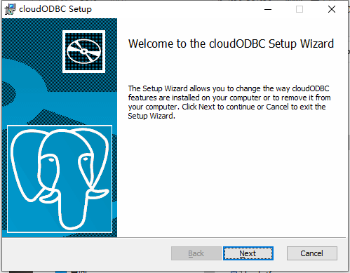
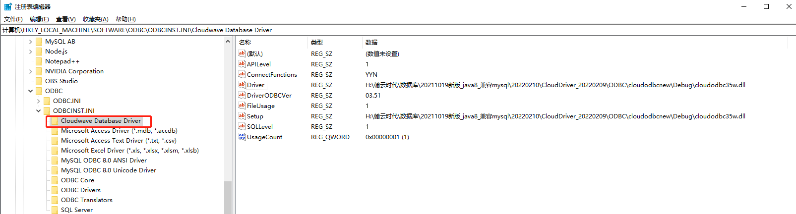
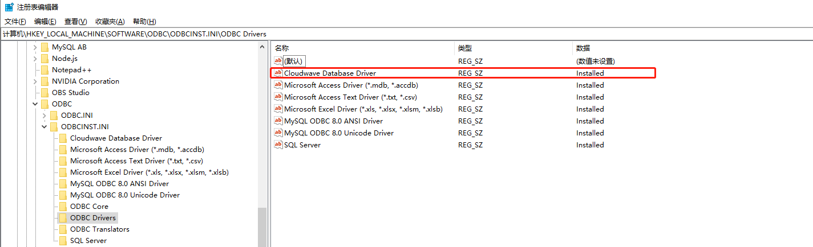
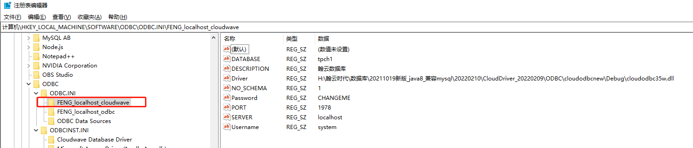
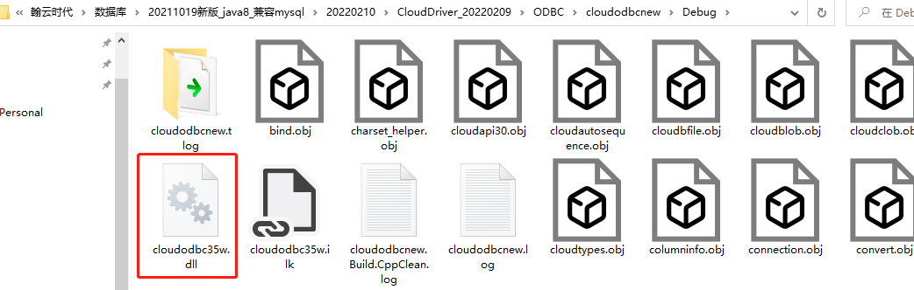
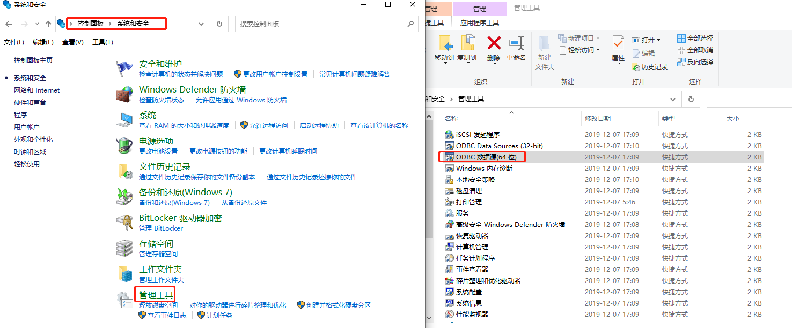
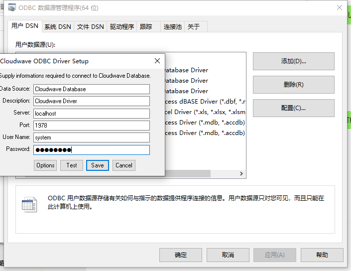

# 1 翰云ODBC驱动软件安装


翰云数据库提供了面向C/C++语言开发环境的ODBC驱动软件。本文重点说明在WINDOWS平台上，翰云ODBC驱动软件的安装和使用方法。

1. ODBC驱动软件在WINDIWS平台的安装：

​      安装程序ODBC Win64.exe提供了图形化界面，一般采用默认配置。

 

安装成功后，会在注册表”HKEY_LOCAL_MACHINE\SOFTWARE\ODBC\ODBCINST.INI”的位置创建名为“Cloudwave Database Driver”的驱动，如下图所示。**有些环境平台，因为本地安全策略的限制，注册表可能无法修改，这时可以手动添加注册项。

 

注册项1：在ODBC Drivers新添字符串值Cloudwave Database Driver。

 

注册项2：在ODBCINST.INI新添项FENG_localhost_cloudwave（方便人辨识的数据连接名称即可），并为其添加字符串值Driver、DriverODBCVer和Setup。其中Driver、Setup指向ODBC的安装位置，取默认配置：

 

H:\翰云时代\数据库\20211019新版_java8_兼容mysql\20220210\CloudDriver_20220209\ODBC\cloudodbcnew\Debug\cloudodbc35w.dll

 

ODBC安装成功后，即可通过Windows的ODBC数据源管理器，添加到翰云数据库的DSN（数据源），DSN是配置到数据库的连接。打开“控制面板-系统和安全-管理工具-ODBC数据源(64位)”：

 

在上图中，“驱动软件”页可以看到已经安装的UDB，打开“用户DSN”页，点击“添加”，选择驱动“Cloudwave Database Driver”，弹出如下对话框，在User Name/Password中输入system/CHAGNEME，点击“Test”，如果此时数据库服务已经在本地启动，连接测试成功，点击“Save”保存配置即可。

 

# 2 支持的数据类型

翰云ODBC驱动软件目前提供了如下表列出的数据类型：

| CLOUD TYPE | C++ TYPE       | SQL IDENTIFIER         |
| ---------- | -------------- | ---------------------- |
| JSON       | CString        | json                   |
| BLOB       | CByteArray     | blob                   |
| BOOLEAN    | bool           | boolean                |
| BYTE       | CByteArray     | binary(n)/varbinary(n) |
| BYTES      | CByteArray     | binary(n)/varbinary(n) |
| CHAR       | CString        | char(1)                |
| CLOB       | CString        | clob                   |
| DATETIME   | Ctime、CString | timestamp              |
| DATE       | Ctime、CString | date                   |
| DECIMAL    | double         | number(m,n)            |
| DOUBLE     | double         | double                 |
| FLOAT      | float          | float                  |
| INT        | int            | integer                |
| LONG       | long           | long                   |
| STRING     | CString        | char(n)/varcahr(n)     |


# 3 主要函数


翰云ODBC驱动软件提供标准ODBC主要接口函数，下面分类列出所具备的常用接口函数，并对接口函数详细表述。


## 3.1 连接到数据源

1. SQLAllocHandle

函数功能：分配环境、连接、语句或者描述符句柄。

```
RETCODE SQLAllocHandle(

   SQLSMALLINT  HandleType,

   SQLHANDLE   InputHandle,

   SQLHANDLE *  OutputHandlePtr);
```

参数详解：

| **参数**        | 类型 | **使用方式**                                                 |
| --------------- | ---- | ------------------------------------------------------------ |
| HandleType      | 输入 | 1.  用于申请环境句柄，赋值SQL_HANDLE_ENV<br/>2.  用于申请连接句柄，赋值SQL_HANDLE_DBC  <br/>3.  用于申请描述符句柄，赋值SQL_HANDLE_DESC    <br/>4.  用于申请语句句柄，赋值SQL_HANDLE_STMT |
| InputHandle     | 输入 | 1. 如HandleType=SQL_HANDLE_ENV，赋值SQL_NULL_HANDLE<br/>2.  如HandleType=SQL_HANDLE_DBC，赋值已分配的环境句柄   <br/>3. 如HandleType=SQL_HANDLE_DESC或SQL_HANDLE_STMT，赋值已分配好的连接句柄 |
| OutputHandlePtr | 输出 | 保存申请来的句柄，申请句柄类型由变量HandleType决定           |

返回值：

 SQL_SUCCESS、SQL_SUCCESS_WITH_INFO、SQL_INVALID_HANDLE、SQL_ERROR

2. SQLConnect

函数功能：建立与驱动软件或者数据源的连接。访问数据源的连接句柄包含了包括状态、事务申明和错误信息的所有连接信息。

```
RETCODE SQLConnect(

   HDBC     ConnectionHandle,

   SQLCHAR *   ServerName,

   SQLSMALLINT   NameLength1,

   SQLCHAR *   UserName,

   SQLSMALLINT   NameLength2,

   SQLCHAR *   Authentication,

   SQLSMALLINT   NameLength3);
```

参数详解：

| **参数**         | 类型 | **使用方式**                                                 |
| ---------------- | :--: | ------------------------------------------------------------ |
| ConnectionHandle | 输入 | 连接句柄                                                     |
| ServerName       | 输入 | 数据源名称，按计算机字长不同，设置obdc32ad.exe中的系统源，设置好其中名称即为该输入变量 |
| NameLength1      | 输入 | ServerName的长度                                             |
| UserName         | 输入 | 用户名                                                       |
| NameLength2      | 输入 | 用户名长度                                                   |
| Authentication   | 输入 | 密码                                                         |
| NameLength3      | 输入 | 密码长度                                                     |
|                  |      |                                                              |

返回值：

SQL_SUCCESS、SQL_SUCCESS_WITH_INFO、SQL_INVALID_HANDLE、SQL_ERROR

3.SQLDriverConnect

函数功能：与SQLConnect相似，用来连接到驱动软件或者数据源。但它比SQLConnect支持数据源更多的连接信息。

```
RETCODE SQLDriverConnect( 

   HDBC      hdbc,

   HWND      hwnd,

   SQLCHAR *    szConnStrIn,

   SQLSMALLINT   cbConnStrIn,

   SQLCHAR *    szConnStrOut,

   SQLSMALLINT   cbConnStrOutMax,

   SQLSMALLINT *  pcbConnStrOut,

   SQLUSMALLINT  fDriverCompletion

);
```

参数详解：

| **参数**          | 类型 | **使用方式**                                                 |
| :---------------- | :--- | :----------------------------------------------------------- |
| hdbc              | 输入 | 连接句柄                                                     |
| hwnd              | 输入 | 窗口句柄                                                     |
| szConnStrIn       | 输入 | 连接字符串                                                   |
| cbConnStrIn       | 输入 | szConnStrIn的长度，如果字符串为 Unicode，则以字符为单位;如果字符串是  ANSI 或 DBCS，则以字节为单位 |
| szConnStrOut      | 输出 | 指向已完成连接字符串的缓冲区的指针                           |
| cbConnStrOutMax   | 输入 | 缓冲区的长度                                                 |
| pcbConnStrOut     | 输出 | 指向缓冲区的指针，在此缓冲区中，返回的字符串  (null 终止字符数，) szConnStrOut中返回的字符数 |
| fDriverCompletion | 输入 | 指示驱动软件管理器或驱动软件是否必须提示输入更多连接信息的标志：SQL_DRIVER_PROMPT、SQL_DRIVER_COMPLETE、SQL_DRIVER_COMPLETE_REQUIRED  或 SQL_DRIVER_NOPROMPT |

返回值：

SQL_SUCCESS、SQL_SUCCESS_WITH_INFO、SQL_NO_DATA、SQL_INVALID_HANDLE、SQL_ERROR、SQL_STILL_EXECUTING

4.  SQLBrowseConnect

函数功能：支持一种交互方法来检索或者列出连接数据源所需要的属性和属性值。

```
RETCODE  SQLBrowseConnect(

   HDBC      hdbc,

   SQLCHAR *    szConnStrIn,

   SQLSMALLINT   cbConnStrIn,

   SQLCHAR *    OutConnectionString,

   SQLSMALLINT   BufferLength,

   SQLSMALLINT *  StringLength2Ptr);
```

参数详解

| **参数**        | **类型** | **使用方式**                           |
| --------------- | -------- | -------------------------------------- |
| hdbc            | 输入     | 连接句柄                               |
| szConnStrIn     | 输入     | 送浏览请求连接字符串                   |
| cbConnStrIn     | 输入     | szConnStrIn的长度                      |
| szConnStrOut    | 输出     | 返回浏览结果连接字符串的字符缓冲区指针 |
| cbConnStrOutMax | 输入     | szConnStrOut 缓冲区的长度              |
| pcbConnStrOut   | 输出     | 输出的字符总数                         |

返回值：

SQL_SUCCESS、SQL_SUCCESS_WITH_INFO、SQL_NEED_DATA、SQL_ERROR、SQL_INVALID_HANDLE 或 SQL_STILL_EXECUTING

## 3.2  获取驱动软件和数据源信息

1. SQLDataSources

函数功能：能够被调用多次来获取应用程序使用的所有数据源的名字。

```
RETCODE  SQLDataSources(

    HENV      EnvironmentHandle,

    SQLUSMALLINT Direction,

    SQLCHAR *   ServerName,

    SQLSMALLINT  BufferLength1,

    SQLSMALLINT *  NameLength1Ptr,

    SQLCHAR *    Description,

    SQLSMALLINT  BufferLength2,

    SQLSMALLINT *  NameLength2Ptr)
```

参数详解：

| **参数**          | **类型** | **使用方式**                                                 |
| ----------------- | -------- | ------------------------------------------------------------ |
| EnvironmentHandle | 输入     | 环境句柄                                                     |
| Direction         | 输入     | 要求驱动软件管理器返回的数据源，可是：SQL_FETCH_FIRST、SQL_FETCH_NEXT、SQL_FETCH_FIRST_USER或SQL_FETCH_FIRST_SYSTEM |
| ServerName        | 输出     | 返回数据源名称的缓冲区指针                                   |
| BufferLength1     | 输入     | *ServerName* 缓冲区的长度                                    |
| NameLength1Ptr    | 输出     | ServerName缓冲区实用长度                                     |
| Description       | 输出     | 驱动软件说明的缓冲区指针                                     |
| BufferLength2     | 输入     | Description缓冲区的长度                                      |
| NameLength2Ptr    | 输出     | Description缓冲区实用长度                                    |

返回值：SQL_SUCCESS、SQL_SUCCESS_WITH_INFO、SQL_NO_DATA、SQL_ERROR、SQL_INVALID_HANDLE

2. SQLDrivers

   函数功能：返回所有安装过的驱动软件清单，包括对它们的描述以及属性关键字。

   ```
   RETCODE SQLDrivers(
   
      HENV       EnvironmentHandle,
   
      SQLUSMALLINT  Direction,
   
      SQLCHAR *    DriverDescription,
   
      SQLSMALLINT   BufferLength1,
   
      SQLSMALLINT *  DescriptionLengthPtr,
   
      SQLCHAR *    DriverAttributes,
   
      SQLSMALLINT   BufferLength2,
   
      SQLSMALLINT *  AttributesLengthPtr);
   ```

   参数详解：

   | **参数**             | **类型** | **使用方式**                                                 |
   | -------------------- | -------- | ------------------------------------------------------------ |
   | EnvironmentHandle    | 输入     | 环境句柄                                                     |
   | Direction            | 输入     | 要求驱动软件管理器返回的数据源可是：SQL_FETCH_NEXT或SQL_FETCH_FIRST |
   | DriverDescription    | 输出     | 返回驱动软件说明的缓冲区的指针                               |
   | BufferLength1        | 输入     | *DriverDescription* 缓冲区的长度                             |
   | DescriptionLengthPtr | 输出     | *DriverDescription* 缓冲区实用长度                           |
   | DriverAttributes     | 输出     | 驱动软件属性的缓冲区指针                                     |
   | BufferLength2        | 输入     | DriverAttributes 缓冲区的长度                                |
   | AttributesLengthPtr  | 输出     | DriverAttributes 缓冲区实用长度                              |

   返回值：SQL_SUCCESS、SQL_SUCCESS_WITH_INFO、SQL_NO_DATA、SQL_ERROR 或 SQL_INVALID_HANDLE

3. SQLGetInfo

   函数功能：返回连接的驱动软件和数据源的元信息。

   ```
   RETCODE SQLGetInfo(
   
      HDBC       ConnectionHandle,
   
      SQLUSMALLINT  InfoType,
   
      SQLPOINTER   InfoValuePtr,
   
      SQLSMALLINT   BufferLength,
   
      SQLSMALLINT *  StringLengthPtr);
   ```

   参数详解：

   | **参数**         | **类型** | **使用方式**               |
   | ---------------- | -------- | -------------------------- |
   | ConnectionHandle | 输入     | 连接句柄                   |
   | InfoType         | 输入     | 信息类型                   |
   | InfoValuePtr     | 输出     | 返回信息的缓冲区指针       |
   | BufferLength     | 输入     | InfoValuePtr 缓冲区的长度  |
   | StringLengthPtr  | 输出     | InfoValuePtr缓冲区实用长度 |

   返回值：SQL_SUCCESS、SQL_SUCCESS_WITH_INFO、SQL_ERROR 或 SQL_INVALID_HANDLE

4. SQLGetFunctions

   函数功能：返回指定的驱动软件是否支持某个特定函数的信息。

   ```
   RETCODE SQLGetFunctions(
   
      HDBC        ConnectionHandle,
   
      SQLUSMALLINT   FunctionId,
   
      SQLUSMALLINT *  SupportedPtr);
   ```

   参数详解：

   | **参数**         | **类型** | **使用方式**                                                 |
   | ---------------- | -------- | ------------------------------------------------------------ |
   | ConnectionHandle | 输入     | 连接句柄                                                     |
   | FunctionId       | 输入     | 标识：SQL_API_ODBC3_ALL_FUNCTIONS 或SQL_API_ALL_FUNCTIONS    |
   | SupportedPtr     | 输入     | 如果驱动软件支持指定的函数，则此值为 SQL_TRUE，如果不支持，则 SQL_FALSE |

   返回值：SQL_SUCCESS、SQL_SUCCESS_WITH_INFO、SQL_ERROR 或 SQL_INVALID_HANDLE

   

5. SQLGetTypeInfo

函数功能：返回指定的数据源支持的数据类型的信息。

```
RETCODE SQLGetTypeInfo(

   HSTMT     StatementHandle,

   SQLSMALLINT  DataType);
```

参数详解：

| **参数**        | **类型** | **使用方式**     |
| --------------- | -------- | ---------------- |
| StatementHandle | 输入     | 结果集的语句句柄 |
| DataType        | 输入     | SQL数据类型      |

返回值：SQL_SUCCESS、SQL_SUCCESS_WITH_INFO、SQL_STILL_EXECUTING、SQL_ERROR 或 SQL_INVALID_HANDLE

## 3.3 设置或者获取驱动软件属性

1. SQLSetConnectAttr

函数功能：设置连接属性值。

```
RETCODE SQLSetConnectAttr(

   HDBC      ConnectionHandle,

   SQLINTEGER  Attribute,

   PTR       Value,

   SQLINTEGER  StringLength);
```

参数详解：

| **参数**         | **类型** | **使用方式**                  |
| ---------------- | -------- | ----------------------------- |
| ConnectionHandle | 输入     | 连接句柄                      |
| Attribute        | 输入     | 要设置的属性                  |
| Value            | 输入     | 指向要与Attribute关联值的指针 |
| StringLength     | 输入     | Attribute长度                 |

返回值：

SQL_SUCCESS、SQL_SUCCESS_WITH_INFO、SQL_ERROR、SQL_INVALID_HANDLE 或 SQL_STILL_EXECUTING

2. SQLGetConnectAttr

函数功能：返回连接属性值。

```
RETCODE SQLGetConnectAttr(

   HDBC       ConnectionHandle,

   SQLINTEGER   Attribute,

   PTR       Value,

   SQLINTEGER   BufferLength,

   SQLINTEGER *  StringLengthPtr);
```

参数详解：

| **参数**         | **类型** | **使用方式**                 |
| ---------------- | -------- | ---------------------------- |
| ConnectionHandle | 输入     | 连接句柄                     |
| Attribute        | 输入     | 要检索的属性                 |
| Value            | 输出     | 指向返回连接属性的缓冲取指针 |
| BufferLength     | 输入     | Value缓冲区长度              |
| StringLengthPtr  | 输出     | Value缓冲区实用长度          |

返回值：

SQL_SUCCESS、SQL_SUCCESS_WITH_INFO、SQL_NO_DATA、SQL_ERROR 或 SQL_INVALID_HANDLE

3.  SQLSetEnvAttr

函数功能：设置环境属性值。

```
RETCODE  SQLSetEnvAttr(

   HENV     EnvironmentHandle,

   SQLINTEGER  Attribute,

   PTR       Value,

   SQLINTEGER  StringLength);
```

参数详解：

| **参数**          | **类型** | **方使用式**              |
| ----------------- | -------- | ------------------------- |
| EnvironmentHandle | 输入     | 环境句柄                  |
| Attribute         | 输入     | 要设置的属性              |
| Value             | 输入     | 指向Attribute的缓冲区指针 |
| StringLength      | 输入     | Attribute缓冲区长度       |

返回值：

SQL_SUCCESS、SQL_SUCCESS_WITH_INFO、SQL_ERROR 或 SQL_INVALID_HANDLE

4.  SQLGetEnvAttr

函数功能：返回环境属性值。

```
RETCODE SQLGetEnvAttr(

   HENV       EnvironmentHandle,

   SQLINTEGER   Attribute,

   PTR       Value,

   SQLINTEGER   BufferLength,

   SQLINTEGER *  StringLength);
```

参数详解：

| **参数**          | **类型** | **使用方式**           |
| ----------------- | -------- | ---------------------- |
| EnvironmentHandle | 输入     | 环境句柄               |
| Attribute         | 输入     | 要获取的属性           |
| Value             | 输出     | 获取到信息缓冲区的指针 |
| BufferLength      | 输入     | Value缓冲区长度        |
| StringLength      | 输出     | Value缓冲区实用长度    |

返回值：

SQL_SUCCESS、SQL_SUCCESS_WITH_INFO、SQL_NO_DATA、SQL_ERROR 或 SQL_INVALID_HANDLE

5.  SQLSetStmtAttr

函数功能：设置语句属性值。

```
RETCODE  SQLSetStmtAttr(

   HSTMT     StatementHandle,

   SQLINTEGER  Attribute,

   PTR       Value,

   SQLINTEGER  StringLength);
```

参数详解：

| **参数**        | **类型** | **使用方式**    |
| --------------- | -------- | --------------- |
| StatementHandle | 输入     | 语句句柄        |
| Attribute       | 输入     | 要设置的选项    |
| Value           | 输入     | 要设置的属性值  |
| StringLength    | 输入     | Value缓冲区长度 |

返回值：

SQL_SUCCESS、SQL_SUCCESS_WITH_INFO、SQL_ERROR 或 SQL_INVALID_HANDLE

6.  SQLGetStmtAttr

函数功能：返回语句属性值。

```
RETCODE  SQLGetStmtAttr(

   HSTMT       StatementHandle,

   SQLINTEGER   Attribute,

   PTR        Value,

   SQLINTEGER   BufferLength,

   SQLINTEGER *  StringLength);
```

参数详解：

| **参数**        | **类型** | **使用方式**               |
| --------------- | -------- | -------------------------- |
| StatementHandle | 输入     | 语句句柄                   |
| Attribute       | 输入     | 要获取的属性               |
| Value           | 输出     | 获取到语句属性缓冲区的指针 |
| BufferLength    | 输入     | Value缓冲区长度            |
| StringLength    | 输出     | Value缓冲区实用长度        |

返回值：

SQL_SUCCESS、SQL_SUCCESS_WITH_INFO、SQL_ERROR 或 SQL_INVALID_HANDLE

## 3.4  设置或者获取描述符字段

1.  SQLGetDescField

函数功能：返回单个描述符字段的值。

```
RETCODE  SQLGetDescField(

   SQLHDESC    DescriptorHandle,

   SQLSMALLINT   RecNumber,

   SQLSMALLINT   FieldIdentifier,

   PTR        Value,

   SQLINTEGER   BufferLength,

   SQLINTEGER *  StringLength);
```

参数详解：

| **参数**         | **类型** | **使用方式**                           |
| ---------------- | -------- | -------------------------------------- |
| DescriptorHandle | 输入     | 描述符句柄                             |
| RecNumber        | 输入     | 指示应用程序从其中查找信息的描述符记录 |
| FieldIdentifier  | 输入     | 指示要返回其值的描述符的字段           |
| Value            | 输出     | 返回描述符信息的缓冲区指针             |
| BufferLength     | 输入     | Value缓冲区长度                        |
| StringLength     | 输出     | Value缓冲区实用长度                    |

返回值：

SQL_SUCCESS、SQL_SUCCESS_WITH_INFO、SQL_ERROR、SQL_NO_DATA 或 SQL_INVALID_HANDLE

2.   SQLGetDescRec

函数功能：返回当前描述符记录的多个字段的值。

```
RETCODE  SQLGetDescRec(

   SQLHDESC    DescriptorHandle,

   SQLSMALLINT   RecNumber,

   SQLCHAR *    Name,

   SQLSMALLINT   BufferLength,

   SQLSMALLINT *  StringLength,

   SQLSMALLINT *  Type,

   SQLSMALLINT *  SubType,

   SQLLEN *    Length,

   SQLSMALLINT *  Precision,

   SQLSMALLINT *  Scale,

   SQLSMALLINT *  Nullable);
```

参数详解：

| **参数**         | **类型** | **使用方式**                                              |
| ---------------- | -------- | --------------------------------------------------------- |
| DescriptorHandle | 输入     | 描述符句柄                                                |
| RecNumber        | 输入     | 指示应用程序从中查找信息的描述符记录                      |
| Name             | 输出     | 指向返回名称缓冲区的指针                                  |
| BufferLength     | 输入     | Name缓冲区的长度                                          |
| StringLength     | 输出     | Name缓冲区实用长度                                        |
| Type             | 输出     | 指向返回描述符记录的缓冲区指针                            |
| SubType          | 输出     | 指向返回SQL_DESC_DATETIME_INTERVAL_CODE字段值的缓冲区指针 |
| Length           | 输出     | 指向返回SQL_DESC_OCTET_LENGTH字段值的缓冲区指针           |
| Precision        | 输出     | 指向返回SQL_DESC_PRECISION字段值的缓冲区指针              |
| Scale            | 输出     | 指向返回SQL_DESC_SCALE 字段值的缓冲区指针                 |
| Nullable         | 输出     | 指向返回SQL_DESC_NULLABLE 字段值的缓冲区指针              |

返回值：

SQL_SUCCESS、SQL_SUCCESS_WITH_INFO、SQL_ERROR、SQL_NO_DATA 或 SQL_INVALID_HANDLE

3.   SQLSetDescField

函数功能：设置单个描述符字段的值。

```
RETCODE  SQLSetDescField(

   SQLHDESC   DescriptorHandle,

   SQLSMALLINT  RecNumber,

   SQLSMALLINT  FieldIdentifier,

   PTR       Value,

   SQLINTEGER  BufferLength);
```

参数详解：

| **参数**         | **类型** | **使用方式**           |
| ---------------- | -------- | ---------------------- |
| DescriptorHandle | 输入     | 描述符句柄             |
| RecNumber        | 输入     | 要设置的字段           |
| FieldIdentifier  | 输入     | 要设置其值的描述符字段 |
| Value            | 输入     | 要设置的值             |
| BufferLength     | 输入     | Value缓冲区长度        |

返回值：

SQL_SUCCESS、SQL_SUCCESS_WITH_INFO、SQL_ERROR 或 SQL_INVALID_HANDLE

4.  SQLSetDescRec

函数功能：设置描述符记录的多个字段。

```
RETCODE  SQLSetDescRec(

   SQLHDESC   DescriptorHandle,

   SQLSMALLINT  RecNumber,

   SQLSMALLINT  Type,

   SQLSMALLINT  SubType,

   SQLLEN    Length,

   SQLSMALLINT  Precision,

   SQLSMALLINT  Scale,

   SQLPOINTER  Data,

   SQLLEN *   StringLength,

   SQLLEN *   Indicator);
```

参数详解：

| **参数**         | **类型** | **使用方式**                                                 |
| ---------------- | -------- | ------------------------------------------------------------ |
| DescriptorHandle | 输入     | 描述符句柄                                                   |
| RecNumber        | 输入     | 指示包含要设置的字段的描述符记录                             |
| Type             | 输入     | 设置描述符记录SQL_DESC_TYPE字段的值                          |
| SubType          | 输入     | Type为SQL_DATETIME或SQL_INTERVAL时，设置SQL_DESC_DATETIME_INTERVAL_CODE的值 |
| Length           | 输入     | 设置描述符记录SQL_DESC_OCTET_LENGTH字段的值                  |
| Precision        | 输入     | 设置描述符记录SQL_DESC_PRECISION字段的值                     |
| Scale            | 输入     | 设置描述符记录SQL_DESC_SCALE字段的值                         |
| Data             | 输入     | 设置描述符记录SQL_DESC_DATA_PTR字段的值                      |
| StringLength     | 输入     | 设置描述符记录SQL_DESC_OCTET_LENGTH_PTR字段的值              |
| Indicator        | 输入     | 设置描述符记录SQL_DESC_INDICATOR_PTR字段的值                 |

返回值：

SQL_SUCCESS、SQL_SUCCESS_WITH_INFO、SQL_ERROR 或 SQL_INVALID_HANDLE

## 3.5  准备SQL语句

1. SQLPrepare

函数功能：准备要执行的SQL语句。

```
RETCODE  SQLPrepare(

   HSTMT     StatementHandle,

   SQLCHAR *   StatementText,

   SQLINTEGER  TextLength);
```

参数详解：

| **参数**        | **类型** | **使用方式**                |
| --------------- | -------- | --------------------------- |
| StatementHandle | 输入     | 语句句柄                    |
| StatementText   | 输入     | SQL 文本字符串              |
| TextLength      | 输入     | StatementText的长度（字符） |

返回值：

SQL_SUCCESS、SQL_SUCCESS_WITH_INFO、SQL_STILL_EXECUTING、SQL_ERROR 或 SQL_INVALID_HANDLE

2. SQLBindParameter

函数功能：在SQL语句中分配参数的缓冲区。

```
RETCODE SQLBindParameter(

   HSTMT       hstmt,

   SQLUSMALLINT  ipar,

   SQLSMALLINT   fParamType,

   SQLSMALLINT   fCType,

   SQLSMALLINT   fSqlType,

   SQLULEN     cbColDef,

   SQLSMALLINT   ibScale,

   PTR        rgbValue,

   SQLLEN      cbValueMax, 

   SQLLEN *     pcbValue);
```

参数详解：

| **参数**   | **类型** | **使用方式**                                                 |
| ---------- | -------- | ------------------------------------------------------------ |
| hstmt      | 输入     | 语句句柄                                                     |
| ipar       | 输入     | 参数位于语句中的序号，最小为1                                |
| fParamType | 输入     | 入参/出参类型标识，取值SQL_PARAM_INPUT，SQL_PARAM_OUTPUT，SQL_PARAM_INPUT_OUTPUT |
| fCType     | 输入     | 对应的C数据类型标识                                          |
| fSqlType   | 输入     | 对应的SQL数据类型标识                                        |
| cbColDef   | 输入     | 对应字段长度                                                 |
| ibScale    | 输入     | 如果是浮点数，则对应字段精度                                 |
| rgbValue   | 输入     | 参数缓存                                                     |
| cbValueMax | 输入     | 参数缓存字节数                                               |
| pcbValue   | 输入     | 用于表示rgbValue指向的缓存数据的字符串长度或NULL尾值的标识，如果是字符串，则表示字符串有效字符数<br/>（或SQL_NTS表示NULL结尾），如果字段值是NULL，则设置为SQL_NULL_DATA。 |

返回值：SQL_SUCCESS、SQL_SUCCESS_WITH_INFO、SQL_ERROR 或 SQL_INVALID_HANDLE

3.  SQLGetCursorName

函数功能：返回与语句句柄相关的游标名称。

```
RETCODE  SQLGetCursorName(

   HSTMT      StatementHandle,

   SQLCHAR *    CursorName,

   SQLSMALLINT   BufferLength,

   SQLSMALLINT *  NameLength);
```

参数详解：

| **参数**        | **类型** | **使用方式**                     |
| --------------- | -------- | -------------------------------- |
| StatementHandle | 输入     | 语句句柄                         |
| CursorName      | 输入     | 指向要返回游标名称的缓冲区的指针 |
| BufferLength    | 输入     | *CursorName* 缓冲区*的长度*      |
| NameLength      | 输出     | *CursorName* 缓冲区实*用长度*    |

返回值：SQL_SUCCESS、SQL_SUCCESS_WITH_INFO、SQL_ERROR 或 SQL_INVALID_HANDLE

4.  SQLSetCursorName

函数功能：设置与语句句柄相关的游标名称。

```
RETCODE  SQLSetCursorName(

   HSTMT     StatementHandle,

   SQLCHAR *   CursorName,

   SQLSMALLINT  NameLength);
```

参数详解：

| **参数**        | **类型** | **使用方式**         |
| --------------- | -------- | -------------------- |
| StatementHandle | 输入     | 语句句柄             |
| CursorName      | 输入     | 游标名称             |
| NameLength      | 输入     | CursorName的字符长度 |

返回值：SQL_SUCCESS、SQL_SUCCESS_WITH_INFO、SQL_ERROR 或 SQL_INVALID_HANDLE


## 3.6  提交SQL请求

1.  SQLExecute

函数功能：与SQLPrepare共同使用，执行准备好的SQL语句。

```
RETCODE  SQLExecute(

   HSTMT  StatementHandle);
```

参数详解：

| **参数**        | **类型** | **使用方式** |
| --------------- | -------- | ------------ |
| StatementHandle | 输入     | 语句句柄     |

返回值：SQL_SUCCESS、SQL_SUCCESS_WITH_INFO、SQL_NEED_DATA、SQL_STILL_EXECUTING、SQL_ERROR、SQL_NO_DATA、SQL_INVALID_HANDLE 或 SQL_PARAM_DATA_AVAILABLE

2.  SQLExecDirect

函数功能：执行一条SQL语句。

```
RETCODE  SQLExecDirect(

   HSTMT     StatementHandle,

   SQLCHAR *  StatementText,

   SQLINTEGER  TextLength);
```

参数详解：

| **参数**        | **类型** | **使用方式**        |
| --------------- | -------- | ------------------- |
| StatementHandle | 输入     | 语句句柄            |
| StatementText   | 输入     | 要执行 SQL 语句     |
| TextLength      | 输入     | StatementText的长度 |

返回值：SQL_SUCCESS、SQL_SUCCESS_WITH_INFO、SQL_NEED_DATA、SQL_STILL_EXECUTING、SQL_ERROR、SQL_NO_DATA、SQL_INVALID_HANDLE 或 SQL_PARAM_DATA_AVAILABLE

3.  SQLNativeSql

函数功能：返回驱动软件对一条SQL语句的翻译，并不执行sql语句。

```
RETCODE  SQLNativeSql(

   HDBC      hdbc,

   SQLCHAR *   szSqlStrIn,

   SQLINTEGER  cbSqlStrIn,

   SQLCHAR *   szSqlStr,

   SQLINTEGER  cbSqlStrMax,

   SQLINTEGER * pcbSqlStr);
```

参数详解：

| **参数**    | **类型** | **使用方式**                               |
| ----------- | -------- | ------------------------------------------ |
| hdbc        | 输入     | 连接句柄                                   |
| szSqlStrIn  | 输入     | 要转换 SQL 文本字符串                      |
| cbSqlStrIn  | 输入     | szSqlStrIn文本字符串的长度（以字符为字符） |
| szSqlStr    | 输出     | 转换好的 SQL 文本字符串                    |
| cbSqlStrMax | 输入     | szSqlStr缓冲区*的长度（*字符数）           |
| pcbSqlStr   | 输出     | szSqlStr缓冲区实*用长度*                   |

返回值：SQL_SUCCESS、SQL_SUCCESS_WITH_INFO、SQL_ERROR 或 SQL_INVALID_HANDLE

4.  SQLDescribeParam

函数功能：返回对SQL语句中指定参数的描述。

```
RETCODE  SQLDescribeParam(

   HSTMT      hstmt,

   SQLUSMALLINT  ipar,

   SQLSMALLINT *  pfSqlType,

   SQLULEN *    pcbParamDef,

   SQLSMALLINT *  pibScale,

   SQLSMALLINT *  pfNullable);
```

参数详解：

| **参数**    | **类型** | **使用方式**                                   |
| ----------- | -------- | ---------------------------------------------- |
| hstmt       | 输入     | 语句句柄                                       |
| ipar        | 输入     | 参数标记编号按参数顺序依次排序                 |
| pfSqlType   | 输出     | 返回指定参数描述的缓冲区指针                   |
| pcbParamDef | 输出     | pfSqlType缓冲区实*用长度*                      |
| pibScale    | 输出     | 返回数据源定义的相应参数的列或表达式的小数位数 |
| pfNullable  | 输出     | 返回指示参数是否允许 NULL 值                   |

返回值：SQL_SUCCESS、SQL_SUCCESS_WITH_INFO、SQL_STILL_EXECUTING、SQL_ERROR 或 SQL_INVALID_HANDLE

5.  SQLNumParams

函数功能：返回SQL语句中参数的个数。

```
RETCODE  SQLNumParams(

   HSTMT      hstmt,

   SQLSMALLINT *  pcpar);
```

参数详解：

| **参数** | **类型** | **使用方式**         |
| -------- | -------- | -------------------- |
| hstmt    | 输入     | 语句句柄             |
| pcpar    | 输入     | 返回语句中的参数数量 |

返回值：SQL_SUCCESS、SQL_SUCCESS_WITH_INFO、SQL_STILL_EXECUTING、SQL_ERROR 或 SQL_INVALID_HANDLE

6.  SQLParamData

函数功能：与SQLPutData联合使用在运行时给参数赋值。

```
RETCODE  SQLParamData(

   HSTMT    StatementHandle,

   PTR *     Value);
```

参数详解：

| **参数**        | **类型** | **使用方式**           |
| --------------- | -------- | ---------------------- |
| StatementHandle | 输入     | 语句句柄               |
| Value           | 输入     | 指向返回值的缓冲区指针 |

返回值：SQL_SUCCESS、SQL_SUCCESS_WITH_INFO、SQL_NEED_DATA、SQL_NO_DATA、SQL_STILL_EXECUTING、SQL_ERROR、SQL_INVALID_HANDLE 或 SQL_PARAM_DATA_AVAILABLE

7.  SQLPutData

函数功能：在SQL语句运行时给部分或者全部参数赋值。

```
RETCODE  SQLPutData(

   HSTMT     StatementHandle,

   SQLPOINTER  Data,

   SQLLEN    StrLen_or_Ind);
```

参数详解：

| **参数**        | **类型** | **使用方式**                           |
| --------------- | -------- | -------------------------------------- |
| StatementHandle | 输入     | 语句句柄                               |
| Data            | 输入     | 指向包含参数或列的实际数据的缓冲区指针 |
| StrLen_or_Ind   | 输入     | Data缓冲区*的长度*                     |

返回值：SQL_SUCCESS、SQL_SUCCESS_WITH_INFO、SQL_STILL_EXECUTING、SQL_ERROR 或 SQL_INVALID_HANDLE

## 3.7 检索结果集及其相关信息

1.  SQLRowCount

函数功能：返回INSERT、UPDATE或者DELETE等语句影响的行数。

```
RETCODE  SQLRowCount(

   HSTMT   StatementHandle,

   SQLLEN *  RowCount);
```

参数详解：

| **参数**        | **类型** | **使用方式**             |
| --------------- | -------- | ------------------------ |
| StatementHandle | 输入     | 语句句柄                 |
| RowCount        | 输出     | 指向要返回行计数的缓冲区 |

返回值：SQL_SUCCESS、SQL_SUCCESS_WITH_INFO、SQL_ERROR 或 SQL_INVALID_HANDLE

2.  SQLNumResultCols

函数功能：返回结果集中列的数目。

```
RETCODE  SQLNumResultCols(

   HSTMT      StatementHandle,

   SQLSMALLINT *  ColumnCount);
```

参数详解：

| **参数**        | **类型** | **使用方式**                         |
| --------------- | -------- | ------------------------------------ |
| StatementHandle | 输入     | 语句句柄                             |
| ColumnCount     | 输出     | 指向要返回结果集内列数的缓冲区的指针 |

返回值：SQL_SUCCESS、SQL_SUCCESS_WITH_INFO、SQL_STILL_EXECUTING、SQL_ERROR 或 SQL_INVALID_HANDLE

3.  SQLDescribeCol

函数功能：返回结果集中列的描述符记录。

```
RETCODE  SQLDescribeCol(

   HSTMT      StatementHandle,

   SQLUSMALLINT  ColumnNumber,

   SQLCHAR *   ColumnName,

   SQLSMALLINT  BufferLength,

   SQLSMALLINT * NameLength,

   SQLSMALLINT * DataType,

   SQLULEN *   ColumnSize,

   SQLSMALLINT * DecimalDigits,

   SQLSMALLINT * Nullable);
```

参数详解：

| **参数**        | **类型** | **使用方式**                        |
| --------------- | -------- | ----------------------------------- |
| StatementHandle | 输入     | 语句句柄                            |
| ColumnNumber    | 输入     | 按升序顺序排列的结果数据的列数      |
| ColumnName      | 输出     | 指向返回列名称的缓冲区指针          |
| BufferLength    | 输入     | ColumnName 缓冲区长度（以字符为限） |
| NameLength      | 输出     | ColumnName 缓冲区实*用长度*         |
| DataType        | 输出     | 指向返回列的 SQL 数据类型的缓冲区   |
| ColumnSize      | 输出     | 返回数据源中列的大小 (以字符)       |
| DecimalDigits   | 输出     | 返回数据源中列的小数位数            |
| Nullable        | 输出     | 指示数据源中列列是否允许 NULL 值    |

返回值：SQL_SUCCESS、SQL_SUCCESS_WITH_INFO、SQL_STILL_EXECUTING、SQL_ERROR 或 SQL_INVALID_HANDLE

4.  SQLColAttribute

函数功能：返回结果集中列的属性。

```
SQLRETURN  SQLColAttribute (

   SQLHSTMT    StatementHandle,

   SQLUSMALLINT  ColumnNumber,

   SQLUSMALLINT  FieldIdentifier,

   SQLPOINTER   CharacterAttribute,

   SQLSMALLINT   BufferLength,

   SQLSMALLINT *  StringLength,

   SQLLEN *    NumericAttribute);
```

参数详解：

| **参数**           | **类型** | **使用方式**                                            |
| ------------------ | -------- | ------------------------------------------------------- |
| StatementHandle    | 输入     | 语句句柄                                                |
| ColumnNumber       | 输入     | 用于检索字段值的记录数                                  |
| FieldIdentifier    | 输入     | 描述符句柄                                              |
| CharacterAttribute | 输出     | 返回 IRD 的 ColumnNumber 行的FieldIdentifier 字段中的值 |
| BufferLength       | 输入     | 如CharacterAttribute为字符串，则表示其长度              |
| StringLength       | 输出     | 缓冲区中返回的字节总数返回值，否则不使用                |
| NumericAttribute   | 输出     | 字段是数值描述符类型时                                  |

返回值：SQL_SUCCESS、SQL_SUCCESS_WITH_INFO、SQL_STILL_EXECUTING、SQL_ERROR 或 SQL_INVALID_HANDLE

5.  SQLBindCol

函数功能：为结果集中的列分配缓冲区。

```
RETCODE  SQLBindCol(

   HSTMT      StatementHandle,

   SQLUSMALLINT  ColumnNumber,

   SQLSMALLINT  TargetType,

   PTR       TargetValue,

   SQLLEN     BufferLength,

   SQLLEN *    StrLen_or_Ind);
```

参数详解：

| **参数**        | **类型**  | **使用方式**                            |
| --------------- | --------- | --------------------------------------- |
| StatementHandle | 输入      | 语句句柄                                |
| ColumnNumber    | 输入      | 要绑定的结果集列的编号                  |
| TargetType      | 输入      | TargetValue 缓冲区的C数据类型的标识符   |
| TargetValue     | 输入      | 指向要绑定到列的数据缓冲区的指针        |
| BufferLength    | 输入      | TargetValue 缓冲区的长度                |
| StrLen_or_Ind   | 输入/输出 | 指向要绑定到列的长度/指示器缓冲区的指针 |

返回值：SQL_SUCCESS、SQL_SUCCESS_WITH_INFO、SQL_ERROR 或 SQL_INVALID_HANDLE

6.  SQLFetch

函数功能：在结果集中检索下一行元组。

```
RETCODE  SQLFetch(

   HSTMT   StatementHandle);
```

参数详解：

| **参数**        | **类型** | **使用方式** |
| --------------- | -------- | ------------ |
| StatementHandle | 输入     | 语句句柄     |

返回值：SQL_SUCCESS、SQL_SUCCESS_WITH_INFO、SQL_NO_DATA、SQL_STILL_EXECUTING、SQL_ERROR 或 SQL_INVALID_HANDLE

1. SQLRowCount

函数功能：返回INSERT、UPDATE或者DELETE等语句影响的行数。

```
RETCODE  SQLRowCount(

   HSTMT   StatementHandle,

   SQLLEN *  RowCount);
```

参数详解：

| **参数**        | **类型** | **使用方式**             |
| --------------- | -------- | ------------------------ |
| StatementHandle | 输入     | 语句句柄                 |
| RowCount        | 输出     | 指向要返回行计数的缓冲区 |

返回值：SQL_SUCCESS、SQL_SUCCESS_WITH_INFO、SQL_ERROR 或 SQL_INVALID_HANDLE

2. SQLNumResultCols

函数功能：返回结果集中列的数目。

```
RETCODE  SQLNumResultCols(

   HSTMT      StatementHandle,

   SQLSMALLINT *  ColumnCount);
```

参数详解：

| **参数**        | **类型** | **使用方式**                         |
| --------------- | -------- | ------------------------------------ |
| StatementHandle | 输入     | 语句句柄                             |
| ColumnCount     | 输出     | 指向要返回结果集内列数的缓冲区的指针 |

返回值：SQL_SUCCESS、SQL_SUCCESS_WITH_INFO、SQL_STILL_EXECUTING、SQL_ERROR 或 SQL_INVALID_HANDLE

3. SQLDescribeCol

函数功能：返回结果集中列的描述符记录。

```
RETCODE  SQLDescribeCol(

   HSTMT      StatementHandle,

   SQLUSMALLINT  ColumnNumber,

   SQLCHAR *   ColumnName,

   SQLSMALLINT  BufferLength,

   SQLSMALLINT * NameLength,

   SQLSMALLINT * DataType,

   SQLULEN *   ColumnSize,

   SQLSMALLINT * DecimalDigits,

   SQLSMALLINT * Nullable);
```

参数详解：

| **参数**        | **类型** | **使用方式**                        |
| --------------- | -------- | ----------------------------------- |
| StatementHandle | 输入     | 语句句柄                            |
| ColumnNumber    | 输入     | 按升序顺序排列的结果数据的列数      |
| ColumnName      | 输出     | 指向返回列名称的缓冲区指针          |
| BufferLength    | 输入     | ColumnName 缓冲区长度（以字符为限） |
| NameLength      | 输出     | ColumnName 缓冲区实*用长度*         |
| DataType        | 输出     | 指向返回列的 SQL 数据类型的缓冲区   |
| ColumnSize      | 输出     | 返回数据源中列的大小 (以字符)       |
| DecimalDigits   | 输出     | 返回数据源中列的小数位数            |
| Nullable        | 输出     | 指示数据源中列列是否允许 NULL 值    |

返回值：SQL_SUCCESS、SQL_SUCCESS_WITH_INFO、SQL_STILL_EXECUTING、SQL_ERROR 或 SQL_INVALID_HANDLE

4. SQLColAttribute

   函数功能：返回结果集中列的属性。

   ```
   SQLRETURN  SQLColAttribute (
   
      SQLHSTMT    StatementHandle,
   
      SQLUSMALLINT  ColumnNumber,
   
      SQLUSMALLINT  FieldIdentifier,
   
      SQLPOINTER   CharacterAttribute,
   
      SQLSMALLINT   BufferLength,
   
      SQLSMALLINT *  StringLength,
   
      SQLLEN *    NumericAttribute);
   ```

   参数详解：

   | **参数**           | **类型** | **使用方式**                                            |
   | ------------------ | -------- | ------------------------------------------------------- |
   | StatementHandle    | 输入     | 语句句柄                                                |
   | ColumnNumber       | 输入     | 用于检索字段值的记录数                                  |
   | FieldIdentifier    | 输入     | 描述符句柄                                              |
   | CharacterAttribute | 输出     | 返回 IRD 的 ColumnNumber 行的FieldIdentifier 字段中的值 |
   | BufferLength       | 输入     | 如CharacterAttribute为字符串，则表示其长度              |
   | StringLength       | 输出     | 缓冲区中返回的字节总数返回值，否则不使用                |
   | NumericAttribute   | 输出     | 字段是数值描述符类型时                                  |

   返回值：SQL_SUCCESS、SQL_SUCCESS_WITH_INFO、SQL_STILL_EXECUTING、SQL_ERROR 或 SQL_INVALID_HANDLE

5. SQLBindCol

函数功能：为结果集中的列分配缓冲区。

```
RETCODE  SQLBindCol(

   HSTMT      StatementHandle,

   SQLUSMALLINT  ColumnNumber,

   SQLSMALLINT  TargetType,

   PTR       TargetValue,

   SQLLEN     BufferLength,

   SQLLEN *    StrLen_or_Ind);
```

参数详解：

| **参数**        | **类型**  | **使用方式**                            |
| --------------- | --------- | --------------------------------------- |
| StatementHandle | 输入      | 语句句柄                                |
| ColumnNumber    | 输入      | 要绑定的结果集列的编号                  |
| TargetType      | 输入      | TargetValue 缓冲区的C数据类型的标识符   |
| TargetValue     | 输入      | 指向要绑定到列的数据缓冲区的指针        |
| BufferLength    | 输入      | TargetValue 缓冲区的长度                |
| StrLen_or_Ind   | 输入/输出 | 指向要绑定到列的长度/指示器缓冲区的指针 |

返回值：SQL_SUCCESS、SQL_SUCCESS_WITH_INFO、SQL_ERROR 或 SQL_INVALID_HANDLE

6. SQLFetch

函数功能：在结果集中检索下一行元组。

```
RETCODE  SQLFetch(

   HSTMT   StatementHandle);
```

参数详解：

| **参数**        | **类型** | **使用方式** |
| --------------- | -------- | ------------ |
| StatementHandle | 输入     | 语句句柄     |

返回值：SQL_SUCCESS、SQL_SUCCESS_WITH_INFO、SQL_NO_DATA、SQL_STILL_EXECUTING、SQL_ERROR 或 SQL_INVALID_HANDLE

7.  SQLFetchScroll

函数功能：返回指定的结果行。

```
RETCODE  SQLFetchScroll(

   HSTMT     StatementHandle,

   SQLSMALLINT  FetchOrientation,

   SQLLEN    FetchOffset);
```

参数详解：

| **参数**         | **类型** | **使用方式**           |
| ---------------- | -------- | ---------------------- |
| StatementHandle  | 输入     | 语句句柄               |
| FetchOrientation | 输入     | 指定要获取结果行的类型 |
| FetchOffset      | 输入     | 要提取的行数           |

返回值：SQL_SUCCESS、SQL_SUCCESS_WITH_INFO、SQL_NO_DATA、SQL_STILL_EXECUTING、SQL_ERROR 或 SQL_INVALID_HANDLE

8. SQLGetData

函数功能：返回结果集中当前行某一列的值。

```
RETCODE  SQLGetData(

   HSTMT      StatementHandle,

   SQLUSMALLINT  ColumnNumber,

   SQLSMALLINT  TargetType,

   SQLPOINTER   TargetValue,

   SQLLEN     BufferLength,

   SQLLEN *    StrLen_or_IndPtr);
```

参数详解：

| **参数**         | **类型** | **使用方式**                             |
| ---------------- | -------- | ---------------------------------------- |
| StatementHandle  | 输入     | 语句句柄                                 |
| ColumnNumber     | 输入     | 要求返回数据的列编号                     |
| TargetType       | 输入     | TargetValue缓冲区的C数据类型的类型标识符 |
| TargetValue      | 输出     | 指向要返回数据的缓冲区指针               |
| BufferLength     | 输入     | TargetValue缓冲区的长度                  |
| StrLen_or_IndPtr | 输出     | 指向要返回其长度或指示器值的缓冲区指针   |

返回值：SQL_SUCCESS、SQL_SUCCESS_WITH_INFO、SQL_NO_DATA、SQL_STILL_EXECUTING、SQL_ERROR 或 SQL_INVALID_HANDLE

9.  SQLSetPos

函数功能：在取到的数据集中设置游标的位置。这个记录集中的数据能够刷新、更新或者删除。

```
RETCODE  SQLSetPos(

   HSTMT       hstmt,

   SQLSETPOSIROW irow,

   SQLUSMALLINT  fOption,

   SQLUSMALLINT  fLock);
```

参数详解：

| **参数**           | **类型** | **参数**                                                     |
| ------------------ | -------- | ------------------------------------------------------------ |
| hstmt    hstmt     | 输入     | 语句句柄                                                     |
| irow    irow       | 输入     | 行集内要执行 Operation 参数指定的操作*行的位置*              |
| fOption    fOption | 输入     | 要执行的操作：SQL_POSITION、SQL_REFRESH、SQL_UPDATE、SQL_DELETE |
| fLock    fLock     | 输入     | 指定在执行 fOption参数中指定的操作后如何*锁定*行：SQL_LOCK_NO_CHANGE、SQL_LOCK_EXCLUSIVE、SQL_LOCK_UNLOCK |

返回值：SQL_SUCCESS、SQL_SUCCESS_WITH_INFO、SQL_NEED_DATA、SQL_STILL_EXECUTING、SQL_ERROR 或 SQL_INVALID_HANDLE

10.  SQLBulkOperations

函数功能：执行块插入和块书签操作，其中包括根据书签更新、删除或者取数据。

```
RETCODE  SQLBulkOperations(

   HSTMT      hstmt,

   SQLUSMALLINT  operation);
```

参数详解：

| **参数**  | **类型** | **使用方式**                                                 |
| --------- | -------- | ------------------------------------------------------------ |
| hstmt     | 输入     | 语句句柄                                                     |
| operation | 输入     | 要执行的操作：SQL_ADD、SQL_UPDATE_BY_BOOKMARK、SQL_DELETE_BY_BOOKMARK、SQL_FETCH_BY_BOOKMARK |

返回值：

SQL_SUCCESS、SQL_SUCCESS_WITH_INFO、SQL_NEED_DATA、SQL_STILL_EXECUTING、SQL_ERROR 或 SQL_INVALID_HANDLE

11  SQLMoreResults

函数功能：确定是否能够获得更多的结果集，如果能就执行下一个结果集的初始化操作。

```
RETCODE  SQLMoreResults( 

   HSTMT  hstmt);
```

参数详解：

| **参数** | **类型** | **使用方式** |
| -------- | -------- | ------------ |
| hstmt    | 输入     | 语句句柄     |

返回值：SQL_SUCCESS、SQL_SUCCESS_WITH_INFO、SQL_STILL_EXECUTING、SQL_NO_DATA、SQL_ERROR、SQL_INVALID_HANDLE 或 SQL_PARAM_DATA_AVAILABLE

12.  SQLGetDiagField

函数功能：返回一个字段值或者一个诊断数据记录。

```
RETCODE  SQLGetDiagField(

   SQLSMALLINT   HandleType,

   SQLHANDLE    Handle,

   SQLSMALLINT   RecNumber,

   SQLSMALLINT   DiagIdentifier,

   SQLPOINTER   DiagInfo,

   SQLSMALLINT   BufferLength,

   SQLSMALLINT *  StringLength);
```

参数详解：

| **参数**       | **类型** | **使用方式**                       |
| -------------- | -------- | ---------------------------------- |
| HandleType     | 输入     | 描述需要诊断的句柄类型的标识符     |
| Handle         | 输入     | 诊断数据结构的句柄                 |
| RecNumber      | 输入     | 指示应用程序从中查找信息的状态记录 |
| DiagIdentifier | 输入     | 指示要返回其值的诊断的字段         |
| DiagInfo       | 输出     | 指向要返回诊断信息的缓冲区指针     |
| BufferLength   | 输入     | 缓冲区长度                         |
| StringLength   | 输出     | 指向缓冲区的指针                   |

返回值：SQL_SUCCESS、SQL_SUCCESS_WITH_INFO、SQL_ERROR、SQL_INVALID_HANDLE 或 SQL_NO_DATA

13. SQLGetDiagRec

函数功能：返回多个字段值或者一个诊断数据记录。

```
RETCODE  SQLGetDiagRec(

   SQLSMALLINT   HandleType,

   SQLHANDLE    Handle,

   SQLSMALLINT   RecNumber,

   SQLCHAR *    SQLState,

   SQLINTEGER *  NativeError,

   SQLCHAR *    MessageText,

   SQLSMALLINT   BufferLength,

   SQLSMALLINT *  TextLength);
```

参数详解：

| **参数**     | **类型** | **使用方式**                                                |
| ------------ | -------- | ----------------------------------------------------------- |
| HandleType   | 输入     | 描述需要诊断的句柄类型的标识符                              |
| Handle       | 输入     | 诊断数据结构的句柄                                          |
| RecNumber    | 输入     | 指示应用程序从中查找信息的状态记录                          |
| SQLState     | 输出     | 指向要返回诊断记录 RecNumber的 *SQLSTATE**代码的*缓冲区指针 |
| NativeError  | 输出     | 指向要返回特定于数据源的本机错误代码*的*缓冲区指针          |
| MessageText  | 输出     | 指向要返回诊断消息文本字符串的缓冲区指针                    |
| BufferLength | 输入     | MessageText缓冲区长度（以字符表示）                         |
| TextLength   | 输出     | 缓冲区中返回字符总数                                        |

返回值：SQL_SUCCESS、SQL_SUCCESS_WITH_INFO、SQL_ERROR、SQL_NO_DATA 或 SQL_INVALID_HANDLE

## 3.8  取得数据源系统表的信息

1. SQLColumnPrivileges

函数功能：返回一个关于指定表的列的列表以及相关的权限信息。

```
RETCODE  SQLColumnPrivileges(

   HSTMT     hstmt,

   SQLCHAR *   szCatalogName,

   SQLSMALLINT  cbCatalogName,

   SQLCHAR *   szSchemaName,

   SQLSMALLINT  cbSchemaName,

   SQLCHAR *   szTableName,

   SQLSMALLINT  cbTableName,

   SQLCHAR *   szColumnName,

   SQLSMALLINT  cbColumnName);
```

参数详解：

| **参数**      | **类型** | **使用方式**            |
| ------------- | -------- | ----------------------- |
| hstmt         | 输入     | 语句句柄                |
| szCatalogName | 输入     | 目录名称                |
| cbCatalogName | 输入     | szCatalogName中字符长度 |
| szSchemaName  | 输入     | 架构名称                |
| cbSchemaName  | 输入     | szSchemaName中字符长度  |
| szTableName   | 输入     | 表名称                  |
| cbTableName   | 输入     | szTableName的长度       |
| szColumnName  | 输入     | 列名称                  |
| cbColumnName  | 输入     | szColumnName的长度      |

返回值：SQL_SUCCESS、SQL_SUCCESS_WITH_INFO、SQL_STILL_EXECUTING、SQL_ERROR 或 SQL_INVALID_HANDLE

2.   SQLColumns

函数功能：返回指定表的列信息的列表。

```
RETCODE  SQLColumns(

   HSTMT      StatementHandle,

   SQLCHAR *   CatalogName,

   SQLSMALLINT  NameLength1,

   SQLCHAR *   SchemaName,

   SQLSMALLINT  NameLength2,

   SQLCHAR *   TableName,

   SQLSMALLINT  NameLength3,

   SQLCHAR *   ColumnName,

   SQLSMALLINT  NameLength4);
```

参数详解：

| **参数**        | **类型** | **使用方式**          |
| --------------- | -------- | --------------------- |
| StatementHandle | 输入     | 语句句柄              |
| CatalogName     | 输入     | 目录名称              |
| NameLength1     | 输入     | CatalogName中字符长度 |
| SchemaName      | 输入     | 架构名称              |
| NameLength2     | 输入     | SchemaName中字符长度  |
| TableName       | 输入     | 表名称                |
| NameLength3     | 输入     | TableName的长度       |
| ColumnName      | 输入     | 列名称                |
| NameLength4     | 输入     | ColumnName的长度      |

返回值：SQL_SUCCESS、SQL_SUCCESS_WITH_INFO、SQL_STILL_EXECUTING、SQL_ERROR 或 SQL_INVALID_HANDLE

3.   SQLForeignKeys

函数功能：返回指定表的外键信息的列表。

```
RETCODE  SQLForeignKeys(

   HSTMT      hstmt,

   SQLCHAR *   szPkCatalogName,

   SQLSMALLINT  cbPkCatalogName,

   SQLCHAR *   szPkSchemaName,

   SQLSMALLINT  cbPkSchemaName,

   SQLCHAR *   szPkTableName,

   SQLSMALLINT  cbPkTableName, 

   SQLCHAR *   szFkCatalogName,

   SQLSMALLINT  cbFkCatalogName,

   SQLCHAR *   szFkSchemaName,

   SQLSMALLINT  cbFkSchemaName,

   SQLCHAR *   szFkTableName,

   SQLSMALLINT  cbFkTableName);
```

参数详解：

| **参数**        | **类型** | **使用方式**                    |
| --------------- | -------- | ------------------------------- |
| hstmt           | 输入     | 语句句柄                        |
| szPkCatalogName | 输入     | 主键表目录名称                  |
| cbPkCatalogName | 输入     | szPkCatalogName的长度（以字符） |
| szPkSchemaName  | 输入     | 主键表架构名称                  |
| cbPkSchemaName  | 输入     | szPkSchemaName的长度（以字符）  |
| szPkTableName   | 输入     | 主键表名称                      |
| cbPkTableName   | 输入     | szPkTableName的长度（以字符）   |
| szFkCatalogName | 输入     | 外键表目录名称                  |
| cbFkCatalogName | 输入     | szFkCatalogName的长度（以字符） |
| szFkSchemaName  | 输入     | 外键表架构名称                  |
| cbFkSchemaName  | 输入     | szFkSchemaName的长度（以字符）  |
| szFkTableName   | 输入     | 外键表名                        |
| cbFkTableName   | 输入     | szFkTableName的长度（以字符）   |

返回值：SQL_SUCCESS、SQL_SUCCESS_WITH_INFO、SQL_STILL_EXECUTING、SQL_ERROR 或 SQL_INVALID_HANDLE

4.   SQLPrimaryKeys

函数功能：返回指定表的主键信息的列表。

```
RETCODE  SQLPrimaryKeys(

   HSTMT      hstmt,

   SQLCHAR *   szCatalogName,

   SQLSMALLINT  cbCatalogName,

   SQLCHAR *   szSchemaName,

   SQLSMALLINT  cbSchemaName,

   SQLCHAR *   szTableName,

   SQLSMALLINT  cbTableName);
```

参数详解：

| **参数**      | **类型** | **使用方式**              |
| ------------- | -------- | ------------------------- |
| hstmt         | 输入     | 语句句柄                  |
| szCatalogName | 输入     | 目录名称                  |
| cbCatalogName | 输入     | szCatalogName中字符的长度 |
| szSchemaName  | 输入     | 架构名称                  |
| cbSchemaName  | 输入     | szSchemaName中字符的长度  |
| szTableName   | 输入     | 表名称                    |
| cbTableName   | 输入     | szTableName中字符的长度   |

返回值：SQL_SUCCESS、SQL_SUCCESS_WITH_INFO、SQL_STILL_EXECUTING、SQL_ERROR 或 SQL_INVALID_HANDLE

5.   SQLProcedureColumns

函数功能：返回指定存储过程的参数信息的列表。

```
RETCODE  SQLProcedureColumns(

   HSTMT     hstmt,

   SQLCHAR *   szCatalogName,

   SQLSMALLINT  cbCatalogName,

   SQLCHAR *   szSchemaName,

   SQLSMALLINT  cbSchemaName,

   SQLCHAR *   szProcName,

   SQLSMALLINT  cbProcName,

   SQLCHAR *   szColumnName,

   SQLSMALLINT  cbColumnName);
```

参数详解：

| **参数**      | **类型** | **使用方式**              |
| ------------- | -------- | ------------------------- |
| hstmt         | 输入     | 语句句柄                  |
| szCatalogName | 输入     | 过程目录名称              |
| cbCatalogName | 输入     | szCatalogName中字符的长度 |
| szSchemaName  | 输入     | 过程架构名称              |
| cbSchemaName  | 输入     | szSchemaName中字符的长度  |
| szProcName    | 输入     | 过程名称                  |
| cbProcName    | 输入     | szProcName中字符的长度    |
| szColumnName  | 输入     | 列名                      |
| cbColumnName  | 输入     | szColumnName中字符的长度  |

返回值：SQL_SUCCESS、SQL_SUCCESS_WITH_INFO、SQL_STILL_EXECUTING、SQL_ERROR 或 SQL_INVALID_HANDLE

6.   QLProcedures

函数功能：返回指定数据源的存储过程信息的列表。

```
RETCODE  SQLProcedures(

   HSTMT      hstmt,

   SQLCHAR *   szCatalogName,

   SQLSMALLINT  cbCatalogName,

   SQLCHAR *   szSchemaName,

   SQLSMALLINT  cbSchemaName,

   SQLCHAR *   szProcName,

   SQLSMALLINT  cbProcName);
```

参数详解：

| **参数**      | **类型** | **使用方式**              |
| ------------- | -------- | ------------------------- |
| hstmt         | 输入     | 语句句柄                  |
| szCatalogName | 输入     | 目录名称                  |
| cbCatalogName | 输入     | szCatalogName中字符的长度 |
| szSchemaName  | 输入     | 架构名称                  |
| cbSchemaName  | 输入     | szSchemaName中字符的长度  |
| szProcName    | 输入     | 过程名称                  |
| cbProcName    | 输入     | szProcName中字符的长度    |

返回值：SQL_SUCCESS、SQL_SUCCESS_WITH_INFO、SQL_STILL_EXECUTING、SQL_ERROR 或 SQL_INVALID_HANDLE

7.   SQLSpecialColumns

函数功能：返回唯一确定某一行的列的信息，或者当某一事务修改一行的时候自动更新各列的信息。

```
RETCODE  SQLSpecialColumns(

   HSTMT     StatementHandle,

   SQLSMALLINT  IdentifierType,

   SQLCHAR *   CatalogName,

   SQLSMALLINT  NameLength1,

   SQLCHAR *   SchemaName,

   SQLSMALLINT  NameLength2,

   SQLCHAR *   TableName,

   SQLSMALLINT  NameLength3,

   SQLSMALLINT  Scope,

   SQLSMALLINT  Nullable);
```

参数详解：

| **参数**        | **类型** | **使用方式**                                 |
| --------------- | -------- | -------------------------------------------- |
| StatementHandle | 输入     | 语句句柄                                     |
| IdentifierType  | 输入     | 要返回的列的类型：SQL_BEST_ROWID、SQL_ROWVER |
| CatalogName     | 输入     | 目录名称                                     |
| NameLength1     | 输入     | CatalogName中字符的长度                      |
| SchemaName      | 输入     | 架构名称                                     |
| NameLength2     | 输入     | SchemaName中字符的长度                       |
| TableName       | 输入     | 表名                                         |
| NameLength3     | 输入     | TableName中字符的长度                        |
| Scope           | 输入     | rowid 的最小必需范围                         |
| Nullable        | 输入     | 是否返回可以具有NULL值                       |

返回值：SQL_SUCCESS、SQL_SUCCESS_WITH_INFO、SQL_STILL_EXECUTING、SQL_ERROR 或 SQL_INVALID_HANDLE

8.   SQLStatistics

函数功能：返回一个单表的相关统计信息和索引信息。

```
RETCODE  SQLStatistics(

   HSTMT      StatementHandle,

   SQLCHAR *    CatalogName,

   SQLSMALLINT   NameLength1,

   SQLCHAR *    SchemaName,

   SQLSMALLINT   NameLength2,

   SQLCHAR *    TableName,

   SQLSMALLINT   NameLength3,

   SQLUSMALLINT  Unique,

   SQLUSMALLINT  Reserved);
```

参数详解：

| **参数**        | **类型** | **使用方式**                                |
| --------------- | -------- | ------------------------------------------- |
| StatementHandle | 输入     | 语句句柄                                    |
| CatalogName     | 输入     | 目录名称                                    |
| NameLength1     | 输入     | CatalogName中字符的长度                     |
| SchemaName      | 输入     | 架构名称                                    |
| NameLength2     | 输入     | SchemaName中字符的长度                      |
| TableName       | 输入     | 表名                                        |
| NameLength3     | 输入     | TableName中字符的长度                       |
| Unique          | 输入     | 索引的类型：SQL_INDEX_UNIQUE或SQL_INDEX_ALL |
| Reserved        | 输入     | 指示结果集中基数列和页列                    |

返回值：SQL_SUCCESS、SQL_SUCCESS_WITH_INFO、SQL_STILL_EXECUTING、SQL_ERROR 或 SQL_INVALID_HANDLE

9.   SQLTablePrivileges

函数功能：返回相关各表的名称以及相关的权限信息。

```
RETCODE  SQLTablePrivileges(

   HSTMT     hstmt,

   SQLCHAR *   szCatalogName,

   SQLSMALLINT  cbCatalogName,

   SQLCHAR *   szSchemaName,

   SQLSMALLINT  cbSchemaName,

   SQLCHAR *   szTableName,

   SQLSMALLINT  cbTableName);
```

参数详解：

| **参数**      | **类型** | **使用方式**              |
| ------------- | -------- | ------------------------- |
| hstmt         | 输入     | 语句句柄                  |
| szCatalogName | 输入     | 目录名称                  |
| cbCatalogName | 输入     | szCatalogName中字符的长度 |
| szSchemaName  | 输入     | 架构名称                  |
| cbSchemaName  | 输入     | szSchemaName中字符的长度  |
| szTableName   | 输入     | 表名                      |
| cbTableName   | 输入     | szTableName中字符的长度   |

返回值：SQL_SUCCESS、SQL_SUCCESS_WITH_INFO、SQL_STILL_EXECUTING、SQL_ERROR 或 SQL_INVALID_HANDLE

10.   SQLTables

函数功能：返回指定数据源中表信息。

```
RETCODE  SQLTables(

   HSTMT     StatementHandle,

   SQLCHAR *   CatalogName,

   SQLSMALLINT  NameLength1,

   SQLCHAR *   SchemaName,

   SQLSMALLINT  NameLength2,

   SQLCHAR *   TableName,

   SQLSMALLINT  NameLength3,

   SQLCHAR *   TableType,

   SQLSMALLINT  NameLength4);
```

参数详解：

| **参数**        | **类型** | **使用方式**            |
| --------------- | -------- | ----------------------- |
| StatementHandle | 输入     | 语句句柄                |
| CatalogName     | 输入     | 目录名称                |
| NameLength1     | 输入     | CatalogName中字符的长度 |
| SchemaName      | 输入     | 架构名称                |
| NameLength2     | 输入     | SchemaName中字符的长度  |
| TableName       | 输入     | 表名                    |
| NameLength3     | 输入     | TableName中字符的长度   |
| TableType       | 输入     | 要匹配的表类型列表      |
| NameLength4     | 输入     | TableType中字符的长度   |

返回值：SQL_SUCCESS、SQL_SUCCESS_WITH_INFO、SQL_STILL_EXECUTING、SQL_ERROR 或 SQL_INVALID_HANDLE


## 3.9 终止语句执行

1.   SQLFreeStmt

函数功能：终止语句执行，关闭所有相关的游标，放弃没有提交的结果，选择释放与指定语句句柄相关的资源。

```
RETCODE  SQLFreeStmt(

   HSTMT      StatementHandle,

   SQLUSMALLINT  Option);
```

参数详解：

| **参数**        | 类型 | 使用方式                                                |
| --------------- | ---- | ------------------------------------------------------- |
| StatementHandle | 输入 | 语句句柄                                                |
| Option          | 输入 | 选项：SQL_CLOSE、SQL_DROP、SQL_UNBIND、SQL_RESET_PARAMS |

返回值：SQL_SUCCESS、SQL_SUCCESS_WITH_INFO、SQL_ERROR 或 SQL_INVALID_HANDLE

2.  SQLCloseCursor

函数功能：关闭一个打开的游标，放弃没有提交的结果。

```
SQLCloseCursor(

   HSTMT  StatementHandle);
```

参数详解：

| **参数**        | **类型** | **使用方式** |
| --------------- | -------- | ------------ |
| StatementHandle | 输入     | 语句句柄     |

返回值：SQL_SUCCESS、SQL_SUCCESS_WITH_INFO、SQL_ERROR 或 SQL_INVALID_HANDLE

3.   SQLCancel

函数功能：放弃执行一条SQL语句。

```
RETCODE  SQLCancel(

   HSTMT   StatementHandle);
```

参数详解：

| **参数**        | **类型** | **使用方式** |
| --------------- | -------- | ------------ |
| StatementHandle | 输入     | 语句句柄     |

返回值：SQL_SUCCESS、SQL_SUCCESS_WITH_INFO、SQL_ERROR 或 SQL_INVALID_HANDLE。

4.   SQLEndTran

函数功能：提交或者回滚事务。

```
RETCODE  SQLEndTran(

   SQLSMALLINT  HandleType,

   SQLHANDLE   Handle,

   SQLSMALLINT  CompletionType);
```

参数详解：

| **参数**       | **类型** | **使用方式**                       |
| -------------- | -------- | ---------------------------------- |
| HandleType     | 输入     | 句柄类型                           |
| Handle         | 输入     | 句柄                               |
| CompletionType | 输入     | 只能是SQL_COMMIT和SQL_ROLLBACK之一 |

返回值：SQL_SUCCESS、SQL_SUCCESS_WITH_INFO、SQL_ERROR、SQL_INVALID_HANDLE 或 SQL_STILL_EXECUTING


## 3.10 中断连接

1.   SQLDisconnect

函数功能：关闭指定连接。

```
RETCODE  SQLDisconnect(

   HDBC   ConnectionHandle);
```

参数详解：

| **参数**         | 类型 | **使用方式** |
| ---------------- | ---- | ------------ |
| ConnectionHandle | 输入 | 连接句柄     |

返回值：SQL_SUCCESS、SQL_SUCCESS_WITH_INFO、SQL_ERROR、SQL_INVALID_HANDLE 或 SQL_STILL_EXECUTING

2.   SQLFreeHandle

函数功能：释放环境、连接、语句或者描述符句柄。

```
RETCODE  SQLFreeHandle(

   SQLSMALLINT  HandleType,

   SQLHANDLE   Handle);
```

参数详解：

| **参数**   | **类型** | **使用方式**                                                 |
| ---------- | -------- | ------------------------------------------------------------ |
| HandleType | 输入     | 句柄类型：SQL_HANDLE_DBC、SQL_HANDLE_DBC_INFO_TOKEN、SQL_HANDLE_DESC、SQL_HANDLE_ENV、SQL_HANDLE_STMT |
| Handle     | 输入     | 要释放的句柄                                                 |

返回值：SQL_SUCCESS、SQL_ERROR或SQL_INVALID_HANDLE

# 4   主要操作实例 

## 4.1 链接数据库

```
typedef struct {

    SQLHENV hEnv; /* environment handle */

    SQLHDBC hCon; /* connection handle */

    SQLHSTMT hStmt; /* statement handle */

} HandleStru;

 

SQLRETURN ConnectDatabase(HandleStru *phandles)

{

    SQLRETURN ret;

    CLOUDCHAR wc[3][256];

 

    phandles->hEnv = NULL;

    phandles->hCon = NULL;

    phandles->hStmt = NULL;

 

    /* Allocates env han-dle */

    SQLAllocHandle(SQL_HANDLE_ENV, SQL_NULL_HANDLE, &(phandles->hEnv));

    SQLSetEnvAttr(phandles->hEnv, SQL_ATTR_ODBC_VERSION, (SQLPOINTER)SQL_OV_ODBC3, 0);

    /* Allocates connection handle */

    SQLAllocHandle(SQL_HANDLE_DBC, phandles->hEnv, &(phandles->hCon));

 

    strcpy((char*)wc[0], "Cloudwave Database");

    strcpy((char*)wc[1], "system");

    strcpy((char*)wc[2], "CHANGEME");

 

    /* connects to database */

    ret = SQLConnect(phandles->hCon,

       wc[0], SQL_NTS, wc[1], SQL_NTS, wc[2], SQL_NTS); 

    if (ret == SQL_SUCCESS || SQL_SUCCESS_WITH_INFO) {

       printf("Success SQLConnect\n");

    }

    else {

       printf("failure SQLConnect return code=%d\n", ret);

       return -1;

    }

    return 0;

}

 

SQLRETURN DisconnectDatabase(HandleStru *phandles)

{

    SQLRETURN ret;

    /* disconnects */

    ret = SQLDisconnect(phandles->hCon);

    if (ret == SQL_SUCCESS_WITH_INFO || ret < 0) {

       printf("failure SQLDisconnect return code=%d\n", ret);

    }

    if (ret == SQL_SUCCESS || SQL_SUCCESS_WITH_INFO) {

       printf("Success SQLDisconnect\n");

    }

    else {

       return -2;

    }

 

    /* Free the database handles. */

    if(phandles->hCon != NULL)

       (void)SQLFreeHandle(SQL_HANDLE_DBC, phandles->hCon);

    if (phandles->hEnv != NULL)

       (void)SQLFreeHandle(SQL_HANDLE_ENV, phandles->hEnv);

 

    return 0;

}

 

SQLRETURN AllocStmtHandle(HandleStru *phandles)

{

    if (SQLAllocHandle(SQL_HANDLE_STMT, phandles->hCon, &phandles->hStmt) < 0) {

       printf("failure AllocStmtHandle Statement\n");

       return -1;

    }

   else {

       printf("Success AllocStmtHandle Statement\n");

    }

    return 0;

}

 

void FreeStmtHandle(HandleStru *phandles)

{

    if (phandles->hStmt != NULL) {

       /* Close the database. */

       SQLFreeHandle(SQL_HANDLE_STMT, phandles->hStmt);

       phandles->hStmt = NULL;

    }

}
```

## 4.2 创建数据库表

```
SQLRETURN CreateUserSchemaTable(HandleStru *phandles)

{

    SQLRETURN ret;

    CLOUDCHAR wcmd[1024];

    CLOUDCHAR sql[256];

    char schema[] = "itest";

 

    // 执行SQL：创建user

    sprintf((char *)sql, "create user %s identified by %s", schema, schema);

    if (SQLExecDirect(phandles->hStmt, sql, SQL_NTS) < 0) {

       printf("Cann't create user: %s\n", sql);

       goto cleanup;

    }

    // 执行SQL：创建schema

    sprintf((char *)sql, "create schema %s", schema);

    if (SQLExecDirect(phandles->hStmt, sql, SQL_NTS) < 0) {

        printf("Cann't %s\n", sql);

       goto cleanup;

    }

    sprintf((char *)sql, "grant all on %s.* to %s", schema, schema);

    if (SQLExecDirect(phandles->hStmt, sql, SQL_NTS) < 0) {

       printf("Cann't %s\n", sql);

       goto cleanup;

    }

    // 执行SQL：创建table

    ascii2wchar("create table itest.mytable (id integer primary key, ic char(10))", wcmd);

    if ((ret = SQLExecDirect(phandles->hStmt, wcmd, SQL_NTS)) < 0) {

       printf("failure SQLExecDirect %s\n", wcmd);

       goto cleanup;

    }

 

cleanup:

    return 0;

}

 

SQLRETURN DropSchemaAndUser(HandleStru *phandles)

{

    int ret;

    CLOUDCHAR sql[256];

    char schema[] = "itest";

 

    // 执行SQL：删除表mytable

    sprintf((char *)sql, "drop table %s.mytable", schema);

    ret = SQLExecDirect(phandles->hStmt, sql, SQL_NTS);

    if (ret < 0) {

       printf("Cann't %s, please check it's exist.\n", sql);

       return ret;

    }

 

    // 执行SQL：删除schema

    sprintf((char *)sql, "drop schema %s", schema);

    ret = SQLExecDirect(phandles->hStmt, sql, SQL_NTS);

    if (ret < 0) {

       printf("Cann't %s, please check it's exist.\n", sql);

       return ret;

    }

 

    // 执行SQL：删除user

    sprintf((char *)sql, "drop user %s", schema);

    ret = SQLExecDirect(phandles->hStmt, sql, SQL_NTS);

    if (ret < 0) {

       printf("Cann't %s, please check it's exist.\n", sql);

       return ret;

    }

    return 0;

}

 
```

## 4.3 插入数据


```
#define ROW_ARRAY_SIZE   10

\#define PARAM_ARRAY_SIZE  20

\#define PARAM_DESC_LEN   32

 

SQLRETURN InsertData(HandleStru *phandles)

{

    SQLRETURN ret;

    CLOUDCHAR wcmd[1024];

 

    // 插入单条记录

    ascii2wchar("insert into itest.mytable values (1, '1c')", wcmd);

    if ((ret = SQLExecDirect(phandles->hStmt, wcmd, SQL_NTS)) < 0) {

       printf("failure SQLExecDirect %s\n", wcmd);

    }

    SQLCloseCursor(phandles->hStmt);

 

    // 插入多条记录

    SQLUSMALLINT i;

    SQLINTEGER  paramArraySz1[PARAM_ARRAY_SIZE];

    CLOUDCHAR  paramArraySz2[PARAM_ARRAY_SIZE][PARAM_DESC_LEN];

    SQLLEN    paramLenInd1[PARAM_ARRAY_SIZE], paramLenInd2[PARAM_ARRAY_SIZE];

    SQLUSMALLINT ParamStatusArray[PARAM_ARRAY_SIZE];

    SQLULEN   ParamsProcessed;

    char     cmd[1024];

 

    SQLSetConnectAttr(phandles->hCon, SQL_ATTR_AUTOCOMMIT, (SQLPOINTER)SQL_AUTOCOMMIT_ON, 0);

 

    memset(paramLenInd1, 0, sizeof(paramLenInd1));

    memset(paramLenInd2, 0, sizeof(paramLenInd2));

    SQLSetStmtAttr(phandles->hStmt, SQL_ATTR_PARAM_BIND_TYPE, SQL_PARAM_BIND_BY_COLUMN, 0);

    SQLSetStmtAttr(phandles->hStmt, SQL_ATTR_PARAMSET_SIZE, (SQLPOINTER)PARAM_ARRAY_SIZE, 0);

    SQLSetStmtAttr(phandles->hStmt, SQL_ATTR_PARAM_STATUS_PTR, ParamStatusArray, 0);

    SQLSetStmtAttr(phandles->hStmt, SQL_ATTR_PARAMS_PROCESSED_PTR, &ParamsProcessed, 0);

 

    // Bind the parameters in column-wise fashion.

    SQLBindParameter(phandles->hStmt, 1, SQL_PARAM_INPUT, SQL_C_LONG, SQL_INTEGER,

       10, 0, paramArraySz1, 0, paramLenInd1);

    SQLBindParameter(phandles->hStmt, 2, SQL_PARAM_INPUT, SQL_C_CHAR, SQL_CHAR,

       PARAM_DESC_LEN - 1, 0, paramArraySz2, sizeof(paramArraySz2[0]), paramLenInd2);

 

    for (i = 0; i < PARAM_ARRAY_SIZE; i++) {

       paramArraySz1[i] = i + 1000;

       sprintf(cmd, "%d-ch", i + 1);

       ascii2wchar(cmd, paramArraySz2[i]);

       paramLenInd1[i] = 0;

       paramLenInd2[i] = SQL_NTS;

    }

 

    ascii2wchar("insert into itest.mytable values(?, ?)", wcmd);

    if ((ret = SQLPrepare(phandles->hStmt, wcmd, SQL_NTS)) < 0) {

       printf("failure SQLPrepare %s\n", wcmd);

       goto cleanup;

    }

 

    ret = SQLExecute(phandles->hStmt);

    if (ret < 0) {

       printf("failure SQLExecute\n");

       goto cleanup;

    }

    SQLCloseCursor(phandles->hStmt);

 

    SQLSetStmtAttr(phandles->hStmt, SQL_ATTR_PARAMSET_SIZE, (SQLPOINTER)1, 0);

 

    ret = SQLEndTran(SQL_HANDLE_ENV, phandles->hEnv, SQL_COMMIT);

    if (ret != SQL_SUCCESS) {

       printf("failure SQLEndTran return code=%d\n", ret);

       goto cleanup;

    }

 

cleanup:

    return ret;

}

 
```

## 4.4 更新数据

```
SQLRETURN UpdateData(HandleStru *phandles)

{

    SQLRETURN ret;

    CLOUDCHAR wcmd[1024];

 

    ascii2wchar("update itest.mytable set ic = '2d' where id = 1", wcmd);

    if ((ret = SQLExecDirect(phandles->hStmt, wcmd, SQL_NTS)) < 0) {

       printf("failure SQLExecDirect %s\n", wcmd);

    }

    SQLCloseCursor(phandles->hStmt);

 

    return ret;

}
```

## 4.5 查询数据

\

```
#define ROW_ARRAY_SIZE 10

typedef struct {

    SQLINTEGER sz1;

    SQLLEN   cb1;

    CLOUDCHAR  sz2[256];

    SQLLEN   cb2;

} ORDERINFO;

 

SQLRETURN SelectData(HandleStru *phandles)

{

    SQLRETURN ret;

    CLOUDCHAR wcmd[1024];

 

    // 取一条记录

    CLOUDCHAR wres[1024];

    char cres[1024];

    SQLLEN cb1, cb2;

    SQLINTEGER sz1;

 

    SQLBindCol(phandles->hStmt, 1, SQL_C_LONG, &sz1, sizeof(sz1), &cb1);

    SQLBindCol(phandles->hStmt, 2, SQL_C_CHAR, wres, sizeof(wres), &cb2);

 

    ascii2wchar("select * from itest.mytable", wcmd);

    if ((ret = SQLExecDirect(phandles->hStmt, wcmd, SQL_NTS)) < 0) {

       printf("failure SQLExecDirect %s\n", wcmd);

       goto cleanup;

    }

    /* Fetch data from database into program variables. */

    ret = SQLFetch(phandles->hStmt);

    if (ret < 0) {

       printf("failure SQLFetch\n");

    }

    SQLCloseCursor(phandles->hStmt);

 

    wchar2ascii(wres, cres);
    printf("%d, %s\n\n", sz1, cres);

 

    // 取多条记录

    SQLINTEGER  NumRowsFetched;

    SQLUSMALLINT i, RowStatusArray[ROW_ARRAY_SIZE];

    CLOUDCHAR   szArray2[ROW_ARRAY_SIZE][256];

    SQLINTEGER  szArray1[ROW_ARRAY_SIZE];

    ORDERINFO   infoArray[ROW_ARRAY_SIZE];

    SQLLEN    LenOrIndArray1[ROW_ARRAY_SIZE], LenOrIndArray2[ROW_ARRAY_SIZE];

 

    ascii2wchar("select * from itest.mytable where id >= 1000", wcmd);

    if ((ret = SQLPrepare(phandles->hStmt, wcmd, SQL_NTS)) < 0) {

       printf("failure SQLPrepare ret=%d\n", ret);

       goto cleanup;

   }

    if ((ret = SQLExecute(phandles->hStmt)) < 0) {

       printf("failure SQLExecute ret=%d\n", ret);

       goto cleanup;

    }

 

    SQLSetStmtAttr(phandles->hStmt, SQL_ATTR_ROW_BIND_TYPE, SQL_BIND_BY_COLUMN, 0);

    SQLSetStmtAttr(phandles->hStmt, SQL_ATTR_ROW_ARRAY_SIZE, (SQLPOINTER)ROW_ARRAY_SIZE, 0);

    SQLSetStmtAttr(phandles->hStmt, SQL_ATTR_ROW_STATUS_PTR, RowStatusArray, 0);

    SQLSetStmtAttr(phandles->hStmt, SQL_ATTR_ROWS_FETCHED_PTR, &NumRowsFetched, 0);

 

    /* Bind SQL fields to program variables. */

    SQLBindCol(phandles->hStmt, 1, SQL_C_LONG, szArray1, sizeof(szArray1[0]), LenOrIndArray1);

    SQLBindCol(phandles->hStmt, 2, SQL_C_CHAR, szArray2, sizeof(szArray2[0]), LenOrIndArray2);

 

    ret = SQLFetch(phandles->hStmt);

    while (ret == SQL_SUCCESS || ret == SQL_SUCCESS_WITH_INFO) {

       printf("fetch: ret=%d, num_rows_fetched %d\n", ret, NumRowsFetched);

       for (i = 0; i < NumRowsFetched; i++) {

           if ((RowStatusArray[i] == SQL_ROW_SUCCESS) ||

              (RowStatusArray[i] == SQL_ROW_SUCCESS_WITH_INFO)) {

              if (LenOrIndArray1[i] == SQL_NULL_DATA)

                  printf(" NULL   ");

              else

                  printf("%d, ", szArray1[i]);

              if (LenOrIndArray2[i] == SQL_NULL_DATA)

                  printf(" NULL   ");

              else

                  printf("%s", szArray2[i]);

           }

           if (RowStatusArray[i] != SQL_ROW_SUCCESS) {

              printf("failure SQLFetch %d\n", i);

              break;

          }

           printf("\n");

       }

       ret = SQLFetch(phandles->hStmt);

    }

    SQLCloseCursor(phandles->hStmt);

 

cleanup:

    return 0;

}
```

## 4.6 删除数据

```
SQLRETURN DeleteData(HandleStru *phandles)

{

    SQLRETURN ret;

    CLOUDCHAR wcmd[1024];

 

    ascii2wchar("delete from itest.mytable where id >= 1000", wcmd);

    if ((ret = SQLExecDirect(phandles->hStmt, wcmd, SQL_NTS)) < 0) {

       printf("failure SQLExecDirect %s\n", wcmd);

    }

    SQLCloseCursor(phandles->hStmt);

 

    return 0;

}
```

## 4.7 函数方法串联

```
void compound()

{

    HandleStru handles;

 

    handles.hEnv = NULL;

    handles.hCon = NULL;

    handles.hStmt = NULL;

 

    ConnectDatabase(&handles);

    AllocStmtHandle(&handles);

 

    DropSchemaAndUser(&handles);

 

    CreateUserSchemaTable(&handles);

 

    InsertData(&handles);

 

    UpdateData(&handles);

 

    SelectData(&handles);

 

    DeleteData(&handles);

 

    FreeStmtHandle(&handles);

    DisconnectDatabase(&handles);

}

 
```

